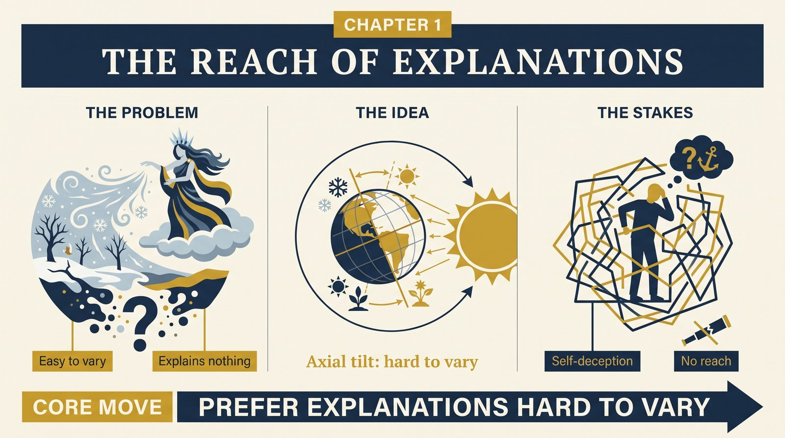
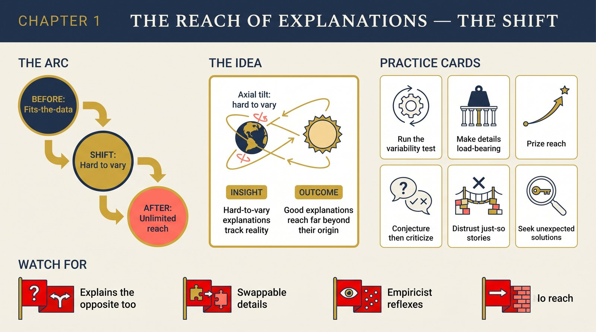

# Chapter 1 — The Reach of Explanations

<audio controls preload="none" style="width:100%" src="../../audio/ch-01-reach-of-explanations.mp3"></audio>

## Core Thesis

Knowledge does not come from the senses. It comes from **conjecture criticized** — guesses about what is really out there, tested against reality and against each other. And the guesses that survive best share a property Deutsch makes the book's foundation: **good explanations are hard to vary** while still accounting for what they explain. Every detail plays a functional role; change any part and the explanation fails.

## The Problem It Solves

Empiricism's ancient error: the belief that we "derive" knowledge from observation. Observation is theory-laden and always local — yet science routinely explains things no one has ever observed: the cores of stars, the curvature of spacetime, the past. Explanation-first epistemology accounts for what empiricism can't: how knowledge reaches far beyond all possible experience.

## Key Episode

Seasons. The Persephone myth "explains" winter — but every detail is arbitrary: swap Persephone for another god, grief for anger, and the myth works equally well, which is why it explains nothing (and why Greek myth predicted winter in Greece while Australia's summer refutes it, unnoticed). The axial-tilt explanation is opposite: geometry forces every detail, predicts opposite seasons in opposite hemispheres, and cannot be varied without breaking. Hard to vary — and it has **reach**: it applies to planets nobody has visited.

## The Shift

From knowledge-as-justified-observation to knowledge-as-hard-to-vary-explanation. "Reach" becomes the signature of good theory: explanations formulated to solve one problem turn out, unbidden, to solve problems in domains never dreamed of. That over-delivery is not luck; it is what tracking reality looks like.

## Critiques & Rivals

Empiricists reply that observation still adjudicates — Deutsch agrees but demotes it: testing chooses among conjectures; it never generates them. Critics of "hard to vary" ask for a metric; Deutsch offers none, holding it as a regulative criterion, recognized in practice. Instrumentalists (predictions matter, explanations don't) are engaged in Chapter 12's demolition.

## Modern Application

Audit any claim — a market thesis, a postmortem, a model — with the variability test: could the story explain the opposite outcome equally well with a tweak? Then it explains nothing. Prefer accounts whose every component is load-bearing. And prize reach: a principle that unexpectedly solves problems it wasn't built for is showing you it's true; a framework that must be re-rigged per case is showing you it isn't.

## Key Terms

- **Good explanation** — hard to vary while still explaining
- **Reach** — a theory's power beyond its intended domain
- **Empiricism** — the misconception that knowledge derives from the senses

## Key Quotes

> "That is what a good explanation will do for you: it makes it harder for you to fool yourself."

> "The reach of an explanation is not a matter of anyone's choice: it is an objective fact about it."

## Reflection Questions

1. Which of your working beliefs could "explain" the opposite result just as smoothly?
2. What's the load-bearing test on your team's current strategic story?
3. Which principle in your toolkit has shown genuine reach — solving problems it wasn't designed for?

## Connections

- Why instruments extend rather than corrupt observation: [Chapter 2](ch-02-closer-to-reality.md)
- The war on bad philosophy this chapter starts: [Chapter 12](ch-12-bad-philosophy.md)
