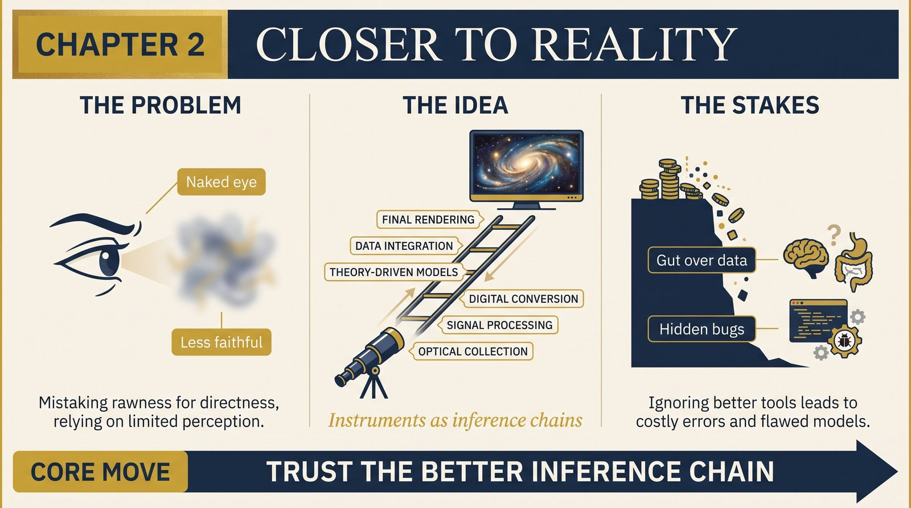
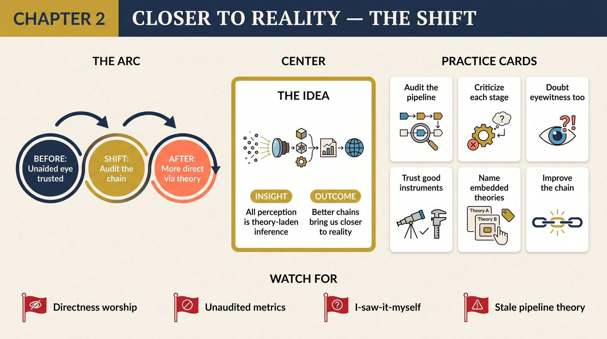

# Chapter 2 — Closer to Reality

<audio controls preload="none" style="width:100%" src="../../audio/ch-02-closer-to-reality.mp3"></audio>

## Core Thesis

Telescopes, interferometers, and computer-processed data do not distance us from reality — they bring us **closer** to it than unaided senses ever could. Perception itself is theory-laden inference from raw signals; instruments are simply better inference chains, built from better theories. Seeing a galaxy in processed false-color imagery is more direct, not less, than seeing a smudge by eye.

## The Problem It Solves

The intuition that "directly observed" means "more real" — and its corollary, that science's reliance on instruments and interpretation makes its objects suspect. Deutsch inverts it: *all* observation is indirect. The brain constructs the visual field from nerve impulses using inborn and learned theories; a camera-plus-software chain differs in quality, not kind. Once that's accepted, the laboratory's exotic entities have the same claim to reality as tables.

## Key Episode

Deutsch's night at the Texas McDonald Observatory: "looking" at a galaxy through an instrument chain — mirror, sensors, processing, screen. Every photon his retina received was manufactured by the display; not one came from the galaxy. Yet the observation was more faithful — corrected for atmosphere, amplified beyond retinal sensitivity — than any unaided look could be. The self is always in a "virtual-reality chamber" built by the brain; science swaps in better renderers.

## The Shift

From authenticity-of-the-unaided-eye to fidelity-of-the-explanation-chain. What makes an observation good is not proximity but the quality of the theories in the chain from reality to awareness. This dissolves the "observable/unobservable" boundary that instrumentalists lean on — quarks and quasars differ from chairs only in chain length.

## Critiques & Rivals

Constructivists take theory-ladenness the other way: if perception is constructed, reality-talk is naive. Deutsch's reply: construction from reality's signals via criticizable theories is precisely what contact with reality *is* — fallible, improvable, real. Van Fraassen's empiricism (believe only the observable) founders on the arbitrariness of where "observable" ends.

## Modern Application

Trust dashboards over gut walks — *if* the pipeline's theories are good. The lesson cuts both ways: instrumented perception (metrics, monitors, models) can be more direct than intuition, but only as good as the inference chain, so audit the chain: what theories does each stage embed, and when were they last criticized? "I saw it myself" deserves the same audit — the brain's pipeline has known bugs (bias, salience, memory rewrite).

## Key Terms

- **Theory-laden observation** — all perception is inference via theories
- **Virtual-reality chamber** — the brain's rendered model of the world
- **Inference chain** — the theory-bearing path from reality to awareness

## Key Quotes

> "We never perceive anything directly. All our external experience is virtual reality... generated by our own brains."

> "Telescopes... are rungs on a ladder of theoretical interpretation which reaches down to the true, unseen reality."

## Reflection Questions

1. Which "direct" impression of yours deserves the same skepticism you give to dashboards?
2. What theories are embedded in your key metrics pipeline — and who criticizes them?
3. Where do you privilege eyewitness over instrument out of mere intuition?

## Connections

- The epistemology this extends: [Chapter 1](ch-01-reach-of-explanations.md)
- Where the brain's renderer becomes the seat of personhood: [Chapter 7](ch-07-artificial-creativity.md)
