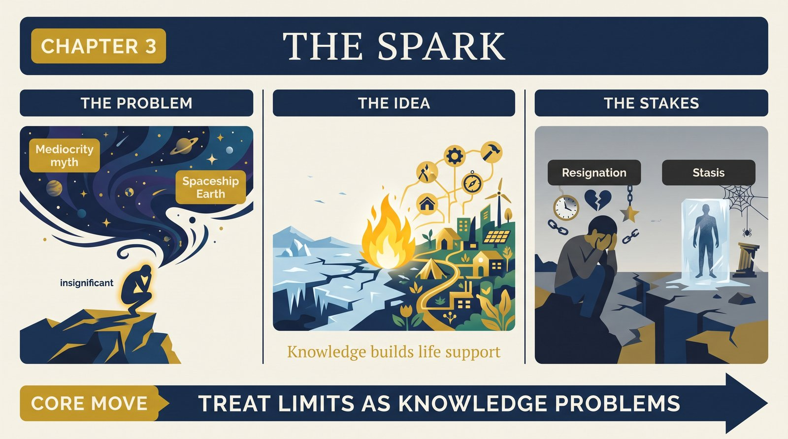
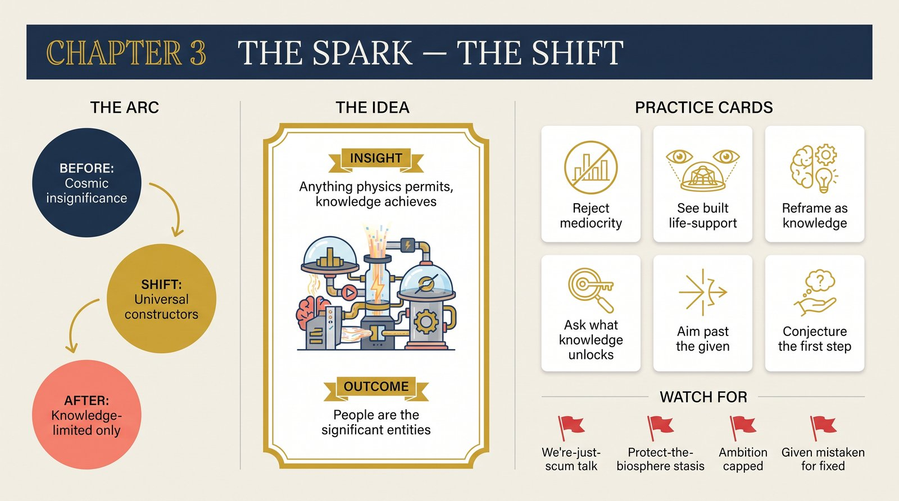

# Chapter 3 — The Spark

<audio controls preload="none" style="width:100%" src="../../audio/ch-03-the-spark.mp3"></audio>

## Core Thesis

Two reigning humilities are false. The **Principle of Mediocrity** ("we are nothing special — chemical scum on a typical planet") and **Spaceship Earth** ("the biosphere is our life-support system, uniquely suited to us"). Deutsch refutes both with one move: people are **universal explainers and constructors**. Anything not forbidden by the laws of physics is achievable by people with the right knowledge — which makes people the most significant entities in the cosmic scheme, and makes every place in the universe equally (in)hospitable pending knowledge.

## The Problem It Solves

A civilization's self-image sets its ambitions. Mediocrity counsels resignation (our understanding must stay parochial); Spaceship Earth counsels stasis (stay within the support system's limits). Both, Deutsch shows, are factually backwards: intergalactic space kills humans in seconds, but so would the Great Rift Valley winter without knowledge — humans survive *anywhere* only by creating knowledge, and with enough of it can thrive anywhere, Earth included.

## Key Episode

The corrected picture of our habitat: a typical place in the universe is intergalactic vacuum at 2.7 kelvin. Earth's biosphere, romanticized as a nurturing mother, never supported humans comfortably — early humans in the Rift Valley died of exposure, starvation, and parasites amid what pastoral imagination calls paradise. What changed wasn't the biosphere; it was knowledge: fire, clothing, agriculture, medicine. Life support was *built*, not given.

## The Shift

From "how insignificant we are" to "how significant knowledge-creators are": people (human or otherwise) are the only known systems with unbounded reach — the universe's way of being comprehensible includes us comprehending it. The chapter's slogan-level inversion: the Earth is not our spaceship; **knowledge is**.

## Critiques & Rivals

Ecologists bristle: doesn't this license recklessness toward the biosphere? Deutsch's answer (developed in Chapter 17): no — it relocates the duty from *preserving* to *knowing*; problems are inevitable, and only knowledge-growth handles them. Anthropic-principle cosmologists contest the physics of "typicality"; theologians and deep ecologists contest the axiology. The claim that physics forbids nothing else — the "momentous dichotomy" — remains the boldest and most contested plank.

## Modern Application

Diagnose your organization's self-image. Mediocrity-culture ("we're a small player, we adapt") and Spaceship-culture ("protect the legacy system, it sustains us") both cap ambition at the status quo. The Deutschian alternative: any outcome not forbidden by the laws of your domain is a knowledge problem. The question shifts from "what does our environment permit?" to "what knowledge would make it permit more?"

## Key Terms

- **Principle of Mediocrity** — "nothing significant about humans" (rejected)
- **Spaceship Earth** — "the biosphere is our tailored life-support" (rejected)
- **Universal constructor/explainer** — people; the momentous dichotomy's engine

## Key Quotes

> "Every problem that is interesting is also soluble... anything that is not forbidden by the laws of nature is achievable, given the right knowledge."

> "The Earth's biosphere is incapable of supporting human life... it is only knowledge that makes it possible."

## Reflection Questions

1. Where does mediocrity-humility cap your team's ambitions below physics?
2. What "life support" in your work is actually built knowledge wearing the costume of a given?
3. Which impossible-seeming goal is merely knowledge-limited — and what's the first conjecture?

## Connections

- What creates that knowledge: [Chapter 4](ch-04-creation.md)
- The sustainability debate this reframes: [Chapter 17](ch-17-unsustainable.md)
