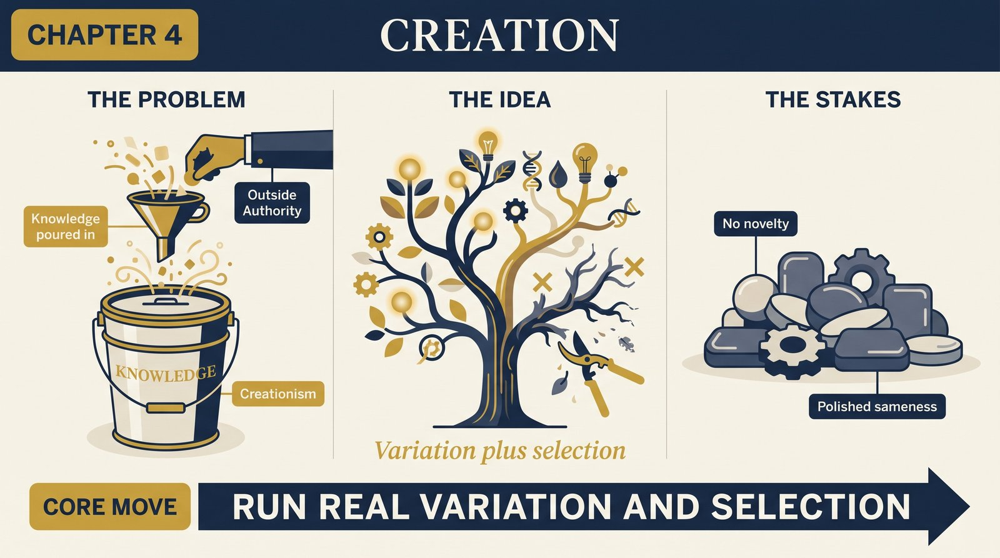
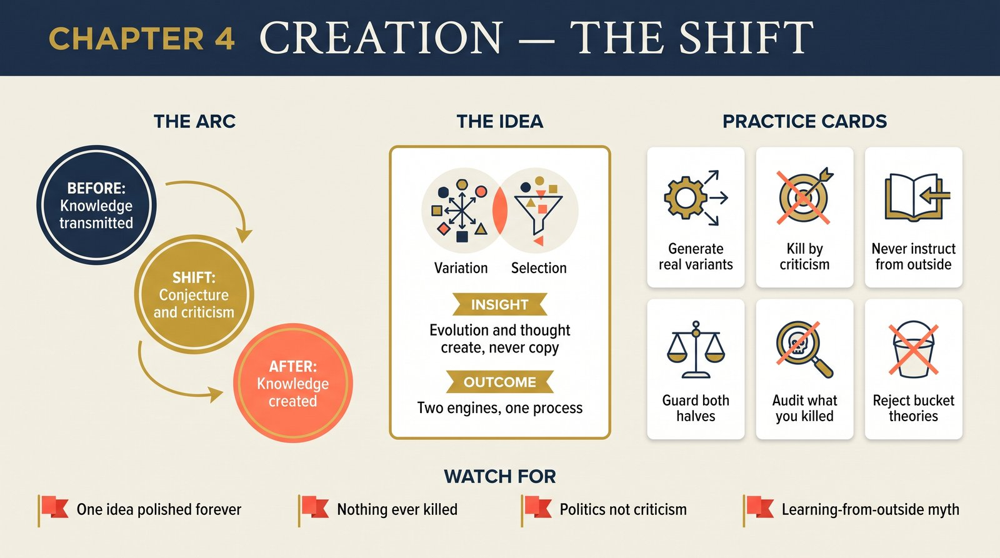

# Chapter 4 — Creation

<audio controls preload="none" style="width:100%" src="../../audio/ch-04-creation.mp3"></audio>

## Core Thesis

Knowledge is created by one process only: **variation and selection** — conjecture and criticism. Biological evolution and human thought are the two known instances. Neither copies knowledge from anywhere: evolution doesn't learn from the environment, and minds don't derive ideas from the senses; both *create* knowledge that wasn't there, by generating variants and killing the failures. Creationism — knowledge poured in from an authority — is false everywhere it's proposed, including its secular forms.

## The Problem It Solves

Where does the apparent design in organisms — and the genuine novelty in ideas — come from? Paley's watch argument had real force: complex adaptation demands explanation. Deutsch's telling makes Darwin's answer epistemological: evolution explains the *origin of knowledge* (in genes) without a knowing designer, just as Popper's epistemology explains discovery without infallible sources. Lamarckism, inductivism, and divine creation are the same error in three costumes: knowledge acquired by instruction from outside, rather than created by variation-selection within.

## Key Episode

Paley's watch on the heath, given its full due — the finest wrong explanation of its century, hard to vary in every respect except the one that matters. Its overthrow: Darwin's population of replicators, varying blindly, filtered by survival. Deutsch sharpens with the modern gene-centric view (Dawkins): what evolves is knowledge in genes for causing their own replication — adaptations are the genes' survival strategies, not the species' welfare programs.

## The Shift

From knowledge-as-transferred to knowledge-as-created. The unification is the point: Neo-Darwinism and Popperian epistemology are the *same theory* at different substrates — replicators/variation/selection ≙ ideas/conjecture/criticism. Both refute every "bucket theory" of knowledge; both make creation ongoing, ordinary, and explicable.

## Critiques & Rivals

Fine-tuning arguments relocate design one level up (constants of physics); Deutsch defers that to anthropic reasoning and multiverse cosmology. Lamarckian echoes recur in modern clothes (epigenetics hype); the core objection stands — acquired characteristics carry no *tested* knowledge. Critics of the evolution–epistemology analogy note thought is guided, not blind; Popperians reply: conjecture is indeed directed by problems, but its *validity* is still established only by selection.

## Modern Application

Run creation processes honestly: brainstorms, product bets, research agendas are variation-selection engines, and starving either half kills them. No variation (one sanctioned idea, refined forever) = Lamarckism: polishing without novelty. No selection (every idea shipped, none killed) = no knowledge created. The practical audit: what did we generate this quarter, and what did we *kill*? Institutions that can't kill variants don't create knowledge; they accrete opinions.

## Key Terms

- **Neo-Darwinism** — replicators + blind variation + selection
- **Creationism (generalized)** — knowledge from authority, in any costume
- **Replicator** — that which gets copied because of what it is

## Key Quotes

> "Like biological adaptations, human ideas are created by variation and selection... neither is derived from the environment."

> "The knowledge in genes is knowledge of how to cause their own replication."

## Reflection Questions

1. Where is your organization Lamarckian — refining one anointed idea without generating rivals?
2. What was actually killed in your last selection round — and by criticism or by politics?
3. Which "learning from the market" narrative is really conjecture-and-selection wearing empiricist dress?

## Connections

- The epistemology being unified: [Chapter 1](ch-01-reach-of-explanations.md)
- Culture as the same process on memes: [Chapter 15](ch-15-evolution-of-culture.md)
