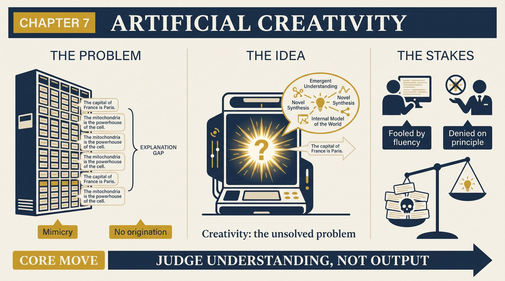
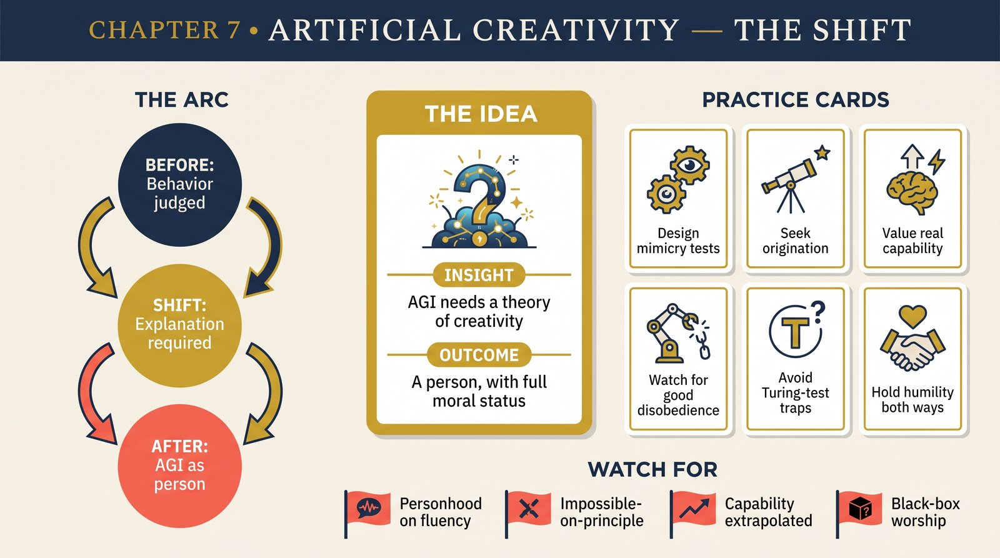

# Chapter 7 — Artificial Creativity

<audio controls preload="none" style="width:100%" src="../../audio/ch-07-artificial-creativity.mp3"></audio>

## Core Thesis

An AGI — artificial *general* intelligence — would be a **person**: a universal explainer, with all the rights and moral status that entails. And it cannot be built by accumulating tricks, training on examples, or imitating outputs; it requires a working explanation of **creativity** — how new explanations are created — which (as of Deutsch's writing) nobody has. The Turing test is the wrong target: judging outputs can't distinguish genuine explanation-creation from an ever-larger lookup table of mimicry.

## The Problem It Solves

Decades of AI's boom-bust pattern: each generation's technique (theorem-provers, expert systems, neural nets) extrapolated to imminent general intelligence, each stalling at the same wall. Deutsch's diagnosis: the field lacks — and doesn't miss — a theory of what creativity *is*. Progress in chess engines and pattern recognizers is real but orthogonal: they get better at tasks; a person is better at *acquiring new tasks* by explaining.

## Key Episode

Lady Lovelace's objection, revived: the Analytical Engine "has no pretensions to originate anything; it can do whatever we know how to order it to perform." Turing thought machines would surprise us into refuting her; Deutsch sides with Lovelace on the deep point — surprise isn't origination. His thought-experimental razor: any Turing-test judge needs, in principle, an *explanation* of how the candidate works; unexplained black-box success is indistinguishable from an enormous recording. Genuine AGI-recognition is explanation-recognition.

## The Shift

From behavior to explanation as the criterion of mind — and from AI-as-capability-stacking to AGI-as-epistemological-breakthrough. Corollaries with teeth: an AGI's education is a *person's* education (it must be free to criticize, err, and dissent — a punished AGI is an enslaved child); and "aligning" a genuine AGI by constraint is both immoral and self-defeating, exactly as it is for humans.

## Critiques & Rivals

The scaling school replies that capability-stacking *is* the path — enough breadth of learned skill just is generality; the wall Deutsch posits may not exist. Functionalists dispute that explanation of mechanism is needed to ascribe mind (we ascribe it to each other on behavior alone). Deutsch's rejoinder: we ascribe it to each other via the *best explanation* — shared biology plus reported inner life; for novel artifacts, only mechanism-explanation can play that role. The debate is, conspicuously, live.

## Modern Application

Two disciplines for the AI age. First, evaluation: for any system, ask what would distinguish understanding from sophisticated mimicry *in this domain* — and design that test, not a vibe check. Second, humility in both directions: don't declare personhood on fluent output; don't declare its impossibility on principle. The tell to watch for, per Deutsch: the system that *disobeys well* — generating criticism, new problems, and explanations nobody ordered.

## Key Terms

- **AGI as person** — universal explainer, full moral status
- **Lovelace's objection** — machines do what we know how to order
- **Mimicry vs origination** — output-matching vs explanation-creation

## Key Quotes

> "What distinguishes people from other information-processing systems is... creativity: the capacity to create new explanations."

> "The field of artificial (general) intelligence has made no progress because there is an unsolved philosophical problem at its heart."

## Reflection Questions

1. In your evaluations of AI tools, what would distinguish understanding from very good mimicry?
2. Where does capability-stacking genuinely serve you — and where are you extrapolating it into a jump it hasn't made?
3. If Deutsch is right about AGI personhood, which current practice would become indefensible first?

## Connections

- The universality framework behind "universal explainer": [Chapter 6](ch-06-jump-to-universality.md)
- Creativity's evolutionary origin: [Chapter 16](ch-16-evolution-of-creativity.md)
