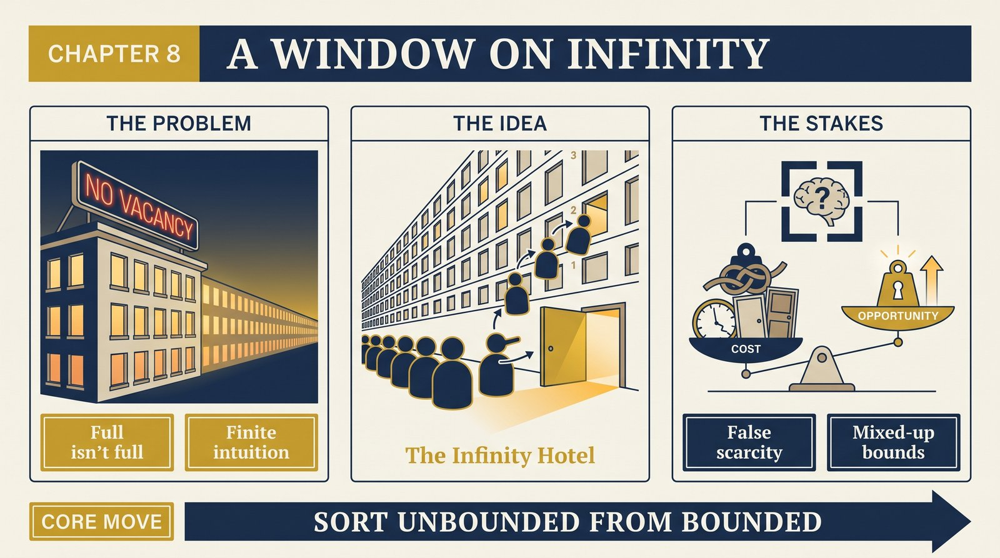
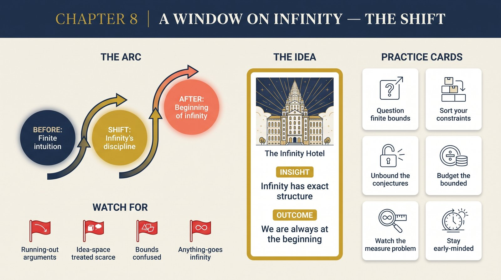

# Chapter 8 — A Window on Infinity

<audio controls preload="none" style="width:100%" src="../../audio/ch-08-window-on-infinity.mp3"></audio>

## Core Thesis

Infinity is not exotic — it is the ordinary working environment of anyone who takes unbounded progress seriously. Deutsch tours Hilbert's **Infinity Hotel** to train the intuition: with infinitely many rooms, "full" never means "no vacancy"; whole infinities can be absorbed by shuffling. The moral: where knowledge-creation is concerned, we are always at the **beginning** of infinity — every achieved state is negligible beside what remains, and "running out" arguments quietly assume finitude they haven't earned.

## The Problem It Solves

Finite intuition misapplied to unbounded processes. Arguments of the form "there are only so many ideas / resources / niches" import bounds from parochial experience. The chapter also dissolves puzzles about probability and typicality in infinite sets (there's no uniform "random room" in the hotel — anthropic reasoning beware), grounding Chapter 3's cosmology and Chapter 9's optimism in careful mathematics.

## Key Episode

Infinity Hotel's management problems, played for keeps: every room full, a new guest arrives — everyone moves up one, room 1 free. Infinitely many new guests? Everyone to double their room number; all odd rooms free. Infinitely many *coaches each with infinitely many passengers* — still absorbable. But: the hotel generates waste faster than any disposal, and "the passengers' union" paradoxes show some tasks are impossible even there. Infinite ≠ anything-goes; it has exact structure.

## The Shift

From infinity-as-metaphor to infinity-as-discipline: which quantities in a domain are genuinely unbounded (explanations, error-corrections, digital copies), which are bounded (energy density, speed), and which puzzles come from mixing them up. Also the mathematical anchor for the book's title: progress has no natural ceiling because explanation-space, unlike any physical warehouse, is infinite.

## Critiques & Rivals

Finitists and constructivists in mathematics reject completed infinities outright — the hotel, they'd say, illustrates grammar, not fact. Physicists note nothing physically realizable is known to be infinite; Deutsch agrees on instantiation while insisting the *reach of knowledge* (an abstraction — Chapter 5) is genuinely unbounded. Anthropic-reasoning practitioners contest his measure-theoretic pessimism about "typical observers."

## Modern Application

Sort your constraints. Teams routinely treat idea-space as scarce (defending one concept as if it were the last) and physical constraints as negotiable (schedules, attention, energy) — exactly backwards. Conjecture-space is Infinity Hotel: another rival explanation always has a room. Meanwhile actual bounds (compute budgets, attention, trust) obey conservation laws. Optimism about the unbounded, arithmetic about the bounded.

## Key Terms

- **Infinity Hotel** — Hilbert's intuition-trainer for countable infinity
- **Beginning of infinity** — every state is early relative to unbounded progress
- **Measure problem** — no uniform probability over infinite sets

## Key Quotes

> "In an infinite hotel, 'full' does not mean what it means elsewhere."

> "We are always at the beginning of infinity."

## Reflection Questions

1. Which "we're running out of ideas" argument in your field smuggles in a finite bound?
2. What do you treat as scarce that is actually unbounded — and vice versa?
3. If your project is at the beginning of infinity, what changes about this quarter's stakes?

## Connections

- The optimism this licenses: [Chapter 9](ch-09-optimism.md)
- Real abstractions with unbounded reach: [Chapter 5](ch-05-reality-of-abstractions.md)
