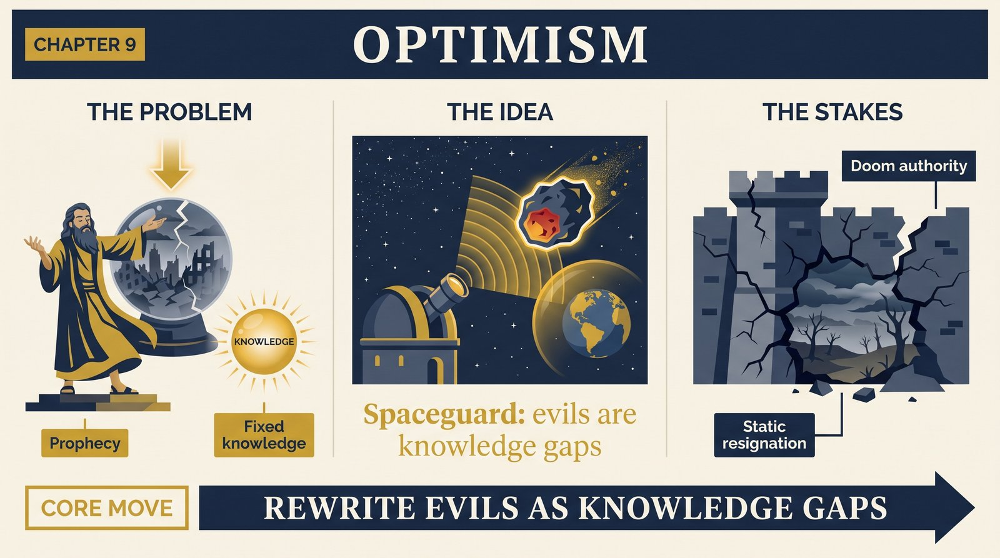
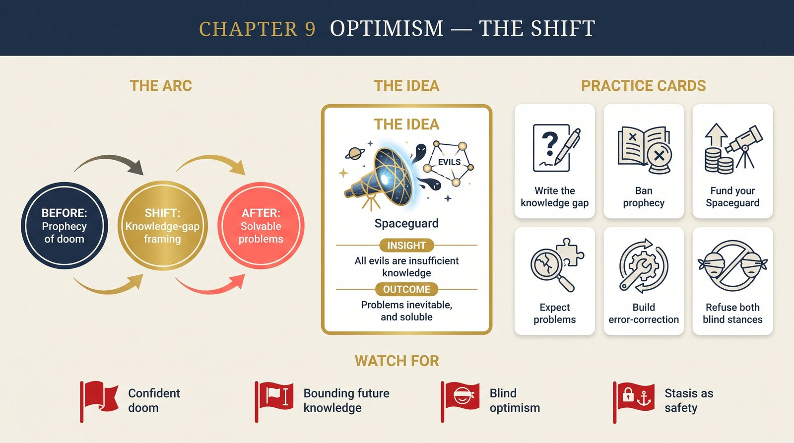

# Chapter 9 — Optimism

<audio controls preload="none" style="width:100%" src="../../audio/ch-09-optimism.mp3"></audio>

## Core Thesis

**All evils are caused by insufficient knowledge.** That is Deutsch's principle of optimism — not a mood but a factual claim paired with a methodological stance: problems are inevitable, and problems are soluble. Optimism, properly defined, is the proposition that all failures — all evils — are due to lack of knowledge, and that knowledge can be created by criticizable conjecture. Pessimism, in all its forms, is a **prophecy** — and prophecy (claiming to know the unknowable growth of future knowledge) is the underlying error.

## The Problem It Solves

The recurring authority of doom. From Malthus to Rees's "final century," pessimists extrapolate present knowledge into futures where problems are fixed and knowledge is not — systematically underweighting the one variable that has broken every previous ceiling. Deutsch names the mirror error too: blind optimism (proceeding as if bad outcomes were impossible). Both go wrong the same way — by prophesying instead of explaining.

## Key Episode

The **Spaceguard** parable in reverse: an asteroid impact would once have been a "natural disaster"; for a civilization that funds sky surveys, it is a preventable failure of knowledge-deployment. And history's laboratory: Athens' brief golden age of criticism versus Sparta's engineered stasis — a civilization optimized to *prevent* change, which therefore could not correct its own errors. The deepest case: why the Enlightenment's "mini-enlightenments" (Athens, Florence) died — they lacked the knowledge to defend the tradition of criticism itself.

## The Shift

From optimism/pessimism as temperaments to a precise epistemic principle: never prophesy the bounds of future knowledge; treat every evil as a solvable knowledge-gap; expect problems, and build the error-correcting institutions that outlast any particular solution. The wealth-test flips accordingly: a civilization's safety is measured not by the problems it has avoided but by its capacity to solve the ones that arrive.

## Critiques & Rivals

Precautionary thinkers reply that some errors (existential ones) permit no error-correction — asymmetric stakes justify prophecy-shaped caution. Deutsch's counter: stagnation is itself the riskiest strategy, since unknown threats require knowledge-growth to meet. Critics also probe "all evils": is death by ancient plague a knowledge-failure of its victims? (Deutsch: of civilization, yes — cures existed in the space of possible knowledge.) The debate structures today's existential-risk discourse.

## Modern Application

Institutionalize the principle: for every persistent evil on your team's map (outages, churn, burnout), write it as a knowledge-gap statement — "we don't yet know how to X" — and it becomes a research agenda instead of weather. Ban prophecy in planning: scenarios and error-budgets, yes; confident declarations of what can't be done or can't go wrong, no. And fund your Spaceguard: surveillance of the problems you'd rather not think about.

## Key Terms

- **Principle of optimism** — all evils are due to insufficient knowledge
- **Blind pessimism / blind optimism** — twin prophecy errors
- **Problems are inevitable & soluble** — the book's twin refrain

## Key Quotes

> "All evils are caused by insufficient knowledge."

> "Problems are inevitable. Problems are soluble."

## Reflection Questions

1. Rewrite your three most persistent problems as "we don't yet know how to..." statements — what agenda appears?
2. Where does your planning prophesy (confidently bounding future knowledge) rather than explain?
3. What's your Spaceguard — the survey you should fund for problems you'd rather not imagine?

## Connections

- The infinite room for solutions: [Chapter 8](ch-08-window-on-infinity.md)
- The static societies that chose otherwise: [Chapter 15](ch-15-evolution-of-culture.md)
