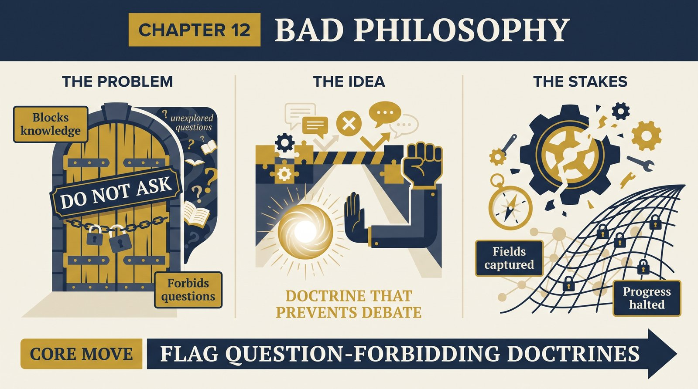
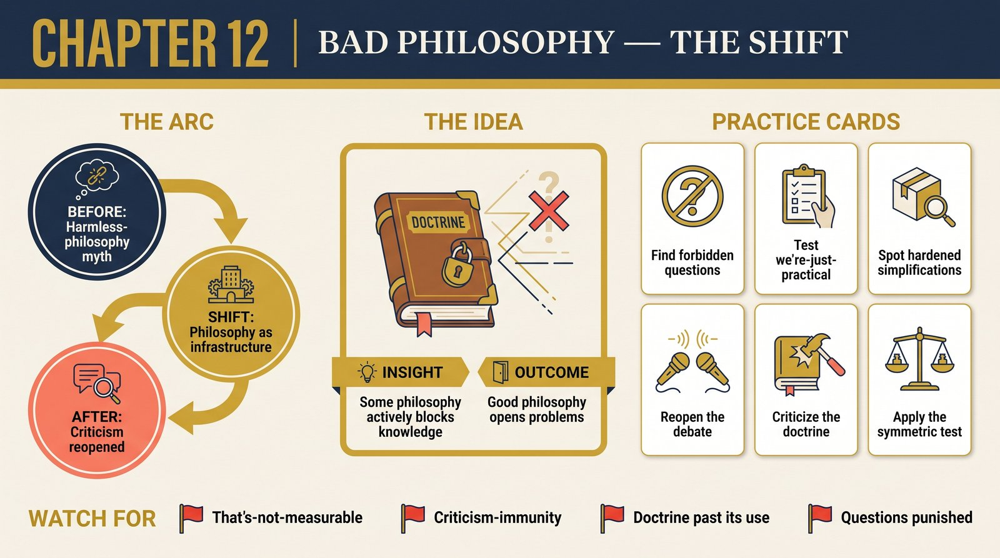

# Chapter 12 — A Physicist's History of Bad Philosophy

<audio controls preload="none" style="width:100%" src="../../audio/ch-12-bad-philosophy.mp3"></audio>

## Core Thesis

**Bad philosophy** is philosophy that actively closes off the growth of knowledge — and it can capture entire sciences. Exhibit A: the Copenhagen interpretation and its descendants, which taught two generations of physicists that seeking an account of quantum reality was naive, that the theory is a prediction-instrument only, and that foundational questions are career poison. Instrumentalism didn't stay modest; it became **doctrine enforcing its own immunity from criticism**.

## The Problem It Solves

How the most successful theory in history came to forbid its own explanation. Deutsch traces the mechanism: early quantum pioneers, facing genuinely weird results, adopted positivist philosophy (only the observable is meaningful) as a shield; the shield hardened into curriculum ("shut up and calculate"); and dissenters — Everett most consequentially — were marginalized not by argument but by the doctrine that the question itself was meaningless. Bad philosophy's signature: it doesn't lose debates; it prevents them.

## Key Episode

The generational tragedy in miniature: Everett's 1957 relative-state formulation — the multiverse, derived from the bare equations — met not with refutation but with shrugs and career exile; he left physics. Meanwhile Bohr's institutional authority propagated "complementarity" — in Deutsch's telling, an edifice of profound-sounding evasion. Runner-up exhibits: behaviorism doing the same to psychology (banning mind-talk), and logical positivism self-destructing (its meaning-criterion is meaningless by its own test) while still poisoning the wells.

## The Shift

From philosophy-as-harmless to philosophy-as-infrastructure: every science runs on philosophical commitments (what counts as explanation, question, evidence), and "we don't do philosophy" means only that the commitments run uncriticized. The chapter's demarcation: good philosophy opens problems and invites criticism; bad philosophy manufactures reasons not to look — and its modern forms (crude relativism, science-as-just-another-narrative) repeat the trick outside physics.

## Critiques & Rivals

Historians of physics contest the villain-narrative: Copenhagen-era pragmatism, they argue, let physics *advance* while metaphysics was premature — strategic quietism, not rot. Philosophers note Deutsch's broad brush (positivism's careful descendants differ from the cartoon). And his own multiverse-partisanship invites the tu quoque: is declaring rivals "not even explanations" itself a criticism-blocker? The meta-lesson survives the fights: doctrines that forbid questions should trigger alarms whoever holds them.

## Modern Application

Audit your field for question-forbidding doctrines: "that's not measurable, so don't ask," "that's philosophy, we ship product," "the metric is the goal, discussion closed." Each may have started as discipline; check whether it now functions as immunity. The test is symmetrical and cheap: what question would this doctrine punish me for asking seriously — and who benefits from the silence?

## Key Terms

- **Bad philosophy** — philosophy that closes down the growth of knowledge
- **Instrumentalism** — theories as prediction-tools, explanation renounced
- **"Shut up and calculate"** — doctrine-enforced quietism

## Key Quotes

> "Bad philosophy is philosophy that is not merely false, but actively prevents the growth of other knowledge."

> "Instrumentalism... is a project for preventing progress in understanding the entities beyond our direct experience."

## Reflection Questions

1. What question does your field's reigning common sense punish you for asking?
2. Which "we're just being practical" stance in your work functions as criticism-immunity?
3. Where did a strategic simplification harden into doctrine after its usefulness expired?

## Connections

- The explanation Copenhagen suppressed: [Chapter 11](ch-11-the-multiverse.md)
- The criterion bad philosophy violates: [Chapter 1](ch-01-reach-of-explanations.md)
