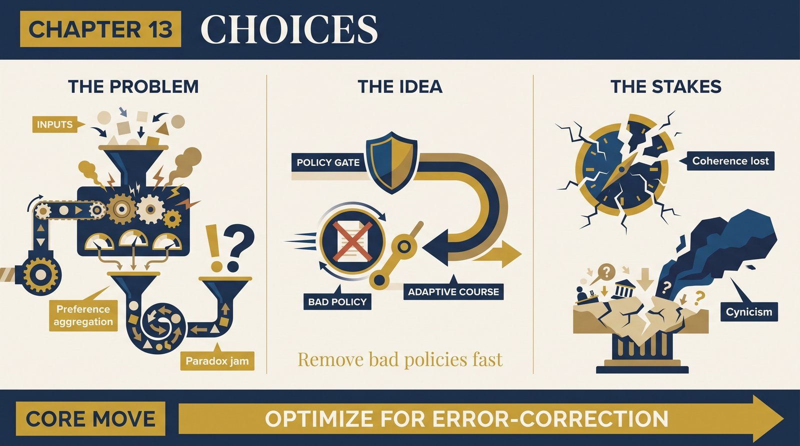
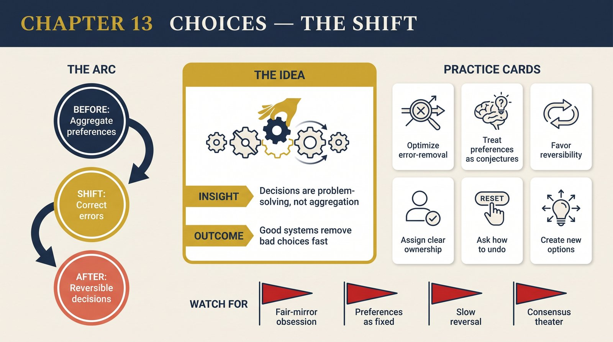

# Chapter 13 — Choices

<audio controls preload="none" style="width:100%" src="../../audio/ch-13-choices.mp3"></audio>

## Core Thesis

Social choice theory's famous impossibility results (Arrow, Condorcet) are real mathematics but **misapplied** — because they inherit the justificationist error. They ask how to aggregate fixed preferences into a decision, as if choosing meant weighing given options by a rule. Deutsch reframes: rational decision-making, individual or collective, is not preference-aggregation but **problem-solving** — creating new options and criticizing away the errors. The paradoxes dissolve because their premise (choice = selection among fixed alternatives) is false.

## The Problem It Solves

The apparent proof that democracy is incoherent (Arrow: no fair voting rule satisfies obvious conditions; Condorcet: majorities cycle). Taken as a bound on collective rationality, these results breed cynicism. Deutsch relocates them: they constrain *aggregation mechanisms*, but rational institutions don't aggregate preferences — they *correct errors*. The right question for a decision system isn't "does it fairly represent the will of the people?" but "how well does it find and fix mistaken policies?"

## Key Episode

Popper's reframing of the founding question of politics — from Plato's "who should rule?" to "**how can we rid ourselves of bad rulers and bad policies without violence?**" Deutsch extends it to all decision-making. The proportional-representation critique lands here: systems optimized for fairly *mirroring* opinion (proportional) can be worse at *error-correction* than "unfair" ones (plurality) that produce decisive changes and clear accountability. The metric is course-correction, not representational fidelity.

## The Shift

From choice-as-aggregation to choice-as-error-correction, mirroring the book's epistemology exactly: options are conjectures, decision is criticism, and a good decision procedure is one that makes bad options easy to identify and remove. Preferences aren't sacred inputs to be weighed; they're conjectures to be improved. Apportionment paradoxes become curiosities rather than refutations of collective rationality.

## Critiques & Rivals

Social-choice theorists reply that aggregation is unavoidable somewhere — even error-correction needs a rule to decide *what* to correct, reintroducing Arrow. Deutsch's defenders note the rule need only be good-enough-and-revisable, not optimal. Political scientists contest the empirical claim that plurality systems out-correct proportional ones (the evidence is genuinely mixed). And "create new options" can sound like it evades the hard cases where options genuinely conflict.

## Modern Application

Redesign decisions around error-correction, not consensus-measurement. In teams: the best decision process isn't the one that most accurately polls everyone's preferences, but the one that surfaces bad calls fastest and reverses them cheaply — favoring reversibility, clear ownership, and rapid feedback over elaborate preference-aggregation. Ask of any governance scheme (board, vote, algorithm): how does it *remove* a bad policy? If the answer is "slowly and painfully," fairness of input won't save it.

## Key Terms

- **Arrow's theorem** — no aggregation rule meets all fairness conditions
- **Error-correction (political)** — removing bad policies/rulers without violence
- **Choice as problem-solving** — creating and criticizing options, not weighing fixed ones

## Key Quotes

> "The essence of democratic decision-making is not the choice made by the system at elections, but the ideas created between elections."

> "The best political institutions are those that make it easiest to detect and correct errors."

## Reflection Questions

1. Does your team's decision process optimize for representing everyone's preferences or for removing bad decisions fast?
2. Where are you treating preferences as fixed inputs instead of improvable conjectures?
3. What's your cheapest available mechanism to reverse a decision that proves wrong?

## Connections

- The Popperian error-correction theme: [Chapter 9](ch-09-optimism.md)
- Justificationism's origin, here reappearing: [Chapter 10](ch-10-dream-of-socrates.md)
