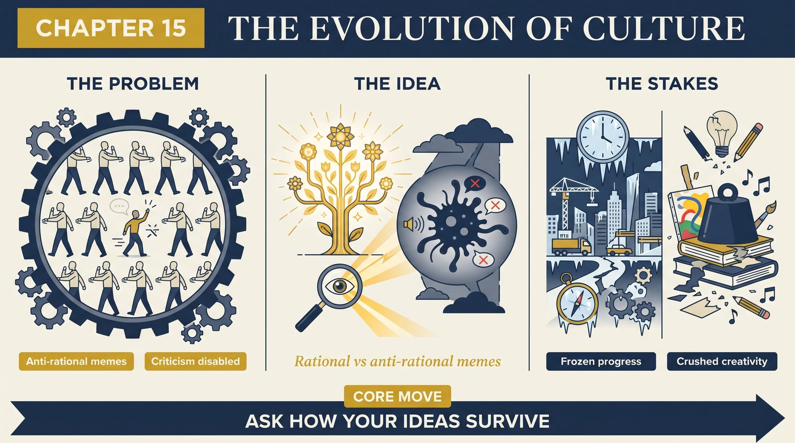
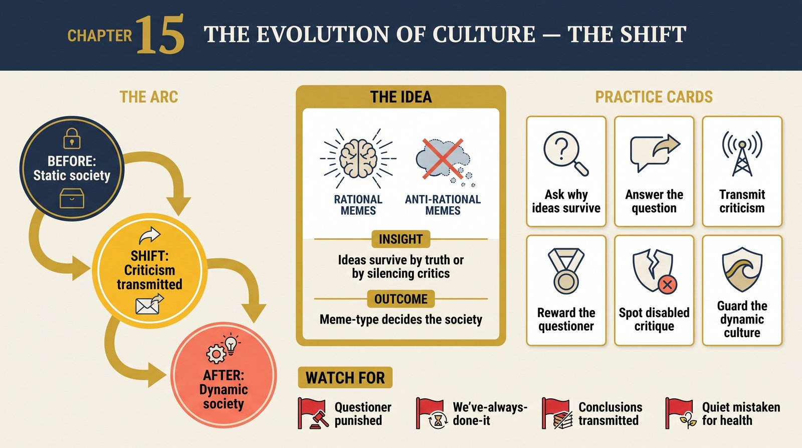

# Chapter 15 — The Evolution of Culture

<audio controls preload="none" style="width:100%" src="../../audio/ch-15-evolution-of-culture.mp3"></audio>

## Core Thesis

Cultures evolve by the variation and selection of **memes** — ideas that are replicators. But Deutsch splits memes into two kinds with opposite survival strategies, producing two kinds of society. **Rational memes** survive because they are *useful and true* — they help their holders, and so are copied for their content. **Anti-rational memes** survive by *disabling the criticism* that would eliminate them — they propagate by suppressing the recipient's capacity to reject them. Which meme-type dominates determines whether a society is dynamic or static.

## The Problem It Solves

Why most societies in history were **static** — millennia of near-zero progress — and why a few became **dynamic**. Standard accounts cite resources or geography; Deutsch cites epistemology. Static societies aren't knowledge-poor by accident; they are actively structured (by anti-rational memes) to *prevent* the transmission of new ideas and the criticism of old ones. Their stability is an achievement of enforced sameness, purchased by crushing individual creativity.

## Key Episode

The static society's machinery: anti-rational memes install themselves by making dissent unthinkable or unbearable — taboo, terror, the sanctification of tradition — so that the very impulse to criticize is disabled in each new generation. Deutsch contrasts the transmission mechanics: a rational meme survives a smart, critical holder (it withstands scrutiny); an anti-rational meme needs the holder *not* to scrutinize, so static cultures specialize in producing incurious minds. The dynamic society (the Enlightenment's rare achievement) inverts this — it makes the tradition *of criticism* itself the thing transmitted.

## The Shift

From culture-as-content to culture-as-selection-environment: the question isn't only *which* ideas a society holds but *what kind of ideas can survive* in it — truth-tested or criticism-proof. Personal creativity gets a dark reframing too: in static societies, humans use their universal creativity mainly to *conform* — to reconstruct the anti-rational memes faithfully — an immense engine of mind turned against itself.

## Critiques & Rivals

Meme skeptics (many cultural evolutionists) doubt ideas are discrete enough to be replicators; Deutsch needs only that they're copied with variation and selection. Anthropologists resist "static society" as pejorative and empirically crude (no society is truly changeless). Gene-culture coevolution offers a rival mechanism (culture shaped by fitness, not idea-fitness). And the rational/anti-rational binary can flatten cases where a false-but-comforting meme is also genuinely useful.

## Modern Application

Diagnose your organization's meme-ecology. Do ideas survive here because they're *true and useful*, or because they're *protected from criticism* (by hierarchy, taboo, "we've always done it this way," fear of the messenger)? The tell of an anti-rational meme: it punishes the act of questioning it rather than answering the question. Dynamic teams transmit the *practice of criticism*; static ones transmit conclusions and police dissent — and mistake the resulting quiet for health.

## Key Terms

- **Meme** — an idea that is a replicator
- **Rational vs anti-rational meme** — survives by truth/usefulness vs by disabling criticism
- **Static vs dynamic society** — enforced sameness vs institutionalized criticism

## Key Quotes

> "A static society is one whose citizens' way of life... does not change noticeably over many generations... it is a society that has succeeded in suppressing the growth of knowledge."

> "Anti-rational memes... survive by disabling the recipients' critical faculties."

## Reflection Questions

1. Do your team's dominant ideas survive by being true, or by being shielded from criticism?
2. Where does your culture punish the questioner instead of answering the question?
3. What do you transmit to new members — conclusions, or the practice of criticizing them?

## Connections

- The variation-selection engine: [Chapter 4](ch-04-creation.md)
- Communication as imperfect copying: [Chapter 10](ch-10-dream-of-socrates.md)
- The optimism static societies forfeit: [Chapter 9](ch-09-optimism.md)
