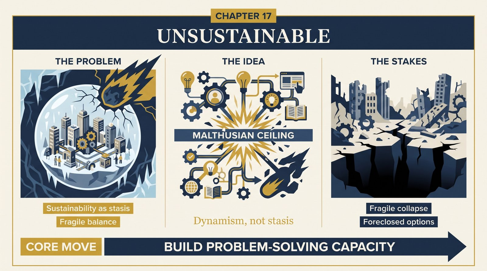
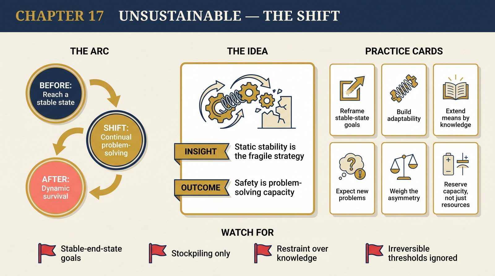

# Chapter 17 — Unsustainable

<audio controls preload="none" style="width:100%" src="../../audio/ch-17-unsustainable.mp3"></audio>

## Core Thesis

**Sustainability**, as usually understood — reaching a stable state that endures unchanged — is not only unattainable but the wrong ideal. It is the aspiration of a *static* society, and static societies fail precisely because problems are inevitable and only knowledge-growth solves them. The right ideal is the opposite: not a fixed sustainable state but **continual problem-solving** — a dynamic society that expects to face unknown problems and keeps creating the knowledge to meet them.

## The Problem It Solves

The intuitive appeal of "living within our means / reaching balance with nature" — which Deutsch argues is a category error. No past civilization survived by achieving stasis; the ones that tried (static societies) were the most fragile, undone by the first problem their frozen knowledge couldn't handle. "Sustainable" prescribes exactly the posture that has always preceded collapse: stop creating knowledge, and trust that no new problem will arrive. But problems are inevitable — so the "sustainable" state is the *least* safe.

## Key Episode

Deutsch's reading of **Easter Island** and other collapse narratives against Jared Diamond's "they exhausted their resources" moral. His inversion: the lesson is not "they should have consumed less" but "they lacked the knowledge (and the knowledge-creating culture) to solve their emerging problems" — a static society could not innovate its way out. Contrast the recurring Malthusian ceilings (food, energy, materials) that knowledge-growth has repeatedly shattered: each "unsustainable" trajectory was rescued not by restraint but by new knowledge (the Haber process, the Green Revolution).

## The Shift

From sustainability-as-stasis to survival-as-dynamism: safety lies not in minimizing footprint toward a steady state but in maximizing the *rate and reach of problem-solving*. "Living within our means" is replaced by "extending our means through knowledge." This is Chapter 9's optimism applied to civilization's future: the wealth that matters is the capacity to solve the next unforeseen problem.

## Critiques & Rivals

The strongest rival is the asymmetry objection (again): some resource limits or ecological thresholds may be crossed irreversibly *before* the rescuing knowledge arrives — betting on future innovation can lose catastrophically. Environmental scientists note real physical bounds (planetary boundaries) that aren't mere Malthusian panics. Defenders of sustainability reply that Deutsch caricatures a nuanced field — most sustainability thinking means *not foreclosing future options*, which is closer to his view than he allows. Deutsch's counter: stasis forecloses the most options of all.

## Modern Application

Reframe "sustainable" goals as problem-solving-capacity goals. For a business or system, durability comes not from a defensive steady state ("lock in the moat, minimize change") but from the institutional ability to detect and solve emerging problems faster than they arrive — reserves of *adaptability*, not just resources. When someone proposes reaching a stable end-state, ask: what unknown problem will arrive, and does this plan build the capacity to solve it, or just the hope that none comes?

## Key Terms

- **Sustainability (critiqued)** — the ideal of an enduring, unchanging state
- **Continual problem-solving** — the dynamic alternative to stasis
- **Problems are inevitable & soluble** — the principle that dooms stasis and licenses dynamism

## Key Quotes

> "A sustainable lifestyle would necessarily be a static one, and a static society is... incompatible with the open-ended creation of knowledge."

> "The maxim 'live within your means' is... a recipe for disaster in a world where problems are inevitable."

## Reflection Questions

1. Which of your "reach a stable state" goals is really a static-society aspiration in disguise?
2. Does your resilience plan build problem-solving *capacity*, or just stockpile against imagined-known threats?
3. Where are you betting on restraint when the historical rescue has always been new knowledge — and where might that bet's asymmetry actually bite?

## Connections

- The optimism principle applied to civilization: [Chapter 9](ch-09-optimism.md)
- Static vs dynamic societies: [Chapter 15](ch-15-evolution-of-culture.md)
- The unbounded room for solutions: [Chapter 8](ch-08-window-on-infinity.md)
