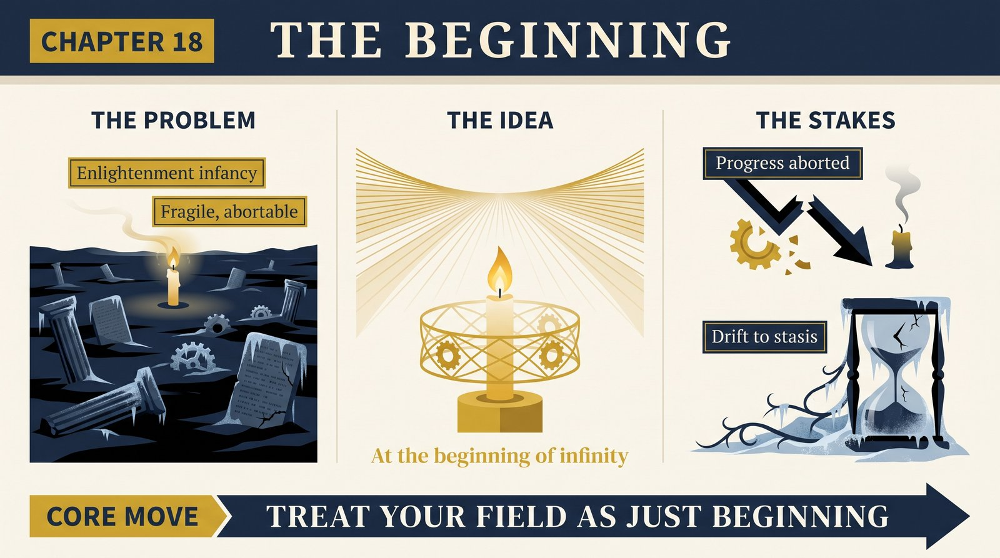
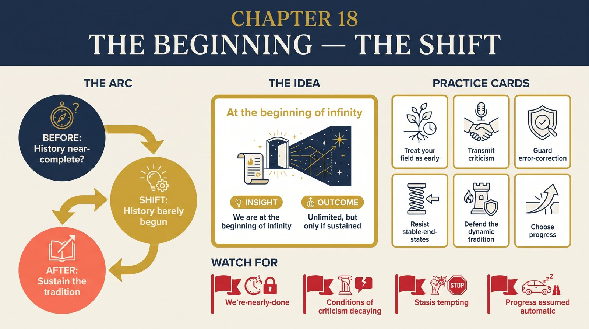

# Chapter 18 — The Beginning

<audio controls preload="none" style="width:100%" src="../../audio/ch-18-beginning.mp3"></audio>

## Core Thesis

The book's threads converge on one claim: we are **at the beginning of infinity**. The Enlightenment — barely a few centuries old — inaugurated the first sustained tradition of criticism, the first *dynamic* society, and thereby the open-ended growth of knowledge. This is not the culmination of history but its infancy. Everything achieved so far is negligible against what is possible, because there is no bound — save the laws of physics — on what knowledge can achieve, and the growth of knowledge has, in principle, no end.

## The Problem It Solves

The pervasive sense of lateness — that the great discoveries are behind us, that we live in a mature, near-complete civilization tidying up details. Deutsch marshals the whole book against it: good explanations have unlimited reach (Ch 1), people are universal constructors (Ch 3), infinity is our working environment (Ch 8), all evils are knowledge-gaps (Ch 9), and problem-solving is unbounded (Ch 17). The conclusion is that our era is not an ending but the fragile, precious *start* of an infinite process — one that could still be snuffed out.

## Key Episode

The closing synthesis rather than a single case: Deutsch draws together the momentous dichotomy (either an idea is forbidden by physics, or it's achievable with the right knowledge), the rarity and fragility of the dynamic society (Ch 15's static-society default is the historical norm), and the choice this poses. The Enlightenment is a candle in a vast dark of static cultures; it survives only if the tradition of criticism keeps being transmitted and defended. Progress is neither automatic nor guaranteed — but it is unlimited *if we choose to sustain it*.

## The Shift

From history-as-nearing-completion to history-as-barely-begun: the reframing is the book's final gift. It converts the reader's default temporal humility ("so much is already known") into a different humility ("so little is known yet") and a corresponding responsibility — because a beginning of infinity can be aborted. Optimism, precisely defined, becomes a stance one must *maintain*, against the gravitational pull of stasis and the twin errors of blind pessimism and complacency.

## Critiques & Rivals

The grand-narrative form invites suspicion: critics see Enlightenment triumphalism and Western-progress ideology dressed in physics. Existential-risk thinkers accept the fragility but weight the downside far more heavily — a "beginning of infinity" is also a moment of maximal peril. Environmental and postcolonial critiques question the universalism. And the whole edifice rests on contested planks (hard-to-vary as criterion, the multiverse, "all evils are knowledge-gaps"). Deutsch would call these the criticism the tradition needs — the argument continuing is the thesis vindicated.

## Modern Application

Adopt the beginning-of-infinity stance operationally: treat your field, your product, your knowledge as *early*, not mature — which reframes both ambition and humility. Practically: guard the conditions of criticism (dissent, error-correction, transmission of *how to question*, not just conclusions), because those, per the whole book, are the fragile source of all progress and the first casualty of decline. The choice Deutsch leaves the reader is civilizational and personal at once: sustain the tradition of criticism, or drift back toward stasis.

## Key Terms

- **The beginning of infinity** — our era as the infancy of unbounded progress
- **The dynamic society** — a fragile, rare tradition of criticism
- **The choice** — progress is unlimited but not guaranteed; it must be sustained

## Key Quotes

> "We are at the beginning of infinity... The whole of history so far has been about the beginning."

> "Everything that is not forbidden by laws of nature is achievable, given the right knowledge."

## Reflection Questions

1. What changes if you treat your field as at its *beginning* rather than its maturity?
2. Which conditions of criticism in your organization are you actively transmitting — and which are quietly decaying?
3. Where are you tempted by stasis (a stable end-state) when dynamism is the only safe course?

## Connections

- Ties together [Chapter 1](ch-01-reach-of-explanations.md), [Chapter 3](ch-03-the-spark.md), [Chapter 9](ch-09-optimism.md), [Chapter 17](ch-17-unsustainable.md)
- The tradition of criticism whose evolution the book traced: [Chapter 15](ch-15-evolution-of-culture.md)
