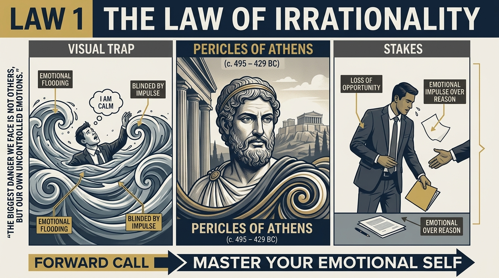
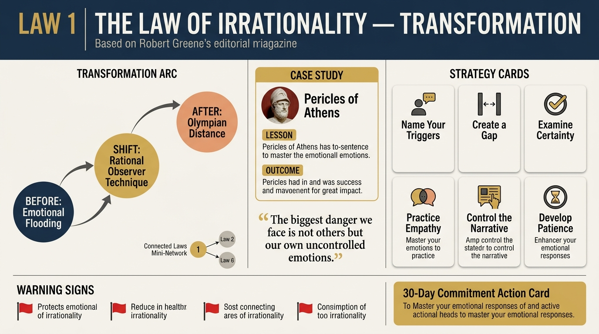

# Law 1: The Law of Irrationality

<audio controls preload="none" style="width:100%" src="../../audio/law-01-irrationality.mp3"></audio>

**Directive: "Master Your Emotional Self"**

---

## Core Concept

The most fundamental law Greene identifies is this: you are not as rational as you think you are. The belief in our own rationality is itself one of the most dangerous illusions humans carry. We experience ourselves as thinking through problems logically, weighing evidence, and arriving at sound conclusions — but beneath this narrative, emotions are doing most of the driving. They evolved hundreds of thousands of years ago as rapid-response survival systems, and they are still operating at that ancient pace, triggering reactions in milliseconds before the rational mind has even registered what is happening.

Greene frames the rational and emotional selves as two distinct entities that share one mind. The emotional self is older, faster, and in most circumstances more powerful. It evolved to respond to immediate threats and immediate rewards, and it has a vested interest in confirming what we already believe, protecting our self-image, and maintaining our tribal affiliations. What it does not have is any particular interest in truth, long-term consequence, or accurate perception of other people. When it takes the wheel — which is far more often than we admit — it distorts everything it touches.

The key mechanism Greene identifies is that the emotional self does not announce itself. It does not say "I am now making you irrational." Instead, it generates emotions that feel like information: this person seems untrustworthy, this plan feels right, this group is clearly wrong. We experience these feelings as perceptions of reality rather than as the distortions they often are. This is what makes the law so insidious — we confuse emotional reactivity with intuition, confirmation bias with good judgment, tribal loyalty with principle.

Greene's ultimate argument is that genuine rationality — what he calls "high-grade rationality" — is among the rarest and most valuable human capacities. It is not the default. It must be actively cultivated through systematic self-observation, specific cognitive practices, and the kind of honest self-examination that most people find deeply uncomfortable. The person who achieves even partial mastery of this law gains an enormous strategic and personal advantage over the vast majority who remain captured by their emotional selves.

## The Human Weakness

Greene identifies a taxonomy of emotional biases that operate as predictable traps. Confirmation bias leads us to seek out and remember information that confirms what we already believe, and to dismiss, distort, or simply not notice information that challenges it. Conviction bias makes us mistake the intensity of our feelings for evidence of our correctness — we assume that because something feels powerfully true, it must be true. Appearance bias leads us to judge people and situations by surface features rather than underlying reality. Group bias causes us to adopt the beliefs and emotional reactions of whatever tribe we belong to, because belonging feels essential to survival. Blame bias makes us locate the source of our problems outside ourselves rather than examining our own contribution.

What makes these biases particularly destructive is that they compound. A leader who is emotionally reactive will make decisions that are subtly or grossly distorted, and because they do not examine their emotional state, they will never understand why outcomes keep diverging from their intentions. They will attribute failures to bad luck, to enemies, to circumstances — never to the distorted perception that produced poor decisions. Each failure that is not examined produces another cycle of the same mistake.

The emotional hijack also operates at the level of social contagion. Emotions are communicable — other people's fear, anger, and excitement are literally contagious, transmitted through mirror neurons and social feedback loops. A group in an emotionally activated state will collectively abandon reasoning it would never individually abandon. Greene shows through historical examples how entire armies, civilizations, and markets have made catastrophically irrational decisions because emotional contagion overcame individual judgment. The person who does not actively guard against this contagion will be swept into collective irrationality without ever realizing it happened.

## Historical Figure: Pericles of Athens (5th Century BCE)

Pericles stands as Greene's exemplar of what high-grade rationality looks like in practice. As the dominant political leader of Athens during its golden age, Pericles operated in an environment of extraordinary emotional turbulence — democratic assemblies driven by rhetoric and passion, enemies pressing military threats, demagogues competing for popular favor. In this environment, his defining characteristic was a quality Greene describes as "Olympian distance" — the ability to remain calm, measured, and clear-eyed when everyone around him was reacting emotionally.

Greene traces how Pericles cultivated this disposition deliberately. He studied philosophy under Anaxagoras, who taught him to approach all phenomena — including human behavior — with rational inquiry rather than emotional reaction. This training gave Pericles a habit of pausing before responding, of examining his own reactions for bias, and of seeking out contrary evidence before committing to a course of action. When Athenians panicked after military setbacks, Pericles could hold the longer strategic view. When demagogues attacked him personally, he refused to be goaded into reactive responses that would have served his enemies' purposes.

The contrast Greene draws is with the Athenians after Pericles's death. Without his steadying rational presence, they fell prey to the seductive rhetoric of demagogues, voted for the disastrous Sicilian Expedition — one of the largest military failures of antiquity — based on excitement and greed rather than strategic calculation. They made exactly the kinds of emotionally-driven decisions that Pericles had spent his career preventing. The same citizens who had been held to rationality by his leadership descended into the collective irrationality that ultimately destroyed their empire.

Greene uses this contrast to make the point that rationality is not just a personal virtue but a social force. A leader who embodies it can elevate the reasoning of those around them; an environment without it tends toward catastrophe. Pericles also demonstrates something crucial: high-grade rationality is not coldness or emotional absence. Pericles was known to feel deeply — but he had developed the capacity to let emotions inform him rather than direct him, to process them rather than be processed by them.

## The Transformation

The shift Greene prescribes is fundamentally a shift in relationship to your own emotional states. Most people experience their emotions as reality — as accurate perceptions of the world. The transformation is to begin experiencing them as events happening inside you, worthy of observation and inquiry, but not automatically trustworthy as guides to action. This requires developing what Greene calls the "Rational Self Observer" — a part of your mind that watches your emotional reactions with curiosity rather than identification.

The practical starting point is the recognition of your emotional "triggers" — the specific situations, people, and events that reliably activate your emotional self and compromise your judgment. These triggers are usually connected to deep biographical patterns: wounds to pride, fears of abandonment, needs for recognition, anxieties about loss of control. When you can identify your triggers in advance, you can prepare for them. When you feel them activating in the moment, you can recognize what is happening and introduce a pause — even a brief one — between stimulus and response. That pause is where rationality lives.

The deeper transformation is the cultivation of a genuine love of truth over ego gratification. Confirmation bias persists because being right feels better than learning something. The person who has made the shift Greene describes has inverted this preference — they find discovering they were wrong more interesting and valuable than the comfort of having their existing beliefs confirmed. This is rare, and it is the foundation of genuine wisdom. Greene argues it is also the foundation of strategic mastery: the person who can accurately see reality — including their own role in creating bad outcomes — will consistently outperform those whose emotional self distorts their perception.

## Practical Guide

- **Name your triggers.** Identify 3-5 specific situations that reliably activate your emotional self — what happens, how it feels, what you do. Write them down. Awareness of the trigger is the beginning of managing it.
- **Create a gap.** When you feel a strong emotional reaction arising, build in a mandatory delay before acting. Do not send the email, make the call, or deliver the response for at least 24 hours when the stakes are high. Emotions metabolize; with time, a clearer view usually emerges.
- **Examine your certainty.** Whenever you feel strongly convinced of something — especially about another person's motives or character — treat the intensity of that conviction as a reason to investigate more carefully, not as evidence you are right.
- **Seek disconfirming evidence.** Before committing to any important decision, actively seek out arguments and evidence against your preferred course of action. Look for people who disagree with you and genuinely listen to their reasoning.
- **Audit your biases periodically.** Set aside regular time — monthly, quarterly — to examine recent decisions and ask: which biases may have been operating? Where did I seek confirming rather than accurate information? Where did group pressure shape my thinking?
- **Distinguish emotion as signal from emotion as directive.** Emotions carry genuine information — anxiety may signal a real risk, anger may point to a real injustice. Practice using them as data points that prompt investigation rather than as commands that prompt immediate action.
- **Study history and biography.** Greene argues that reading deeply in history builds a "reality check" database — you see the patterns of human irrationality play out again and again, which makes them easier to recognize in yourself and others.

## Modern Application

**Workplace conflict:** A manager receives critical feedback about their team's performance from a senior executive. The emotional self triggers immediately — defensiveness, the urge to explain and justify, perhaps anger at being unfairly judged. Under this emotional state, the manager either deflects blame onto their team or doubles down on what they are already doing. The rational response is to treat the feedback as data: Is it accurate? What part of it is accurate? What would changing the pattern require? Most workplace dysfunction is this dynamic playing out at scale.

**Social media and news consumption:** Platforms are architecturally designed to exploit emotional bias — confirming your existing beliefs, triggering outrage, creating tribal in-group/out-group dynamics. The person captured by their emotional self builds an information diet that only confirms what they already believe, growing increasingly certain and increasingly wrong. Applying this law means deliberately seeking out high-quality information that challenges your priors, and treating your own certainty as a warning signal.

**Romantic relationships:** Most relationship conflicts are not really about the presenting issue — the dishes, the schedule, the comment at dinner. They are about emotional triggers connected to old patterns: fear of not being valued, fear of losing control, fear of abandonment. Two people in an emotionally reactive state will escalate a minor conflict into a major one because neither is actually responding to the present situation. The practice of this law in relationships means learning to recognize when you have been triggered, naming it, and pausing before the emotional self creates destruction.

**Investment and business decisions:** Bubbles — financial, real estate, startup — are collective irrationality made visible. Individuals with high intelligence and professional training consistently abandon rational analysis when emotional contagion is strong enough. FOMO, social proof, excitement about novelty, desire to belong to the winning group — these override systematic analysis. Applying Greene's law in investment contexts means developing explicit decision-making processes and pre-committed rules precisely because you know the emotional self will compromise judgment when pressure and excitement are highest.

## Warning Signs

- You are certain about something important — a person's motives, the right course of action, who is to blame — without having seriously examined contrary evidence.
- You feel a strong emotional reaction and move immediately to action without pausing to consider what triggered you and whether your perception is accurate.
- You find yourself constantly agreeing with your own social group and finding the views of outsiders obviously wrong or ridiculous.
- You explain your failures primarily in terms of external factors — bad luck, other people's failings, unfair circumstances — while attributing your successes to your own skill and character.
- You experience people who challenge your views as personally threatening rather than as potentially useful sources of information.
- You notice that you feel most clear and certain about your judgment precisely when the emotional stakes are highest — when you are angry, excited, or afraid.

## Key Quotes

> "The brain that we possess is the accumulated product of millions of years of evolution, and along the way it developed two distinct forms of thinking: the emotional and the rational. The emotional form is ancient, fast, and powerful. The rational form is relatively recent, slow, and in most people, weak."

> "What you want in life, what you think you see in others, what you consider to be rational behavior — all of this is deeply influenced by emotions that you are barely conscious of."

> "The goal is not to be free of emotions but to develop a higher relationship to them — to use them as information, as signals, to let them pass through you without having to act on them immediately."

## Reflection Questions

1. What are your three most reliable emotional triggers — the situations, people, or types of comments that most reliably hijack your judgment? What is the biographical root of each?
2. Think of a significant decision you made in the last year that you now regret. How much of that decision was made from an emotionally activated state? What would a genuinely rational process have looked like?
3. Where in your life are you most susceptible to confirmation bias — where do you most aggressively seek information that confirms what you already believe and avoid information that challenges it?
4. Who in your life currently challenges your views most directly? When did you last genuinely engage with their perspective rather than defending against it?
5. Greene argues that the pursuit of truth must become more emotionally rewarding than the maintenance of comfortable beliefs. How much of your identity is invested in your current beliefs being correct? What would it cost you to discover you were wrong?

## Connected Laws

- [law-06-shortsightedness](law-06-shortsightedness.md) — Both laws describe the dominance of immediate, reactive thinking over longer, clearer judgment; shortsightedness is irrationality applied specifically to time horizon.
- [law-02-narcissism](law-02-narcissism.md) — Narcissism is a specific manifestation of emotional capture: the inability to see beyond the self's emotional needs distorts perception of other people as surely as any other bias.
- [law-04-compulsive-behavior](law-04-compulsive-behavior.md) — Compulsive behavioral patterns are the long-term crystallization of unexamined emotional reactions; irrationality left unaddressed becomes the compulsive script.
