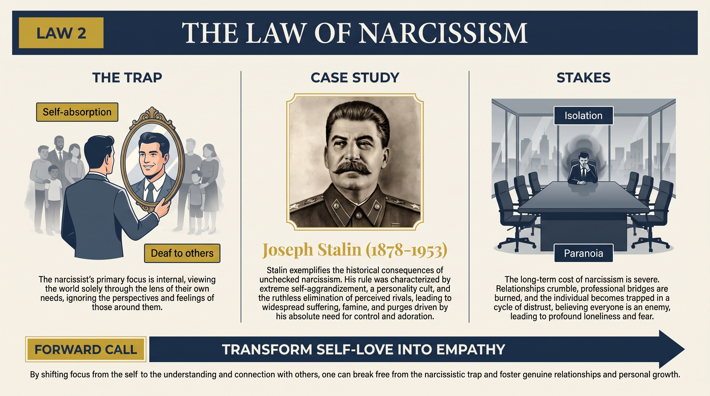
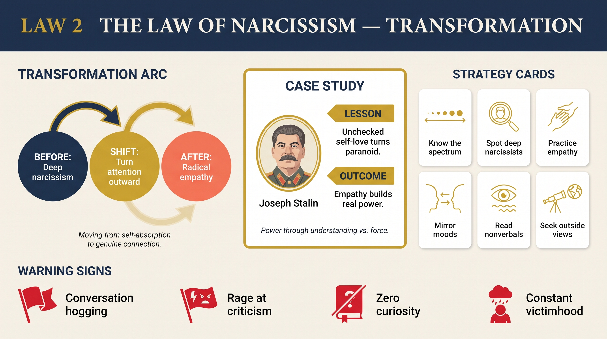

# Law 2: The Law of Narcissism

<audio controls preload="none" style="width:100%" src="../../audio/law-02-narcissism.mp3"></audio>

**Directive: "Transform Self-Love into Empathy"**

---

## Core Concept

Greene's second law begins with a disturbing proposition: narcissism is not a personality disorder reserved for a clinical minority but a fundamental feature of human psychology that every person carries to some degree. We are all, by the nature of consciousness, trapped inside our own perspective — inside our own needs, fears, desires, and narrative. The infant is completely narcissistic by necessity; the project of psychological development is the gradual capacity to extend awareness outward, to perceive others as having an inner life as real and complex as our own. Most people achieve this only partially.

The narcissism spectrum Greene describes runs from healthy self-regard at one end through moderate narcissism in the middle to what he calls "deep narcissism" at the far end. Healthy self-regard is necessary for functioning — without a basic sense of self-worth and personal agency, a person cannot navigate the world. But as narcissism deepens, other people begin to lose their reality. They become instruments for supplying the narcissist with what they need — validation, admiration, compliance — or obstacles to be removed. They stop being people and become props in the narcissist's internal drama.

What Greene makes clear is that this collapse of others' reality is not a conscious choice or a moral failure in the ordinary sense — it is a perceptual deficit. The deep narcissist genuinely cannot see what they cannot see. They interpret every event through the lens of their own needs, attribute every interaction to its meaning for them, and experience any challenge to their self-image not as information but as attack. This perceptual limitation makes them dangerous in positions of power and toxic in intimate relationships, not because they are malicious (though malice can be a symptom) but because they are fundamentally operating in a world of one.

Greene's prescription is the development of genuine empathy — not the performance of empathy, which narcissists can execute brilliantly when it serves them, but the visceral capacity to inhabit another person's perspective, to feel their reality as something separate from and as real as your own. This capacity is what distinguishes the great leaders, the great artists, and the great lovers from those who ultimately destroy what they touch.

## The Human Weakness

The core trap of narcissism is that it feels like clarity. The narcissist does not experience themselves as self-absorbed — they experience themselves as perceptive, realistic, and appropriately focused on what matters. Their own needs feel urgent and legitimate; others' needs feel like impositions or noise. Their own perspective feels like common sense; others' perspectives feel like irrationality or manipulation. This is the genius of the trap: it mimics the very qualities it destroys.

Greene is particularly precise about the mechanism of the "narcissistic wound" — the hypersensitivity that drives explosive or disproportionate reactions. Every person has a zone of vulnerability around their self-image, and when something penetrates that zone — a criticism, a perceived slight, a failure — the pain is genuine and intense. For the moderately narcissistic person, this triggers defensiveness, excuse-making, blame-shifting. For the deeply narcissistic person, it can trigger rage, paranoia, and the desire to destroy whoever caused the wound. The reaction is never calibrated to the triggering event because the event is not what the reaction is really about — it is about the foundational anxiety of a self that never became secure.

The social cost of narcissism compounds over time in a predictable pattern. In the short term, narcissists are often compelling — their certainty, energy, and self-focus can look like confidence and leadership. They attract followers and admirers. But the people around them gradually learn that their needs and perspectives will never truly register, that the relationship is fundamentally extractive rather than reciprocal, and that proximity to the narcissist is increasingly costly to their own wellbeing. The narcissist, unable to understand why relationships keep failing, typically concludes that others are the problem — unworthy, disloyal, manipulative — and the pattern repeats. The isolation that deep narcissism ultimately produces is both its punishment and its final cruelty.

## Historical Figure: Joseph Stalin (Soviet Union, 1920s–1953)

Greene uses Stalin as the most devastating case study in what deep narcissism produces when combined with absolute power. Stalin's pathology was not simply cruelty — many cruel leaders have operated without the specific dynamics Greene traces. Stalin's defining characteristic was his inability to experience other people as genuinely real. They existed for him as instruments, threats, or potential threats. Even those closest to him — his inner circle, his family — were perceived through the lens of their usefulness and their danger to him. The emotional texture of genuine human connection was simply absent.

Greene traces this pattern to Stalin's early biography: a brutal, alcoholic father, a domineering mother, humiliation by noble-born peers during his seminary years, repeated betrayals during the underground revolutionary period. These experiences did not create empathy for the suffering of others — they created a fortified self that could not afford to feel others' reality because vulnerability felt lethal. The revolutionary ideology provided a framework for this narcissism: the individual was always subordinate to the historical mission, which meant Stalin's needs and judgments were always, by definition, historically correct.

The operational consequences were catastrophic. Stalin's paranoia — itself a manifestation of his inability to see others as having genuine motivations he might actually understand — produced the Great Purge, in which he eliminated virtually the entire first generation of Soviet leadership, millions of people in labor camps, famines deliberately engineered to break resistant populations, and military purges that left the Red Army crippled at the outset of World War Two. These decisions were not strategic errors in the ordinary sense — they were the outputs of a mind that could not process human reality. When he imagined threats, he destroyed real people. When he needed validation, he eliminated those who might withhold it. The state became a mechanism for managing his own internal emotional states.

Greene contrasts Stalin with Abraham Lincoln, who had every reason to develop in the same direction — poverty, social humiliation, repeated political failures, personal tragedy, and a personality prone to depression. What Lincoln developed instead was the capacity to transform his own suffering into a lens through which he could understand others' suffering. He became genuinely porous to the experience of people around him — soldiers, freed slaves, political enemies, grieving mothers. This porousness, Greene argues, was the source of his moral and strategic greatness. It allowed him to see reality more accurately, to make decisions that accounted for the full complexity of human experience, and to lead with an authority that had nothing to do with domination.

## The Transformation

The transformation Greene describes requires confronting the hardest truth about narcissism: that the self you have built, the narrative you carry about who you are and how the world relates to you, is distorted. This is not a comfortable recognition, and the emotional self will resist it strenuously. But the beginning of genuine empathy is the acknowledgment that other people's inner lives are as vivid, as complex, and as real as your own — and that most of the time, you are not actually perceiving them at all. You are perceiving your projection of them.

The practical shift Greene prescribes is a deliberate reorientation of attention during interactions. Instead of monitoring how others are responding to you — which is the natural narcissistic posture — you train yourself to genuinely focus on the other person: what is their emotional state? What are they not saying? What do they actually need in this moment, as opposed to what you need them to want? This sounds simple but requires sustained effort, because the pull back toward self-focus is constant and largely unconscious.

Deeper still, Greene argues for what he calls developing a "reality lens" about yourself — the willingness to examine your own behavior honestly, to recognize the patterns through which your unmet needs damage your relationships, and to begin meeting those needs in ways that do not require exploitation of others. This is ultimately a project of building the secure self that deep narcissism never managed to develop — a self that does not need constant external validation because it has developed a stable internal foundation. The paradox is that the person who has made this transformation becomes genuinely more compelling and more influential than the narcissist, because others can feel that they are truly seen.

## Practical Guide

- **Practice the "other person's inner monologue" exercise.** After any significant interaction, spend 5 minutes reconstructing the experience from the other person's perspective. What were they feeling? What were they worried about? What did they want? Do this as concretely and generously as possible.
- **Identify your narcissistic wounds.** Note which criticisms, slights, or situations produce reactions that feel disproportionate — a flash of rage, deep shame, sudden desire to withdraw or attack. These are your wound zones, and understanding them is the first step to stopping them from running your behavior.
- **Distinguish deep narcissists from ordinary difficult people.** Deep narcissists have specific markers: they cannot genuinely acknowledge wrongdoing (only tactical apologies), they respond to others' suffering with indifference or irritation, their empathy turns on and off based on whether it serves them, and they circle back to the same self-serving narrative regardless of evidence. Once identified, manage distance carefully.
- **Create a "listening ledger."** Track whether conversations with key people in your life are genuinely reciprocal — are you as interested in their experience as in sharing your own? Are you asking real questions and actually listening to answers? Imbalance here is diagnostic.
- **Seek out experiences that force perspective-taking.** Volunteer work, deep friendships across lines of difference, reading literature that inhabits radically different lives — all of these build the empathic muscle that narcissism atrophies.
- **When you feel the urge to validate yourself through others, pause.** The craving for admiration, agreement, or validation is itself diagnostic. Ask: what need is this craving trying to meet? Can that need be met in a way that does not require another person to perform it?
- **Study the contrast figures in your own life.** Think of the people you have most admired for their wisdom and effectiveness. What is their relationship to other people — genuinely curious, genuinely present? This gives you a model to move toward.

## Modern Application

**Leadership and management:** The narcissistic manager is a well-documented organizational pathogen. They extract credit, deflect blame, respond to challenge with retaliation, and gradually build teams of sycophants while driving out the most capable people who refuse to perform subordination. The damage is usually explained as "personality conflict" long after the pattern is obvious. Greene's law suggests that organizations should actively screen for empathic capacity in leaders, and that the behaviors associated with deep narcissism — inability to take genuine feedback, disproportionate reaction to criticism, consistent pattern of blaming others — are predictive of organizational damage.

**Romantic relationships:** The early stages of romantic attachment suppress narcissistic patterns in most people because the other person feels genuinely fascinating and important. As the relationship deepens and the novelty fades, baseline narcissism reasserts itself. Couples who develop genuine mutual empathy — who remain curious about each other's inner lives, who can take the other's perspective during conflict, who can acknowledge their own contribution to dysfunction — sustain connection. Those who cannot gradually experience each other as obstacles to their own needs, and the relationship becomes a zero-sum competition.

**Social media and public persona:** Platforms that optimize for external validation are architecturally narcissism-amplifying. Likes, follower counts, and engagement metrics train the attention to focus constantly on self-presentation and others' response to it. The person who curates their life for external validation is practicing narcissism regardless of their baseline personality, and the practice reinforces the pattern. Greene's law suggests that the most dangerous aspect of these platforms is not their effect on self-esteem but their effect on empathic capacity — the atrophying of genuine interest in others that results from treating all interaction as an opportunity for self-performance.

**Politics and public life:** Greene's comparison of Stalin and Lincoln applies directly to contemporary politics. Leaders who can genuinely inhabit the perspective of those they serve — who are curious about lives different from their own, who can be moved by others' suffering, who experience disagreement as information rather than attack — tend to make better decisions and build more durable coalitions. Leaders whose political activity is primarily a vehicle for self-aggrandizement and narcissistic supply tend toward the authoritarian and the destructive, regardless of their stated ideology.

## Warning Signs

- The person consistently interprets events in terms of what they mean for themselves — even genuinely neutral events are processed through the lens of personal threat or validation.
- They cannot sustain genuine curiosity about others' experience; conversations consistently circle back to themselves.
- When they cause harm to others, they offer explanations rather than apologies — the focus is on making themselves feel better about what happened rather than on the person harmed.
- They experience the success of others in their field as personally threatening rather than inspiring.
- Their empathy is performative and selective — deployed when it serves them, absent when it does not.
- They maintain a persistent narrative of victimhood or exceptionalism (often both simultaneously) that is immune to contrary evidence.

## Key Quotes

> "We are all narcissists; some of us are just more aware of it than others. The key is whether you can transform that self-absorption into something productive — into a genuine curiosity about others, an empathy that is not performance but perception."

> "The deep narcissist has constructed a false self — a performance of greatness, competence, and superiority — because the real self feels hopelessly inadequate. Everything they do is in service of maintaining this performance. Other people exist only as audience."

> "Lincoln had suffered so deeply and so personally that he had the capacity to feel others' suffering as his own. This is the paradox of great empathy: it is usually forged in pain that could just as easily have produced its opposite."

## Reflection Questions

1. Where on the narcissism spectrum do you honestly place yourself, and in which specific domains does your narcissism most reliably distort your perception of others?
2. Think of a relationship that ended badly or became significantly damaged. How much of that outcome was produced by your inability to genuinely see and prioritize the other person's needs and experience?
3. Who in your life do you have the most difficulty seeing as a fully real, complex person — and what does that tell you about your own emotional needs or wounds?
4. When someone criticizes you, what is your first internal response? Track the gap between your first reaction and what you eventually express — that gap is the space where your narcissism operates.
5. Greene argues that genuine empathy requires the willingness to be changed by contact with others' reality. When did someone else's experience genuinely change how you see something? What made you open to it in that moment?

## Connected Laws

- [law-01-irrationality](law-01-irrationality.md) — Narcissism is a specific form of irrationality: the emotional self's investment in its own story systematically distorts perception of others, operating through the same biases Greene identifies in Law 1.
- [law-03-role-playing](law-03-role-playing.md) — Understanding others' masks and performances requires the empathic capacity this law develops; without genuine interest in others' inner reality, you can only read the performance, not the person beneath it.
- [law-04-compulsive-behavior](law-04-compulsive-behavior.md) — Deep narcissism is itself a compulsive pattern, forged in early experience and repeated across contexts; the paranoia and control-seeking that Greene traces in figures like Hughes and Stalin are narcissism's compulsive expression.
