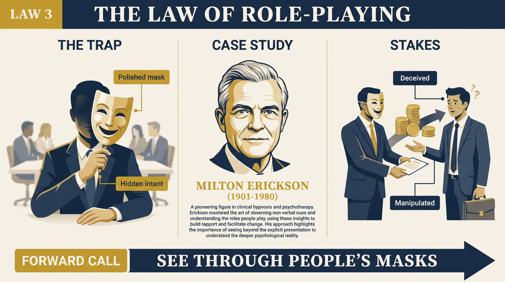
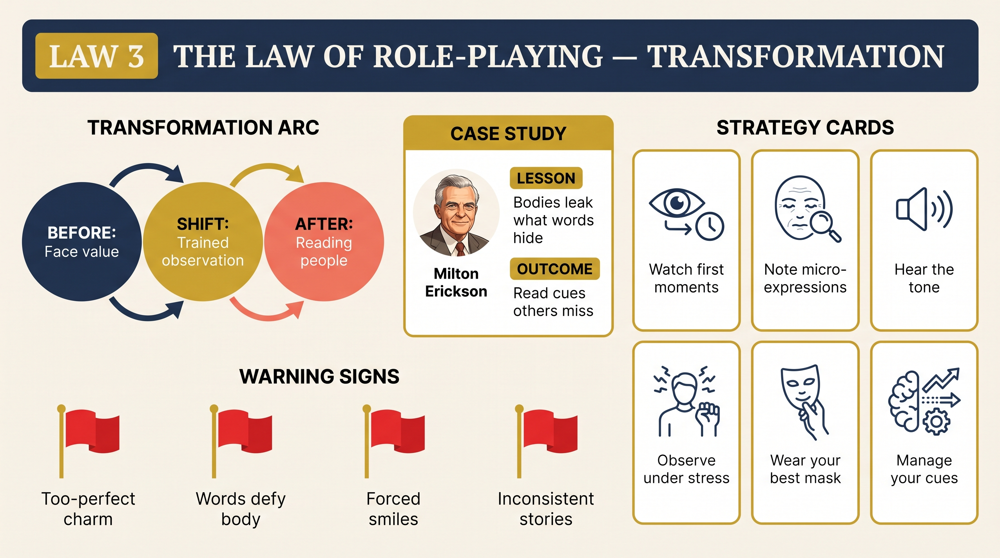

# Law 3: The Law of Role-Playing

<audio controls preload="none" style="width:100%" src="../../audio/law-03-role-playing.mp3"></audio>

**Directive: "See Through People's Masks"**

---

## Core Concept

Human beings are social animals who evolved in groups where reputation and perceived status were often matters of survival. As a result, we developed an extraordinarily sophisticated capacity for social performance — the ability to present a curated version of ourselves to others, managing their impressions, concealing our vulnerabilities, and projecting the qualities that serve our social purposes. This performance is not cynical in most cases; it is simply what social life requires. But it means that the person you encounter in any social interaction is, to a significant degree, a performance rather than a full disclosure.

Greene frames this as the gap between the "social mask" — the persona people consciously project — and the "real character" that lies beneath it. The mask is designed with considerable skill, because humans are instinctively attuned to social approval from childhood. We learn early what qualities to display and what to conceal in different contexts. The professional presents competence and confidence; the friend presents warmth and loyalty; the subordinate presents deference and enthusiasm. None of these presentations is necessarily false in content — but all are selective, managed, and shaped by social calculation, often below the level of conscious awareness.

The critical insight Greene draws from this is that most people read only the performance. They take the projected persona at face value, because the person presenting it intends them to, because reading beneath it requires effort and attention, and because social norms discourage probing beneath the surface. This creates a systematic and exploitable blind spot. The people who cause the most damage in our lives — who betray trust, manipulate outcomes, or deliver consistently disappointing results — almost always signaled their character clearly in advance. We simply were not reading the right signals.

What separates those who see clearly from those who remain captured by the mask is attention — specifically, where you direct your attention. Most people focus on words and explicit self-presentation, which are the most controllable and most managed channels. The real signal lies in everything else: the micro-expressions that flash before the controlled expression settles, the vocal quality when words are confident but tone is strained, the behaviors across time that contradict the stated values, and the patterns that appear across different contexts. Learning to read these signals is the practice this law prescribes.

## The Human Weakness

The core trap Greene identifies is that we are designed to be fooled by performances — or more precisely, we are designed to accept them without examination because doing otherwise is socially costly. Challenging someone's self-presentation feels rude, invasive, and socially aggressive. Social life runs on the mutual fiction that we accept each other's presentations as accurate, and the person who regularly refuses this fiction becomes uncomfortable to be around. So we are trained from childhood to focus on what people say rather than what they reveal, to give the benefit of the doubt, and to feel ashamed of our own moments of suspicion.

This politeness bias creates asymmetric vulnerability. The skilled performer — the person who has learned consciously or unconsciously to curate their presentation — has a structural advantage over the person who takes presentations at face value. Con artists, charismatic manipulators, and dark triad personalities all exploit this asymmetry. They have often spent years honing a performance that triggers trust, admiration, or sympathy, specifically because they know how reliably people respond to the performance rather than investigating the person. The honestly naive person is genuinely disadvantaged in these encounters, not because they are foolish but because they are operating by rules that the other person has abandoned.

The secondary trap is what Greene calls the "emotional transfer" — the tendency to read others' inner states through the lens of our own. When someone presents confidence, we assume they feel confident. When someone expresses enthusiasm, we assume they are genuinely enthusiastic. When someone displays warmth, we assume they feel warm. This is often simply wrong. People present states they do not feel because it serves social purposes, and the person who reads others only through their own emotional experience will consistently miss the gap between presentation and reality. Developing genuine perceptive skill requires breaking this default assumption and learning to look for evidence rather than accepting projection.

## Historical Figure: Milton Erickson (20th Century, United States)

Milton Erickson was one of the most influential figures in the history of psychotherapy, widely credited with transforming hypnotherapy and developing the conversational and observational techniques that later influenced NLP and modern brief therapy. Greene uses him not as a story of manipulation but as the exemplar of what extraordinary perceptual skill looks like when fully developed — what becomes possible when someone trains themselves to read everything a person communicates, not merely the words.

Erickson's path to this skill was forged by physical adversity. Severely dyslexic as a child, partially deaf, and later paralyzed by polio, he was forced to develop alternative pathways for understanding his environment. While confined to bed during his recovery from polio as a teenager, he spent months with nothing to do but observe his family — watching how they moved, how their voices shifted with mood, what their faces expressed when they thought no one was watching. He began to notice massive discrepancies between what people said and what they simultaneously communicated through non-verbal channels: the slight tension in a jaw that contradicted a smile, the way a foot moved when words were expressing calm, the micro-changes in breathing that preceded particular emotional states.

Greene traces how Erickson built this observational practice into the foundation of his therapeutic method. Rather than waiting for patients to verbally describe their inner states — a process inevitably distorted by self-deception, shame, and the desire to present well — he read what their bodies and behavior were already broadcasting. He would notice which physical metaphors a patient used repeatedly, what emotional content leaked through when they were describing supposedly neutral events, where their attention moved involuntarily. This allowed him to understand the real structure of their psychological situation before they had consciously articulated it, and to intervene with precise suggestions calibrated to their actual emotional reality rather than their presented story.

What Greene emphasizes about Erickson is that his skill was not mystical but disciplined — the result of decades of deliberate observation, hypothesis-testing, and refinement. He made his perceptive capacity teachable precisely because it was not intuition in the vague sense but a specific practice of attention. Erickson demonstrates Greene's central claim: that the gap between performance and reality is always present, and that a disciplined observer can consistently navigate it.

## The Transformation

The transformation Greene prescribes is a fundamental reorientation of where you look during social interaction. The default is to focus primarily on what people are saying — the content, the explicit message, the argument or story being presented. The shift is to treat words as only one of many channels, and often the least revealing one, while training your attention on the full bandwidth of human communication.

In practice, this means developing what Greene describes as a "dual awareness" during interactions: one part of your attention engaging normally with the conversation while another part observes from a slight remove — registering the voice quality, the body posture, the micro-expressions, the pace and rhythm of speech, the moments of incongruence between what is being said and how it is being delivered. This dual awareness is a learnable skill, and like all perceptive skills, it develops through practice and through the accumulation of a reference database — patterns you have observed, hypotheses you have formed, and outcomes that have confirmed or disconfirmed them.

The deeper shift is from reading individuals in isolated moments to reading patterns across time and context. Any single behavioral signal is ambiguous — it could mean many things. But patterns across contexts are far more diagnostic. The person who is generous in public and quietly punitive in private, whose stated values never quite match their behavior under pressure, who presents warmth in early interactions that gradually reveals as conditional — these patterns become readable only when you are tracking across time rather than accepting each individual presentation at face value. Greene argues that character is best understood as the pattern that persists across contexts, and that the most important skill in human relations is learning to read that pattern early.

## Practical Guide

- **Develop a baseline for key people.** Before you can read deviation, you need to know what is normal for a specific person: their typical voice, typical pace, typical posture in relaxed conversation. Deviations from baseline — tension, speed changes, vocal strain — are more diagnostic than any single observed behavior.
- **Watch for incongruence between channels.** When someone's words say one thing but their voice, face, or body says another, trust the non-verbal channel. People control their words most carefully; bodies and voices leak far more honestly.
- **Track what people do, not what they say.** Over time, the most reliable signal of character is the pattern of actions, not the stated values or intentions. Ask: what have they actually done, repeatedly, when their behavior has consequences?
- **Notice what people are not saying.** Omissions are often as revealing as statements. The colleague who never mentions a key project, the partner who never asks about your inner life, the leader who never takes personal responsibility — the silence is data.
- **Observe people under pressure.** The mask thins significantly when people are tired, stressed, frustrated, or scared. The version that appears in these moments is typically closer to the real character. Do not take this as the only version — everyone has bad moments — but do take it seriously.
- **Study the emotional transfer you are making.** Before reading someone else, ask: Am I perceiving them or projecting my own emotional state? Am I assuming they feel what I would feel in their position? Correct for this habitually.
- **Read behavioral history across multiple contexts.** How does this person behave with people who can do nothing for them — service workers, subordinates, strangers? How do they behave when they think they are not being observed? These contexts strip the performance most reliably.

## Modern Application

**Hiring and talent assessment:** The interview is the most managed, most performative context most people ever encounter — candidates are specifically trained to present their best version and to answer questions in ways that signal whatever qualities the interviewer seems to value. The mask is at its most deliberate. Skilled interviewers know this and design processes that test behavior under pressure, probe for specific concrete examples rather than general statements, and observe how candidates treat people with whom they interact incidentally — assistants, other candidates, the people who greet them at the door.

**Negotiation and business relationships:** The person across the table from you in a negotiation is presenting a strategic position, not their true one. Learning to read the signals of genuine flexibility versus performance of inflexibility — the moments when their stated position produces microexpressions of discomfort, the topics they move away from too quickly, the offers they dismiss with more force than necessary — gives you a significant structural advantage. Greene's law suggests that the best negotiators are reading the person as much as the proposal.

**Romantic and personal relationships:** The early stages of a relationship are the highest-performance period for most people — everyone is presenting their most appealing version. The trap is treating this performance as the full person. Greene's prescription in this context is patience and attention: time and stress will reveal the character that the early performance conceals. Notice how they treat people who have disappointed them. Notice how they respond when they do not get what they want. Notice whether their behavior toward you changes when they feel secure in the relationship.

**Online and remote interaction:** The digital environment has created new forms of mask-wearing and new challenges to reading through them. Text strips away voice, body, and most non-verbal information, making it easier to project and harder to read. The signals that remain — patterns of response time, what topics they raise versus avoid, the gap between their stated values and their actual behavior in digital contexts — become more important. The person whose online persona is extremely polished should be approached with the same critical attention as any other performance.

## Warning Signs

- Someone's self-description is dramatically at odds with how they have actually behaved over time — the stated values do not match the behavioral record.
- Their empathy and warmth turn on and off too cleanly, appearing reliably when something is needed from you and disappearing when it is not.
- They perform emotions rather than feeling them — their expressions are calibrated to effect rather than arising naturally from what they are describing.
- You notice consistent incongruence between what they say and how they say it — words confident but voice tight, smile present but eyes uninvolved.
- They tell stories about their past that consistently cast them as the reasonable, wronged party — the pattern of victimhood is too consistent to reflect reality accurately.
- When caught in a contradiction between their stated values and their actual behavior, they change the subject, reframe, or attack the questioner rather than genuinely engaging with the discrepancy.

## Key Quotes

> "The mask is not the lie. The mask is the performance people give because social life requires it. The lie is when we forget this and treat the performance as the person."

> "Erickson understood that the real communication is always happening on multiple channels simultaneously, and that words — the channel people control most carefully — are usually the least revealing. Everything else is broadcasting the truth."

> "People signal their character constantly. The difficulty is not that the signals are hidden — it is that reading them requires a form of attention that social norms discourage and that most people have never developed."

## Reflection Questions

1. Think of someone who disappointed or betrayed you in a significant way. Looking back, what signals were present early in the relationship that you either missed or rationalized away? What would it have taken for you to read them accurately at the time?
2. What are the specific aspects of your own social mask — the qualities you consistently project and the qualities you consistently conceal? What does the gap between them tell you about what you fear others seeing?
3. In your most important current relationships — professional and personal — how much do you actually know about the other person's inner life, versus how much are you assuming based on their self-presentation?
4. Greene argues that people who are consistently honest about themselves are genuinely unusual. How do you respond when someone presents a self-image that seems inflated or inconsistent with what you observe? Do you challenge it, accept it politely, or avoid the person?
5. If someone skilled at reading people were observing you across a week of your life — not just your best moments but your moments of stress, frustration, and entitlement — what would they see that your own self-image does not fully account for?

## Connected Laws

- [law-02-narcissism](law-02-narcissism.md) — Empathy is the foundation of reading people accurately; the narcissist cannot truly read others because their attention never genuinely leaves themselves, making them paradoxically bad at social perception despite their social focus.
- [law-04-compulsive-behavior](law-04-compulsive-behavior.md) — The compulsive pattern is what breaks through the mask most clearly; when you read someone's behavioral repetitions across contexts, you are seeing the character beneath the performance.
- [law-05-covetousness](law-05-covetousness.md) — Understanding that you are always performing for others' perception, and that others are performing for yours, is the foundation for the strategic use of mystery and selective revelation that Law 5 prescribes.
