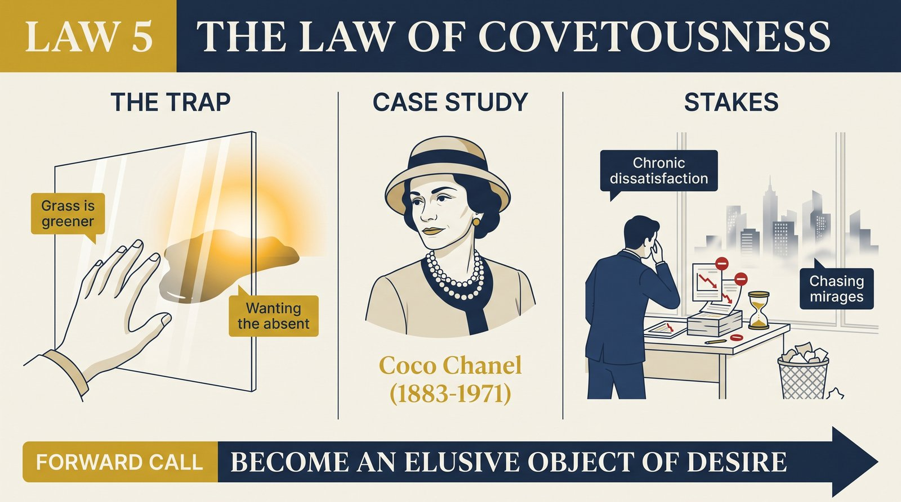
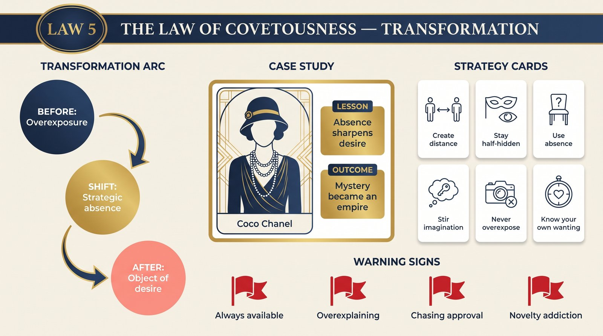

# Law 5: The Law of Covetousness

<audio controls preload="none" style="width:100%" src="../../audio/law-05-covetousness.mp3"></audio>

**Directive: "Become an Elusive Object of Desire"**

---

## Core Concept

At the foundation of this law is a paradox about human desire: we want most intensely what we cannot fully have. The psychological mechanism is well-documented — desire is fueled not by possession but by anticipation, not by certainty but by mystery, not by presence but by strategic absence. The moment we possess something completely, the imagination switches off; there is nothing left to project onto the object, nothing left to pursue, and desire deflates. This is as true of people as it is of objects, as true of ideas as it is of status. What we can fully examine and completely know, we value at its real worth. What remains partially beyond our grasp, we value at the worth our imagination assigns it — which is almost always higher.

Greene argues that most people do the opposite of what desire requires. They make themselves too available, too readable, too eager to please and to be known. They answer every question, fill every silence, show up whenever called, and share their inner life with comprehensive transparency. This feels like connection and generosity — and in some contexts it is — but it systematically destroys the conditions for desire. Familiarity breeds, if not contempt, at minimum the erosion of fascination. The person you can fully understand, whose reactions you can fully predict, whose needs you have completely met, is a person you have stopped finding interesting.

The law applies across domains — personal magnetism, professional reputation, creative work, commercial brands. In all of these contexts, the same dynamic operates: what creates sustained desire is not the complete satisfaction of curiosity but the calibrated frustration of it. The artist whose work rewards sustained attention but never fully yields its meaning creates a relationship of ongoing engagement. The leader whose thinking is always slightly ahead of what they have revealed creates followers who are perpetually curious about what they are thinking. The person whose story is known in outline but not in full detail remains interesting in a way that the completely transparent person does not.

Greene does not prescribe manipulation or deception — the elusiveness he describes is not about lying but about pacing, about choosing what to reveal and when, about understanding that the imagination of others is a resource that must be cultivated rather than immediately exhausted. The person who understands this law works with human psychology as it actually operates rather than against it.

## The Human Weakness

The core trap Greene identifies is the anxiety of not being seen, not being valued, not being chosen — and the way this anxiety drives people to make themselves too available in exactly the circumstances where availability kills desire. When we want someone's attention, we tend to pursue it directly; when we want someone's respect, we tend to demonstrate our qualities aggressively; when we want to be liked, we tend to display our likeability constantly. All of these strategies work in the short run and undermine themselves in the long run, because sustained desire requires the imagination to remain active, and constant availability gives the imagination nothing to do.

There is a related trap in the domain of social media and personal branding: the pressure toward transparency, constant sharing, and the performance of authentic self-revelation. Platforms reward the continuous production of content, and the creator who shares everything, documents every experience, and makes themselves comprehensively visible becomes familiar — and familiarity is desire's enemy. The audience that once found you interesting gradually stops finding you surprising, and attention migrates to whoever is currently maintaining an element of productive mystery. This is not a moral failure of the audience; it is the law of human desire operating exactly as it always has.

A subtler version of the trap is what Greene calls "covetousness in reverse" — the tendency to be consumed by desire for what others have rather than cultivating yourself as an object of desire. Envy and status-anxiety focus attention outward and downward, on what you lack relative to others, rather than inward and upward, on developing the genuine qualities and strategic mystery that make you genuinely coveted. The person captured by reverse covetousness is constantly reacting to others' perceived advantages rather than building their own position. They are being played by the law rather than playing it.

## Historical Figure: Coco Chanel (France, 1883–1971)

Coco Chanel understood the law of desire intuitively and applied it to both her personal life and her creative work with a consistency that amounts to strategic genius. Greene traces how the biographical facts of her life — poverty, illegitimacy, convent upbringing, early abandonment — were not overcome but transformed into mystery. Rather than revealing her origins accurately, she created multiple conflicting versions of her story, each of which was more interesting and mythologically resonant than the mundane truth. The very inconsistency of her self-presentation became a feature: people were fascinated by who she really was precisely because they could never be certain.

In her personal relationships, Chanel was consistently elusive — deeply attractive, intensely present in moments of connection, and then unavailable in ways that frustrated her suitors and intensified their desire. She had significant relationships with wealthy and powerful men — the Duke of Westminster, Igor Stravinsky, Arthur Capel — but she never fully committed, never made herself completely available, and never allowed any single relationship to define her identity. This was not calculated cruelty; it reflected a genuine sense of her own identity as primary and others' desire as something to be cultivated rather than fully satisfied. The men who pursued her were pursuing someone they could not fully possess, and this incompleteness was the engine of desire.

In her design work, the same sensibility operated. Chanel's revolutionary aesthetic was built on selective restraint — the removal of excess, the refusal of decoration for its own sake, the confidence to leave things unfinished in ways that required the wearer's body and personality to complete the design. Her clothes implied more than they stated. They were, as she understood, a form of productive mystery — they invited projection and imagination rather than answering every question the eye could ask. And in her business practice, she understood scarcity as a design principle: the Chanel suit was never so widely available that possession of it became ordinary. Access was curated, the brand remained slightly beyond reach, and this calibrated unavailability sustained desire across decades.

Greene uses Chanel to demonstrate that this law is not passive — it requires active intelligence and a clear understanding of how desire operates. Chanel was not merely lucky in her elusiveness; she was deliberate. She understood, at a level most people never articulate, that the imagination of the other person is the mechanism of desire, and that keeping that imagination actively engaged was the most important thing she could do. Everything else — the design, the social performance, the carefully managed biography — was in service of this understanding.

## The Transformation

The shift Greene prescribes begins with understanding the difference between connection and complete exposure. These are not the same thing, and confusing them — treating full transparency as the path to deep connection — is a fundamental error about how human desire and attachment actually work. Genuine intimacy is possible, but it develops through the gradual revelation of depth rather than through comprehensive disclosure. The relationship that sustains long-term desire is one in which there is always something more to discover, always a layer deeper than the one currently visible.

In practice, the transformation involves developing what Greene calls "presence with reserve" — the quality of being fully engaged in an interaction without revealing everything that is happening in you. This is not pretense; it is the deliberate cultivation of interiority — developing a rich inner life and then revealing it selectively, allowing glimpses rather than full disclosure, creating the experience in others that you are deeper and more interesting than they have yet managed to understand. This quality is itself genuinely attractive, and it is the opposite of the anxious transparency that kills desire.

The strategic dimension of the transformation is learning to create and sustain legitimate desire through what you associate yourself with rather than only through what you explicitly present about yourself. Chanel associated herself with the most compelling aesthetic and social currents of her era; great leaders associate themselves with the most urgent questions their organization faces; great artists associate their work with the deepest concerns of the human experience. The person who is genuinely coveted is usually someone who has made themselves indispensable to desires that are already operating in others — who has positioned themselves at the intersection of what people want and what remains partially unavailable.

## Practical Guide

- **Create selective scarcity.** Be genuinely less available than your natural anxiety about connection would make you. This does not mean disappearing — it means calibrating your presence so that there is always something of you that others are waiting for or seeking rather than fully possessed.
- **Pace your revelation.** In new relationships — professional or personal — reveal your thinking, your history, and your inner life in layers over time rather than all at once. The person who has shared everything by the third meeting has nothing left to offer that discovery; the person who reveals gradually remains interesting as the layers deepen.
- **Develop genuine mystery by developing genuine depth.** Mystery built on withholding without substance collapses under scrutiny. The most sustainable form of elusiveness is having more inner life, more range of thought, more complexity of perspective than you typically reveal. The cultivation of this depth — through reading, thinking, developing genuine expertise — is the foundation of genuine magnetism.
- **Make others pursue rather than pursuing.** In any domain where desire is the relevant currency — romantic attraction, business reputation, professional opportunity — the direction of pursuit matters enormously. When you are the one pursuing, you are positioning the other as the desired object; when they are pursuing you, the positions are reversed. Understanding how to create conditions in which others come to you is more valuable than knowing how to approach them.
- **Associate yourself with what is already desired.** In developing your reputation and persona, deliberately align yourself with quality, with ideas and people that carry genuine prestige and aspiration. Let what you are associated with do work that explicit self-promotion cannot do — desire transfers through association.
- **Use absence strategically.** Periodic genuine withdrawal from social circulation — stepping back from the conversation, becoming less visible and available for a period — often refreshes others' desire for your presence in a way that constant availability prevents. The absence does not have to be long; it has to be real.
- **Audit your transparency.** In your most important relationships, ask whether you have made yourself so comprehensively known that the other person's imagination has gone quiet. If so, what would it mean to introduce genuine surprise — not through deception but through revealing a dimension of yourself that you have not previously shared?

## Modern Application

**Personal branding and creative careers:** The creators who sustain audience engagement across years and decades are almost never the most comprehensively transparent. They develop a recognizable aesthetic or perspective while maintaining productive mystery around their process, their influences, and their personal life. They share enough to create genuine connection while withholding enough to keep the audience's imagination active. The creator who documents every moment of their life and shares every thought in real time has, in essence, consumed themselves as content — there is nothing left for the audience to project onto or wonder about.

**Leadership presence:** The leader whose thinking is always fully disclosed, whose next move is always predictable, and whose opinions on every topic are thoroughly known has forfeited a significant source of influence. The leader who maintains an element of productive mystery — whose judgment is trusted but not fully predictable, whose inner world is engaged but not completely revealed — commands a kind of ongoing attention and deference that the entirely transparent leader does not. This is not about manipulation; it is about understanding that authority is partly a function of how others' imaginations are engaged by you.

**Negotiation and deal-making:** Revealing your position, your needs, and your constraints completely in a negotiation is the most reliable way to weaken your outcome. The effective negotiator maintains productive ambiguity about their bottom line, their alternatives, and the intensity of their desire for the deal. This is not dishonesty — it is the maintenance of the conditions under which the other party's imagination remains engaged with possibilities rather than calculating against known constraints.

**Romantic attraction:** The early dynamics of romantic pursuit are among the clearest illustrations of this law. The person who responds immediately and completely to every expression of interest, who makes themselves entirely available, and who reveals their feelings fully and early typically experiences a reduction in the other's desire rather than a deepening of it. This is counterintuitive — it feels like honesty and openness should reward — but desire requires imagination, and complete availability satisfies imagination before it can deepen into genuine attachment. The practice of this law in romantic contexts means developing the confidence to be genuinely present while not being completely consumed by the other person's approval.

## Warning Signs

- You feel compelled to fill every silence in a conversation or relationship with disclosure, explanation, or demonstration of your qualities — the silence makes you anxious in ways that are worth examining.
- You respond to expressions of interest or desire by immediately escalating availability — becoming easier to reach, more frequently present, more comprehensively accommodating — in ways that reliably decrease rather than deepen the other's engagement.
- You notice that people who know you very well find you less interesting than people who are meeting you for the first time — and that the gap has grown rather than narrowed over time.
- You are consumed by envy of others' status, possessions, or relationships — reverse covetousness that orients you as the desirous subject rather than as a cultivated object of desire.
- You have made yourself so thoroughly available to a key relationship — professional or personal — that you have lost any independent position from which the relationship can be properly evaluated.
- You share your creative or intellectual work before it is ready — before the mystery of the process has produced something genuinely surprising — in ways that satisfy your need for immediate validation but undermine the work's ultimate impact.

## Key Quotes

> "People are not attracted to what they fully understand and completely possess. They are attracted to what engages their imagination — to what remains partially beyond their grasp, partially mysterious, partially unresolved. This is not a flaw in human psychology. It is how desire works."

> "Chanel understood something that most people never articulate: your biography, your persona, your creative output — all of these are materials that can be shaped to engage others' desire. The question is whether you shape them deliberately or let them be shaped by accident."

> "The paradox of becoming coveted is that it requires genuine development, not performance. Sustainable mystery is always backed by real depth. What you are cultivating is not the appearance of substance but the substance itself, selectively revealed."

## Reflection Questions

1. In which important relationships — professional or personal — have you made yourself so thoroughly available that the other person's imagination has gone quiet? What would it look like to recover a genuine element of productive mystery without being manipulative?
2. What aspects of your inner life, your history, or your thinking do you almost never share with anyone? Could any of these be the source of a deeper kind of interest if offered more selectively?
3. Greene argues that cultivating others' desire for your presence requires first being genuinely interesting — developing real depth — rather than performing mystery. What are you doing to develop genuine depth in your thinking, expertise, or perspective?
4. Where in your life are you most captured by reverse covetousness — focused on others' advantages rather than developing yourself as someone others want to be near? What is the emotional driver of that focus?
5. Think of someone whose company you consistently find compelling over a long period of time. What is it about them that sustains your interest? How much of it is related to what they do not fully reveal?

## Connected Laws

- [law-03-role-playing](law-03-role-playing.md) — The mask every person wears is, in Greene's framing, a kind of performance — and understanding that others are always performing enables you to craft your own performance with strategic intelligence rather than naive transparency.
- [law-06-shortsightedness](law-06-shortsightedness.md) — The anxiety that drives over-disclosure and availability is often a short-term reaction to immediate social discomfort; the longer-term view Greene prescribes in Law 6 supports the patience required to cultivate sustained desire rather than seeking immediate approval.
- [law-01-irrationality](law-01-irrationality.md) — Covetousness exploits the emotional self's capacity for imagination and projection; understanding how irrational desire operates is the foundation for working with it strategically rather than being unconsciously manipulated by it.
