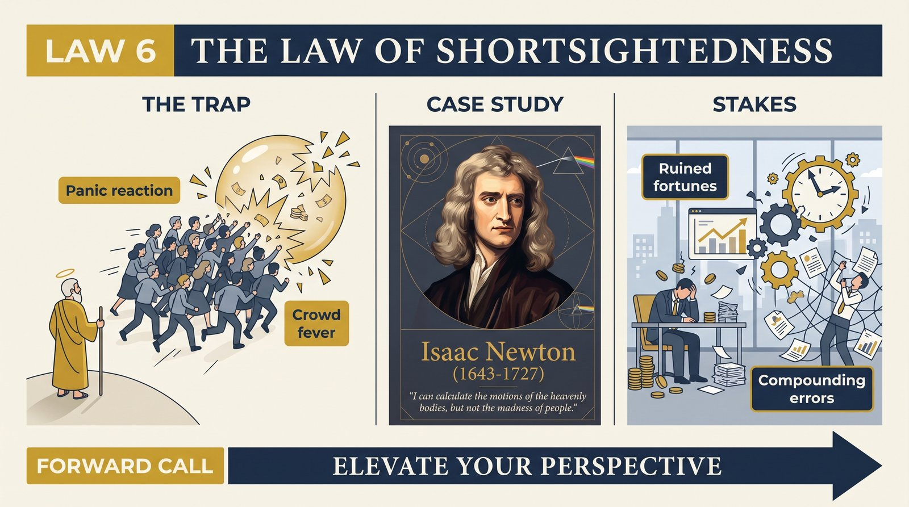
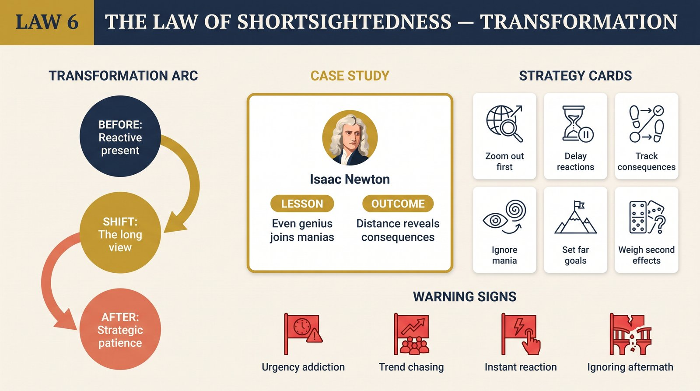

# Law 6: The Law of Shortsightedness

<audio controls preload="none" style="width:100%" src="../../audio/law-06-shortsightedness.mp3"></audio>

**Directive: "Elevate Your Perspective"**

---

## Core Concept

The human brain's default operating mode is calibrated for survival in a world that no longer exists. Our ancestral environment rewarded fast response to immediate threats and immediate opportunities — the animal in the brush, the rival at the waterhole, the food that would not last. The neural architecture built for that world is still running, and it has a strong bias toward the present: what is visible now, what is threatening now, what is rewarding now. Long-term thinking — projecting consequences years into the future, tracing second and third-order effects of current decisions, holding strategic position against tactical opportunity — is cognitively expensive and, in the short run, emotionally unrewarding. So we default to the immediate, consistently and predictably, and we suffer for it at every scale from the personal to the civilizational.

Greene frames this not as stupidity but as a systematic cognitive limitation that operates across the spectrum of intelligence and education. The South Sea Bubble was not populated by fools. Isaac Newton — who lost a fortune in it — was arguably the most brilliant individual of his era. The financial crises and speculative manias that recur across history are not produced by ignorance of long-term consequences; they are produced by the emotional and cognitive mechanisms that override long-term thinking when immediate excitement, social pressure, and fear of being left out are operating at full intensity. The intelligence is there; the architecture for using it under pressure is not.

The practical scope of this law is enormous. It operates in careers — the person who takes the immediate opportunity rather than building toward the strategic position. In relationships — the person who relieves short-term emotional discomfort in ways that create long-term damage. In organizations — the leadership that manages quarterly earnings at the expense of multi-year competitive position. In societies — the political systems that optimize for next election cycle at the expense of generational wellbeing. In each case, the same dynamic: the immediate is vivid, emotionally present, and socially reinforced, while the long-term is abstract, emotionally distant, and easy to defer.

Greene's argument is that the capacity to genuinely think long-term — to hold the distant horizon in mind while navigating the present moment, to make decisions based on strategic trajectory rather than tactical reaction — is one of the scarcest and therefore most valuable human abilities. It is not natural; it must be deliberately cultivated against the grain of the cognitive architecture that is working constantly to pull attention back to the immediate.

## The Human Weakness

The specific trap of this law is not merely that people think short-term but that short-term thinking feels like clarity. When immediate opportunity presents itself, when social excitement is high, when the group is moving in a direction — the emotional state is one of certainty and engagement, not confusion. The South Sea investor in 1720 did not feel uncertain or confused; they felt they were seeing clearly, that the opportunity was real, that the skeptics were missing it. The emotional architecture of shortsightedness is designed to suppress the anxiety that would otherwise accompany abandoning long-term analysis — it produces conviction precisely when uncertainty would be appropriate.

Greene identifies several specific mechanisms that reinforce shortsightedness. Social contagion is perhaps the most powerful: when a group is in an emotionally activated state — excited, fearful, or driven by competitive pressure — individual judgment deteriorates markedly. The mirror neuron system makes others' emotional states literally contagious, and a group in a state of collective excitement creates an emotional environment that is actively hostile to independent long-term analysis. The person who raises concerns about long-term consequences in such a context is not just proposing an alternative view — they are challenging the group's emotional state, which triggers social sanction.

FOMO — the fear of being left out — is a related and ancient mechanism. It is a social survival instinct: the group moving toward something that you are not part of represents a potential threat to your position and future. This mechanism was appropriate when the group moving toward something was a hunting party or a migration and staying behind was genuinely dangerous. In modern speculative markets, it produces exactly the panic-buying at peak prices that destroys fortunes. The mechanism doesn't know the difference, and the emotional urgency it produces is indistinguishable from the urgency produced by a genuine threat. This is why intelligent people consistently make this mistake — not because they lack information but because the emotional system overrides the analytical one.

## Historical Figure: The South Sea Bubble (England, 1720)

The South Sea Bubble remains one of history's most instructive demonstrations of collective shortsightedness. The South Sea Company had been granted a monopoly on trade with South America and the South Pacific in 1711 — a monopoly that proved largely illusory, given that Spain controlled those routes and had no intention of yielding them. But the stock, promoted aggressively and supported by political connections reaching into Parliament and the royal court, began to rise in early 1720 based not on commercial reality but on expectation, narrative, and social excitement.

Greene traces how the bubble's dynamics stripped away long-term rational analysis from virtually everyone it touched. Early investors made spectacular gains; social proof propagated the story that this was an unmissable opportunity; the rising price itself became evidence of the investment's wisdom, because social cognition treats "what others are doing" as information about what is valuable. By mid-1720, buying South Sea stock had become a social phenomenon — duchesses and generals, merchants and servants, all participating in what felt like a historic opportunity. Isaac Newton, who had initially sold his position for a healthy profit, watched his friends continue to make gains and re-entered the market near the peak, eventually losing approximately twenty thousand pounds — the equivalent of several million in modern terms.

What Greene emphasizes about Newton's loss is not that Newton was foolish but that he was human — specifically, that the same emotional mechanisms that override long-term thinking in ordinary people operate in extraordinary people with equal force when social contagion is strong enough and the fear of being excluded is activated. Newton is reported to have said afterward that he could calculate the motion of heavenly bodies but not the madness of people. This is precisely Greene's point: the madness is not random. It is systematic. It is the predictable output of an emotional architecture that prioritizes immediate social belonging and immediate reward over long-term analysis.

The collapse when it came was catastrophic and swift. The stock fell from roughly a thousand pounds per share in August to under a hundred by December. Fortunes accumulated over lifetimes were obliterated in weeks. The social cost extended far beyond individual investors — the wave of bankruptcies disrupted commerce broadly, and the political consequences included investigations, prosecutions, and the resignation of significant figures. What the bubble demonstrates, and what recurs in every subsequent speculative mania, is that the costs of collective shortsightedness are not merely proportional to the original bad decision — they compound, because the same mechanism that produced the mania produces panicked overcorrection in the collapse.

Greene also notes the handful of figures who did not participate in the mania — not because they were smarter in the general sense but because they had developed specific habits of mind that insulated them against the particular mechanism driving collective shortsightedness. They had seen similar patterns before and recognized the signature. They had made explicit commitments to their own reasoning that social pressure could not easily override. They had learned, from study of history or personal experience, that the moment of maximum social enthusiasm is frequently the moment of maximum risk. These figures represent Greene's model for what the transformation of this law looks like in practice.

## The Transformation

The transformation Greene prescribes is the deliberate development of what he calls the "Distant Horizon" mindset — a trained orientation toward longer time horizons that actively competes with the brain's default pull toward the immediate. This is not a passive disposition that some people naturally have; it is a cognitive discipline that must be built through specific practices and maintained through ongoing effort. The goal is not to eliminate responsiveness to the present but to develop the capacity to hold the long view simultaneously, using it as a constant corrective to the distortions that immediate thinking produces.

In practice, this means developing the habit of systematically projecting consequences forward — not just asking "what is the immediate effect of this decision?" but "what does this look like in one year, in five years, in ten?" It means tracing second and third-order effects: if this action produces result A, what does A then produce? Who else is affected, and how will they respond? What new constraints or opportunities does this create? Most decisions are made by people who have only seriously considered first-order effects, and many disasters are the second- and third-order consequences that were entirely predictable but never examined.

The deeper transformation Greene describes is developing what he calls "strategic patience" — the capacity to forego immediate reward or relief in service of a longer-term position. This is genuinely difficult because the emotional cost of foregoing immediate reward is real and present, while the benefit of the long-term position is abstract and future. The practice requires building a specific kind of trust in your own long-term analysis — confidence that the position you are holding toward is real and worth the present cost — which in turn requires having had the experience of being right over longer time horizons. This virtuous cycle takes time to establish, which is one reason that long-term thinking tends to improve with genuine experience and why the young and inexperienced are disproportionately vulnerable to shortsightedness.

## Practical Guide

- **Force yourself to write out the long-term scenario.** Before any significant decision, write out explicitly what the world looks like in 1 year, 3 years, and 5 years if this decision goes as planned — and if it goes wrong. The act of writing forces engagement with the future that mental consideration often avoids.
- **Map second and third-order consequences.** For any important decision, list the first-order effects, then ask what each of those effects produces, then do the same again. Many catastrophic outcomes were predictable as third-order consequences that no one traced because they stopped at the first level.
- **Recognize the social contagion signature.** Widespread excitement, strong group consensus, social pressure toward participation, and the sense that skeptics are missing something obvious — these are the specific conditions under which collective shortsightedness is most likely. Treat them as warning signals that require deliberately increased analytical rigor, not as confirmation that the opportunity is real.
- **Develop pre-commitments against acute shortsightedness.** Before entering volatile, high-excitement environments — financial markets, competitive negotiations, social situations with strong group dynamics — make explicit commitments about your behavior that are difficult to override in the moment. Written investment rules, explicit decision criteria, pre-agreed consultation requirements — these are mechanisms for making your long-term judgment operative when your immediate emotional state would otherwise override it.
- **Study historical analogues.** Every significant type of collective shortsightedness — speculative bubbles, political panics, organizational groupthink — has historical precedents with recognizable signature patterns. Building familiarity with these patterns is the most reliable way to recognize them when they recur in slightly different form.
- **Seek out the unconvinced.** When you find yourself in a situation of strong social consensus, deliberately seek out the people who are skeptical or who have not participated. Their reasoning is the most likely source of the long-term perspective that the group enthusiasm is suppressing.
- **Create a "future self" practice.** Regularly and concretely imagine your life in 10-20 years — what you will have built, what you will have lost, what will matter to you then that you are currently trading away for immediate comfort or reward. Use this future self as a decision-making reference point.

## Modern Application

**Technology and startup culture:** Venture-backed startup culture has structural features that are shortsightedness amplifiers: rapid funding cycles, high social excitement around particular categories, strong FOMO among investors and founders, and metrics that reward growth over sustainability. The result is recurring boom-bust cycles in specific sectors where large amounts of capital and talent are deployed toward businesses that are valued on immediate excitement rather than long-term economic logic. The founders and investors who consistently outperform are typically those who have developed the capacity to maintain long-term thinking precisely when social excitement is working hardest to suppress it.

**Career decision-making:** The most common career mistake Greene's law predicts is the acceptance of an immediately attractive opportunity — higher salary, higher status, more visible role — at the cost of the trajectory toward a genuinely strategic long-term position. The person who takes the impressive job title at the declining company, or who optimizes for current compensation at the cost of the skills and relationships that would compound into major long-term advantage, is making exactly the error this law describes. The correct question is never "is this better than where I am now?" but "where does this path lead in five years, and is that where I want to be?"

**Organizational leadership:** The most destructive form of corporate shortsightedness is the systematic prioritization of quarterly earnings and near-term metrics at the expense of the investments — in people, in technology, in culture, in research — that build long-term competitive position. This is not irrational from the perspective of the individual executive whose compensation and tenure are measured in short cycles; it is entirely rational given their incentive structure. But it is catastrophic for the organizations whose long-term health is traded away. Greene's law suggests that the organizational design problem — creating structures and incentives that reward long-term thinking — is as important as the individual cognitive problem.

**Health and personal finance:** The most statistically significant failures of long-term thinking in ordinary life are in personal health and financial behavior. The decisions that produce the best long-term health outcomes — consistent exercise, quality sleep, nutritional discipline — all require trading immediate comfort and convenience for benefits that will not be felt for years or decades. The same structure governs savings, compound investment returns, and debt management. The gap between knowing what long-term wellbeing requires and actually doing it is enormous, and it is produced by exactly the mechanisms Greene describes: the immediate cost is real and present, the future benefit is abstract and distant, and the emotional architecture systematically discounts the latter in favor of the former.

## Warning Signs

- You are making a significant decision while feeling a strong sense of urgency — a sense that you must decide now, that the opportunity will close, that you cannot afford to think carefully — and that urgency has not been created by genuinely objective constraints.
- You are aware that a group or social environment you are part of is enthusiastically moving toward something and you feel the pull to join without having done your own independent analysis.
- When you try to think about the long-term consequences of your current direction, you find the exercise boring, abstract, or anxiety-producing in ways that make you want to stop thinking about it.
- You are consistently choosing the option that relieves immediate discomfort or provides immediate reward, and deferring the option that requires present cost for future benefit, across multiple domains of your life simultaneously.
- You have made the same category of mistake multiple times — the same type of investment, the same type of relationship, the same type of career decision — without developing a principled analysis of what is driving the pattern.
- You experience people who raise long-term concerns as negative, unambitious, or risk-averse rather than as sources of information that might correct your temporal bias.

## Key Quotes

> "Isaac Newton lost a fortune in the South Sea Bubble — not because he was foolish but because he was human. He could calculate the trajectory of planets, but he could not calculate the trajectory of his own emotional response to watching his neighbors get rich while he stood aside. This is not a story about Newton. It is a story about all of us."

> "The future is always less emotionally real than the present. The threat that might materialize in five years produces a fraction of the urgency of the threat in the room right now. This asymmetry is built into our architecture, and it requires deliberate, systematic effort to correct."

> "The rarest strategic capacity is not intelligence, creativity, or even discipline. It is the ability to genuinely hold the long-term view while navigating the short-term pressures that are trying constantly to pull you off course. This capacity compounds dramatically over time."

## Reflection Questions

1. Think of a significant mistake you have made in the last five years — a decision that produced worse outcomes than you expected. How much of that mistake was driven by short-term thinking: responding to immediate opportunity, pressure, or emotional state rather than to where the trajectory would lead?
2. What is the most important long-term investment you should be making in your own life right now — in your health, skills, relationships, or financial position — that you are consistently deferring in favor of more immediate priorities? What will the cost of this deferral be in ten years?
3. Where in your life are you most vulnerable to social contagion — to having your judgment about what is good or valuable shaped by the excitement or consensus of people around you? How would your behavior change if you removed that social pressure?
4. Greene argues that second and third-order consequences are where most important mistakes live. Take your most significant current decision or direction. What are the second-order consequences — what does the first-order outcome produce? What are the third-order consequences of that?
5. Who in your life most reliably takes the long view — who consistently makes decisions based on trajectory and long-term position rather than immediate reward? What have they sacrificed for this capacity, and what have they gained?

## Connected Laws

- [law-01-irrationality](law-01-irrationality.md) — Shortsightedness is a specific form of irrationality, driven by the same emotional architecture that produces the biases Greene catalogues in Law 1; the immediate emotional reality overrides the analytic capacity to think across time.
- [law-04-compulsive-behavior](law-04-compulsive-behavior.md) — Compulsive patterns are often most visible in their relationship to time: the person running a compulsive script is locked in a perpetual present, repeating the same responses without the long view that would reveal the pattern and its costs.
- [law-05-covetousness](law-05-covetousness.md) — The anxiety that drives shortsighted availability and over-disclosure is an immediate-gratification response; the patience required to cultivate genuine desire is precisely the long-term orientation that this law develops.
