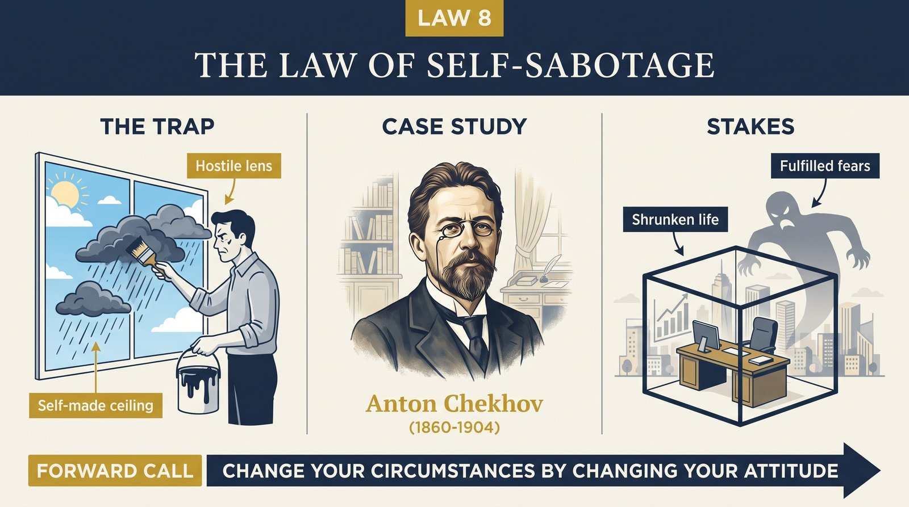
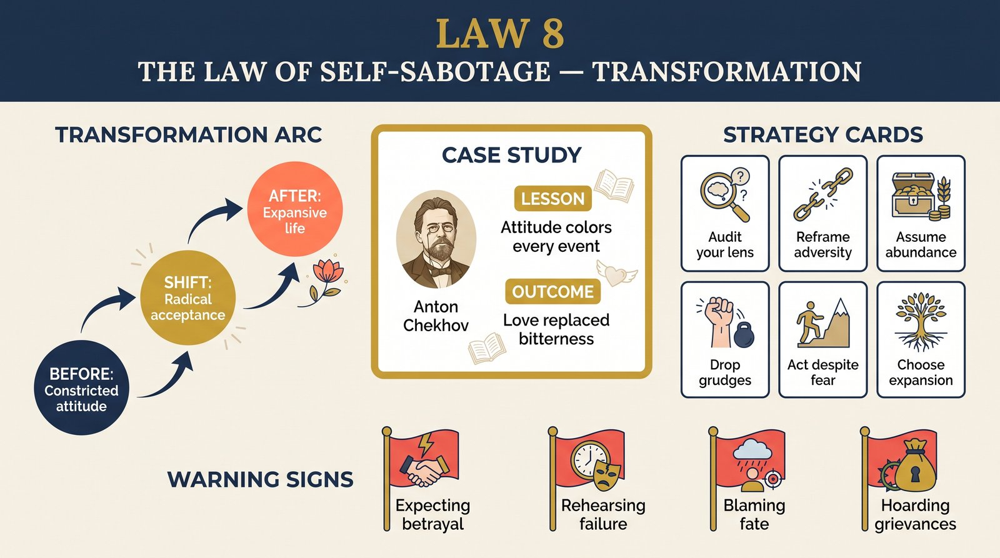

# Law 8: The Law of Self-Sabotage

<audio controls preload="none" style="width:100%" src="../../audio/law-08-self-sabotage.mp3"></audio>

**Directive: "Change Your Circumstances by Changing Your Attitude"**

---

## Core Concept

Most people believe that their attitude is determined by their circumstances: that they feel resentful because of unkind treatment, anxious because of genuine threats, pessimistic because the world has given them reason to be. This is one of the most persistent and costly illusions in human psychology. Greene argues the opposite: attitude precedes and generates circumstances far more than circumstances generate attitude. The emotional lens through which we interpret events — not the events themselves — determines what we see, how others respond to us, what opportunities we notice, and what risks we take. Attitude is not a reaction. It is a cause.

This operates through a set of self-reinforcing feedback loops. A person who approaches interactions with a baseline of suspicion will behave in ways — guardedness, preemptive hostility, second-guessing — that cause others to become guarded and hostile in return, confirming the original suspicion. A person who approaches projects with a fundamental belief in their own inadequacy will avoid challenges, rush when they do engage, and interpret neutral feedback as confirming evidence of failure, ensuring results that match the inner conviction. The "self-fulfilling prophecy" is not a metaphor but a description of how attitude functions as a behavioral and perceptual filter that actively constructs the reality it predicts.

Greene draws a distinction between "attitude" in the pop-psychology sense — positive thinking, affirmations, motivated belief — and what he means by it: the fundamental emotional orientation a person brings to experience. He calls this the "life force," and it operates at a level below conscious thought. It determines which details in an environment catch our attention, which interpretations feel most natural, which risks seem acceptable, and which relationships feel worth investing in. This life force can be expanding — curious, resilient, creative, engaged — or contracting — fearful, resentful, entitled, numb. The direction of this force is the single most important variable in a person's trajectory.

The law is not a claim that attitude alone overcomes all obstacles, or that circumstances are irrelevant. Systemic injustice, poverty, illness, and bad luck are real. But Greene's claim is more specific and more provable: within whatever constraints a person faces, the attitude they bring to those constraints determines almost everything about what they do with them. Two people in identical circumstances, with genuinely different fundamental orientations, will have demonstrably different outcomes — not because of luck, but because attitude is itself a form of agency.

## The Human Weakness

The fundamental human weakness this law addresses is the deep comfort of externalization — the tendency to locate the source of our difficulties entirely outside ourselves. This is comfortable for several reasons: it relieves us of responsibility, it positions us as victims deserving sympathy, and it gives us a story that others can validate and confirm. The tragedy is that it is also completely disempowering. The moment we decide that our circumstances are fully determined by external forces, we have also decided that changing those circumstances requires changing those external forces — something largely beyond our control.

Externalization is also self-reinforcing in a particularly insidious way. A contracting emotional orientation — one rooted in resentment, victimhood, or anxiety — actively generates the experiences that confirm it. The resentful person notices and remembers the injustices done to them, discounts or explains away any good treatment, and behaves in ways that make others less generous and kind toward them. Over time, they accumulate a dense portfolio of evidence that the world is indeed unjust and hostile — evidence that was, in part, manufactured by the orientation that was looking for it. This is not a character flaw. It is a structural feature of how attention and interpretation work in a mind organized around a contracted emotional baseline.

There is also the complication of inheritance. Greene traces how contracting orientations are often absorbed in childhood from parents, cultural environments, or formative experiences of trauma and injustice. They feel innate because they were acquired so early and so completely. The person who grew up in an environment of criticism and emotional unpredictability develops a vigilant, defensive emotional orientation that was, in that environment, adaptive. The tragedy comes when that same orientation is carried into adult environments where it is no longer adaptive — where it creates the very dynamics it was designed to protect against.

## Historical Figure: Anton Chekhov (Russian Literature, 19th–20th Century)

Anton Chekhov's life story is Greene's most extended and intimate example in this section — a genuine case study in the deliberate transformation of a contracted emotional orientation into an expanded one. Chekhov grew up under a tyrannical, abusive father who subjected his children to poverty, religious fanaticism, and unpredictable cruelty. The psychological legacy of this environment was an inherited worldview that Greene describes as deeply pessimistic, self-pitying, and shame-saturated. The young Chekhov had absorbed, without choosing, a contracted emotional orientation: the world was harsh, effort was futile, and suffering was the baseline condition of existence.

What makes Chekhov remarkable — and what makes him Greene's chosen example — is that he recognized this inheritance and undertook a deliberate, sustained effort to examine and dismantle it. Chekhov described this work in his letters with striking clarity: "I have been squeezing the slave out of myself, drop by drop," he wrote to a close friend. He was not describing positive thinking; he was describing a rigorous, often painful examination of the specific emotional reflexes, assumptions, and habitual interpretations he had absorbed from his upbringing. He identified the ways his father's worldview had lodged inside him — the shame, the resentment, the fatalism — and he worked, year by year, to extract them.

The transformation was not achieved through ideology or affirmation but through practice: writing, medicine, travel, and the deliberate cultivation of curiosity about other people. Chekhov's stories are famously non-judgmental — he writes characters across the full spectrum of human behavior with a warmth and precision that comes from genuine curiosity rather than moral categorization. This was not merely an artistic strategy. It was the product of an inner transformation: a man who had every reason to view people through a lens of resentment and suspicion who had instead cultivated an orientation of genuine interest and compassion. And his external circumstances changed accordingly — he became one of the most celebrated writers of his age, developed deep and lasting friendships, and sustained a creative output that continues to influence literature more than a century after his death.

Greene's point is not that Chekhov had an easy path or that the transformation was complete or linear. It was hard, private work, sustained over years. But the direction is clear: he identified the specific emotional orientation he had inherited, recognized how it was contracting his experience and limiting his output, and deliberately cultivated the opposite — not as a performance for others, but as a practical project of psychological self-authorship.

## The Transformation

The transformation required by this law begins with what Greene calls "radical observation" — turning the same quality of attention outward onto the world inward onto your own emotional patterns. Most people, when things go wrong, examine the external situation: what went wrong, who was at fault, what should change. Greene's law asks for a prior inquiry: what is my habitual emotional orientation toward situations like this one? What do I expect before I arrive? What do I notice that confirms that expectation? What do I explain away? This level of self-observation is rare because it is uncomfortable — it means taking responsibility not for specific bad choices but for a pervasive pattern that may underlie many of them.

The next stage is identifying whether your fundamental life force is expanding or contracting. Greene describes the expanding orientation as one of curiosity, resilience, and genuine engagement — an orientation that moves toward challenge, interprets ambiguity as interesting rather than threatening, and processes setback as information. The contracting orientation moves away from challenge, interprets ambiguity as threatening, and processes setback as confirmation of inadequacy or injustice. Most people have a mixture of the two — expanding in some domains, contracting in others. The work is to identify specifically where and how the contraction operates.

Critically, Greene is not describing positive thinking. The transformation is not "believe things will work out" but "approach this as something genuinely worth engaging with, regardless of outcome." It is a shift from outcome-orientation to process-orientation, from defensive self-protection to genuine curiosity. This shift cannot be performed through willpower alone. It requires the kind of sustained practice Chekhov engaged in: examining the origins of the contracted patterns, understanding how they were once adaptive, and deliberately cultivating the specific habits of attention and interpretation that constitute the expanded alternative.

## Practical Guide

- **Map your inherited emotional orientation**: Write out the core beliefs about the world, people, and your own capacities that you absorbed before the age of fifteen. Where did each come from? Which ones are still serving you? Which ones are producing outcomes you don't want?
- **Track the feedback loop for one week**: For seven days, notice how your baseline emotional state before an interaction affects the quality of that interaction. Do this without judgment — simply as data collection. Where are the clearest correlations between your inner orientation and the outer outcome?
- **Identify your specific contracting patterns**: Fear of failure? Resentment of others' success? Entitlement-based passivity? Chronic self-criticism? Name the specific form your contracting orientation takes — general awareness does not produce change; specificity does.
- **Practice expanding moves in low-stakes situations**: Begin with contexts where you are relatively comfortable and practice curiosity, genuine engagement, and resilience. These are skills that can be built through repetition, not insights that arrive fully formed through understanding.
- **Find a model of the expanded orientation**: Identify someone — historical or contemporary — who embodies the expanding life force in a way you find genuinely admirable. Study not just their achievements but their specific emotional habits and interpretive tendencies.
- **Create accountability for the inner shift, not just the outer behavior**: Tell someone you trust that you are working to change a specific emotional pattern. Make the interior work visible and accountable, not just the behavioral results.
- **Practice the Chekhov method**: When you find yourself in a familiar contracted state, ask: "If I approached this with genuine curiosity rather than defensiveness, what would I do differently right now?" Then do that thing.

## Modern Application

**In career plateaus**: The most common explanation for a career plateau is external — the market, the economy, bad bosses, limited opportunity. Greene's law suggests a prior question: what is the emotional orientation you bring to your work? Are you genuinely curious and engaged, or are you performing while privately feeling entitled, resentful, or defeated? Leaders, colleagues, and clients read emotional orientation with remarkable accuracy. A person with a genuinely expanding orientation in a mediocre situation generates more opportunities than a person with a contracting orientation in an excellent situation.

**In chronic relationship conflict**: Couples and families caught in recurring conflict typically analyze the specific issues — money, parenting, time. But the same conflicts recur because the emotional orientation of each party remains constant. The person who approaches intimacy with a baseline of mistrust will find evidence for mistrust regardless of what their partner does. The person who approaches disagreement with a baseline of contempt will frame every difference as confirmation of the other person's inadequacy. Therapy that focuses only on behaviors without examining the underlying orientation achieves limited results.

**In creative and entrepreneurial work**: Creators who approach their work with a contracting orientation — one organized around fear of judgment, comparison with others, or the need for external validation — reliably underperform their talent. The contracted state narrows attention, accelerates work to escape discomfort, and makes honest self-assessment impossible. Expanding orientation — genuine curiosity about the problem, engagement with the process for its own sake, resilience toward rejection — is not a personality trait that some people have and others lack. It is a cultivated habit, and the evidence from creators as different as Chekhov, Darwin, and Toni Morrison suggests it can be deliberately built.

**In health and physical performance**: The research on placebo effects, psychoneuroimmunology, and the mind-body connection is extensive enough that the directional claim is beyond dispute: a person's fundamental emotional orientation affects physiological outcomes including immune function, inflammation, and recovery time. This is not mysticism — it is the downstream consequence of the stress hormones, behavioral choices, and social support that flow from a contracting versus expanding emotional stance.

## Warning Signs

- **You frequently explain your situation using the word "because" followed by external factors**: "I can't do X because of Y" — when Y is always someone else's behavior, a structural situation, or bad luck. Track how often you use this construction and what the Y consistently is.
- **You feel a subtle satisfaction when your predictions of failure come true**: The contracted orientation gains a strange validation from being proven right about how bad things are. If you notice a flicker of "I knew it" satisfaction at others' failures or your own, this is a significant signal.
- **Your closest relationships share and reinforce your grievances**: Social environments where shared resentment is the primary bonding mechanism are contracting environments. They feel supportive but they function as echo chambers for the patterns that are limiting you.
- **You have a well-developed story about why your situation is uniquely difficult**: Every contracted orientation has a story — often partially true — about why the standard advice doesn't apply to them. The very sophistication of the story is a warning sign.
- **You are more comfortable analyzing problems than engaging with them**: Intellectualizing is one of the contracting orientation's most sophisticated defenses. Understanding a pattern is not the same as changing it; if understanding becomes a substitute for changing, the analysis itself is a form of self-sabotage.
- **When things go well, you discount or minimize the success**: Attributing successes to luck or external factors while attributing failures to your own limitations (or vice versa) is a reliable signal of a distorted emotional orientation that will perpetuate the distortion.

## Key Quotes

- Chekhov in a letter to his publisher Suvorin, 1889: "What aristocratic writers take from nature gratis, the less privileged must pay for with their youth. Write a story... about a young man, the son of a serf... who squeezes the slave out of himself, drop by drop."
- Greene on the life force: "The attitude with which we begin any endeavor will determine much of its outcome. We see this over and over in life — people who seem to have everything going for them but who fail to thrive because of a fundamentally contracted orientation."
- "Your emotional life is not something that happens to you. It is something you do, something you practice, day after day, until it becomes the lens through which all experience is filtered." — paraphrased from Greene's synthesis

## Reflection Questions

1. What is the core emotional orientation you bring to your most important life domain (work, relationships, creative life)? Would you describe it as more expanding or more contracting? What specific behaviors reveal this?
2. Which of your current circumstances can you trace, even partially, to an attitude you have been carrying — one that you absorbed rather than chose?
3. Who in your life most clearly embodies an expanding life force? What specific habits and interpretive tendencies characterize how they move through the world?
4. What would you do differently in the next thirty days if you approached your primary challenge with genuine curiosity rather than your habitual defensive or anxious orientation?
5. What is the earliest origin you can identify for your most persistent contracting pattern? What was adaptive about it in that original context, and what is it costing you in the current context?

## Connected Laws

- [law-09-repression](law-09-repression.md) — Repressed shadow material is one of the primary drivers of the contracting orientation. The resentments, fears, and denied impulses that feed self-sabotage are exactly what Law 9 asks you to confront directly. These two laws work as a pair: Law 8 diagnoses the pattern; Law 9 explains its deepest source.
- [law-07-defensiveness](law-07-defensiveness.md) — The defensive resistance described in Law 7 is itself one form of the contracting orientation: when we protect our self-image from challenge, we also protect it from growth. Understanding self-sabotage (Law 8) illuminates why indirect influence (Law 7) is necessary — people in contracted states cannot receive direct challenge.
- [law-11-grandiosity](law-11-grandiosity.md) — Grandiosity is one specific and highly consequential form of the contracting orientation, disguised as its opposite. The grandiose person appears expanding but is actually organized around fear of inadequacy — their inflated self-assessment is a defense against the contracted state beneath it.
