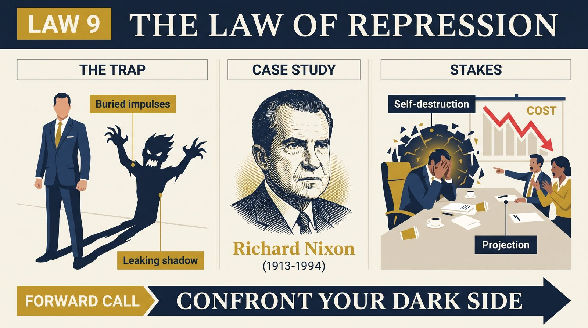
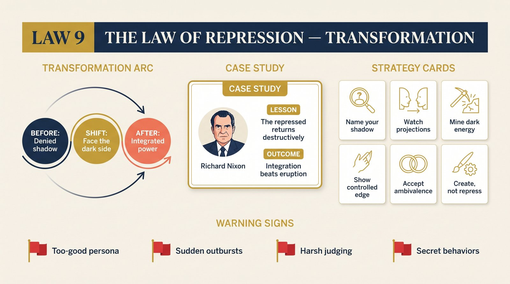

# Law 9: The Law of Repression

<audio controls preload="none" style="width:100%" src="../../audio/law-09-repression.mp3"></audio>

**Directive: "Confront Your Dark Side"**

---

## Core Concept

Every human being has a shadow. This is not a metaphor but a structural psychological reality first described systematically by Carl Jung and elaborated by Greene into one of the most practically consequential of the laws. The shadow is not simply our "bad" side in the moral sense — it is the totality of what the conscious ego finds unacceptable, frightening, or incompatible with its self-image and has therefore pushed into the unconscious. This includes impulses of rage, envy, lust, cowardice, cruelty, and grandiosity — but also, and this is Jung's most counterintuitive insight — genuine strengths and capacities that were suppressed because they were inconvenient, threatening to those around us, or incompatible with an identity we were forced to adopt.

The fundamental mechanism of repression is that the unconscious is not a disposal site. Material pushed there does not disappear — it accumulates pressure. The more vigorously we suppress something, the more energy it gathers, and the more irresistible its eventual expression becomes. Repressed material "returns" — not in its original, clean form, but in distorted, often destructive manifestations: projection (seeing in others what we cannot see in ourselves), sudden irrational behavior that seems out of character, compulsive repetition of damaging patterns, physical symptoms with no organic cause, and in extreme cases, the complete collapse of the persona in acts of violence or disgrace. The pattern is consistent across cases: the stronger the surface persona, the more dangerous the shadow beneath it.

Greene emphasizes that this is not a minor psychological curiosity — it is one of the primary engines of human destructiveness, both personal and historical. The most catastrophic individual failures and many of the worst collective catastrophes can be traced to repressed material erupting through the persona of someone who believed themselves — and perhaps was believed by others — to be in full control. The rigid moralist who commits the crimes he most loudly denounces; the ideological purist who becomes the mirror image of what he claims to oppose; the controlled, disciplined achiever who one day does something that destroys everything — these are not anomalies. They are the law working with absolute consistency.

The antidote Greene draws from Jung is counterintuitive and demanding: not stricter control, not better repression, but integration. The goal is to make the unconscious contents conscious — to look at what is in the shadow, name it with honesty, and bring it into relationship with the ego. This does not mean acting on dark impulses; it means knowing that you have them, understanding their sources, and robbing them of their compulsive, autonomous energy by bringing them into the light of awareness. As Jung formulated it — and as Greene repeatedly returns to — "I'd rather be whole than good."

## The Human Weakness

The weakness this law addresses is the near-universal human desire for a clean, coherent, morally acceptable self-image — and the lengths to which people will go to maintain it against internal evidence to the contrary. This desire is not vanity; it is the ego's fundamental organizing function. The self-image provides continuity, predictability, and social legibility. Without it, people experience what psychologists call "identity diffusion" — a genuinely destabilizing loss of coherent selfhood. So the ego defends itself against internal threats — against impulses, memories, and desires that would render the self-image incoherent — by pushing them below consciousness.

The tragedy of repression is that it feels like virtue. The person doing the repressing does not experience themselves as hiding something — they experience themselves as having transcended it. The man who represses his rage believes he is genuinely calm and patient. The woman who represses her ambition believes she is genuinely humble. The puritanical moralist who represses his sexuality believes he is genuinely uninterested. These sincere self-perceptions make the eventual eruption all the more shocking, both to the person and to everyone around them. It comes without warning — or rather, with many warnings that were visible to everyone except the person generating them.

The secondary weakness is projection — the primary cognitive defense against shadow material. Unable to acknowledge something in ourselves, we become extraordinarily sensitive to its presence in others. We see it everywhere, criticize it loudly, feel genuine moral outrage about it, and pursue it with disproportionate zeal. The homophobic politician, the anti-corruption crusader with hidden dealings, the advocate for emotional openness who shuts down anyone who challenges them — these are not hypocrites in the simple sense. They are people whose projection is so complete that they genuinely do not see the connection. Recognizing projection — in oneself and in others — is one of the most practically useful skills this law provides.

## Historical Figure: Richard Nixon (U.S. Presidency, 20th Century)

Richard Nixon is Greene's central case study for this law, and the choice is deliberate and precise. Nixon was not a simple villain — he was, in many respects, a man of genuine talent, discipline, and political acumen. He understood foreign policy with unusual sophistication, managed complex international relationships with skill, and sustained a public career of remarkable longevity despite repeated setbacks that would have ended lesser politicians. His persona was carefully constructed: the patriot, the fighter for the common man, the disciplined professional who had earned everything through hard work against a privileged establishment that underestimated him.

What Nixon could not acknowledge — what he spent his entire career repressing with increasing desperation — was the rage, the resentment, the deep insecurity, and the hunger for revenge that animated everything beneath the controlled surface. These were not simply personality flaws; they were the emotional residue of a childhood characterized by deprivation, loss, and a profound sense of being looked down upon by those with more privilege, more ease, more natural belonging. Nixon had, in effect, built his entire public persona as a monument to denying these feelings — as proof that he had overcome them, transcended them, defeated them through sheer achievement.

But the shadow does not respond to achievement. The more Nixon succeeded, the more the repressed material accumulated pressure, because success did not resolve the underlying wound — it simply raised the stakes for what would happen when the shadow broke through. And it broke through, consistently, in distorted forms: the enemies lists, the obsessive surveillance of political opponents, the paranoid conviction that shadowy forces were aligned against him, the decision to order crimes that were not strategically necessary and that he must have known, at some level, would destroy him. The Watergate break-in and cover-up were not rational political calculations — no rational calculation would have supported them. They were the return of the repressed: the rage, the resentment, and the conviction that the rules that applied to others did not apply to a man who had suffered and struggled as he had.

Greene's analysis is not a psychological condemnation of Nixon — it is a case study in how repression operates at scale, in real consequences. Nixon's tragedy was that his persona was so rigidly maintained, so thoroughly defended, that when the shadow finally erupted, he had no tools for understanding or managing what was happening. He had spent fifty years telling himself and the world that he did not feel what he felt. By the time Watergate unfolded, he was — in a real psychological sense — the last person who understood what was driving him.

## The Transformation

The transformation this law demands is one of the most difficult in Greene's entire taxonomy, precisely because it requires moving toward what we most want to move away from. The first stage is acknowledging the existence of the shadow — accepting, as a psychological reality rather than a moral accusation, that you contain impulses and desires that your self-image would find unacceptable. This requires a particular quality of intellectual honesty: not self-flagellation (which is itself often a performance for the self-image), but genuine curiosity about what is actually inside.

Greene offers several practical methods for approaching shadow work. The first is examining your strongest emotional reactions — especially those that seem disproportionate to their triggers. Disproportionate reactions are almost always shadow signals: the content being denied is generating the excess charge. If someone's success fills you with a rage or contempt that surprises you in its intensity, the shadow is speaking. If a criticism stings far beyond its objective significance, there is something in the shadow that the criticism touched. Tracking these reactions over time creates a map of the shadow's territory.

The second method is examining the opposite of your public persona. If you present as patient and even-tempered, your shadow likely contains significant rage. If you present as selfless and giving, your shadow likely contains significant entitlement and the desire for recognition. If you present as confident and decisive, your shadow likely contains significant doubt and fear. This is not a perfect inverse — reality is more complex — but it is a useful starting heuristic. The qualities most loudly expressed in the persona are often those most urgently suppressing their opposites.

The goal, as Greene makes explicit, is not to become a different person or to act on shadow impulses. It is to achieve what Jung called the "transcendent function" — a consciousness that can hold the tension between the persona and the shadow without collapsing into either. The person who has genuinely integrated their shadow is paradoxically more stable, not less — because they are no longer spending enormous energy on repression, and they are no longer vulnerable to the unpredictable eruptions of unacknowledged material. They know what they are. And knowing what they are, they can make conscious choices about what to do with it.

## Practical Guide

- **Begin a shadow journal**: For thirty days, record your most disproportionate emotional reactions — irritation that seemed out of scale, envy you felt but did not want to admit, satisfaction at someone's failure, rage that surprised you. Do not analyze immediately; first simply observe and record.
- **Inventory your strongest moral judgments**: The qualities in others that generate the most intense moral indignation are often those most vigorously repressed in yourself. This is not a universal law, but it is common enough to be worth examining. For each strong judgment you hold, ask: where might this exist in me, in a different form?
- **Examine your persona's opposite**: Write out the primary qualities you project publicly. Then write the genuine opposite of each quality. Sit with the possibility that the opposite exists in you, in some form. This is not a confession — it is an exploration.
- **Distinguish between acknowledgment and action**: The goal of shadow work is awareness, not expression. Recognizing that you contain rage does not mean acting on it; it means understanding where it comes from, what triggers it, and how to make conscious choices in its presence rather than being driven unconsciously by it.
- **Work with a trusted other**: Shadow material that is genuinely entrenched often requires a skilled therapist or a very honest friend to surface. We cannot see what we have repressed alone, because the mechanism of repression is precisely the inability to see it. External reflection is often necessary.
- **Study historical shadow eruptions**: Greene's examples (Nixon, others throughout the book) are not just cautionary tales — they are diagnostic templates. Study how the shadow manifested in someone you find instructive. What were the warning signs? What was the persona covering? How did the eruption occur?
- **Practice "whole, not good"**: When you notice yourself performing virtue — doing the right thing in a way that feels more like self-display than genuine ethical choice — ask what you are covering. The performance of goodness often signals shadow pressure beneath it.

## Modern Application

**In organizational leadership**: Leaders with strongly repressed shadows are among the most dangerous people in organizations. Their shadow material manifests as unpredictable rages, paranoid responses to disagreement, sudden betrayals of people who had been allies, and catastrophic decisions that seem inexplicable from the outside. The warning signs are consistent: rigid self-righteousness, extreme sensitivity to perceived disrespect, disproportionate reactions to minor challenges to authority. Organizations benefit enormously from structures that give leaders honest feedback — not as a management nicety but as a mechanism for preventing shadow eruption at scale.

**In intimate relationships**: The most persistent conflicts in long-term partnerships are almost always partially driven by shadow material. The partner who cannot apologize is often covering a deep shame they cannot acknowledge. The partner who becomes explosively angry over small infractions is often expressing accumulated material that cannot be expressed in its original form. Couples therapy that does not address the shadow — that focuses only on communication techniques and behavioral agreements — achieves limited results because the underlying source of the conflict remains untouched.

**In creative work**: Many of the most powerful creative works emerge from artists who have done genuine shadow work — who can access and channel their darker material into form rather than repressing it. Chekhov (from Law 8), Dostoevsky, and many other major artists wrote characters whose darkness is credible precisely because it came from genuine self-knowledge. Conversely, creative work that is relentlessly positive, morally simple, or emotionally sanitized often rings false — it has the quality of repression, of material being avoided rather than engaged.

**In public and political life**: Greene's Nixon analysis generalizes. Political leaders who operate primarily from repressed material — whose public personas are elaborate defenses against acknowledged inner realities — pose a particular risk to the people and institutions around them. The warning signs are the same as in personal life, simply at larger scale: disproportionate rage at critics, paranoia about opposition, sudden breaks from stated principles, an inability to tolerate genuine accountability.

## Warning Signs

- **You find a particular kind of person intensely, viscerally irritating for reasons you cannot fully explain**: Irrational intensity in a reaction to a type of person or behavior is often a shadow signal. The irritation is recognition.
- **You frequently catch yourself performing virtue in contexts where no one is watching**: If you feel the need to narrate your own moral correctness to yourself, something is being covered.
- **People who know you well describe recurring "out of character" episodes that you minimize or explain away**: The people closest to us often see our shadow eruptions more clearly than we do. Repeated accounts of "you're not yourself when X" deserve serious attention, not defensive dismissal.
- **Your strongest moral campaigns involve qualities you feel absolutely certain you do not possess**: Absolute certainty about our own virtue in any domain is a warning sign. The shadow is most active where the certainty is most complete.
- **You are more frightened of therapy or honest self-examination than you can rationally account for**: Resistance to the process of looking inward is proportional to what is being avoided. If the idea of genuine self-examination produces anxiety disproportionate to any realistic threat, the shadow is protecting itself.
- **Your worst behaviors emerge in private contexts where accountability is low**: Shadow material surfaces when the persona does not need to be maintained. If your behavior changes significantly when no one important is watching, you are experiencing the gap between persona and shadow.

## Key Quotes

- Carl Jung, as paraphrased by Greene: "I would rather be whole than good." This encapsulates the entire law — the willingness to acknowledge complexity and darkness in oneself rather than maintaining a clean but false self-image.
- Greene on Nixon: "He could not see the shadow that drove him, because seeing it would have required dismantling the persona that had sustained him for fifty years. The shadow did not care. It drove him anyway."
- "The unconscious is not a basement where things are safely stored. It is a furnace where pressure accumulates. Repress long enough and hard enough and the release will not be chosen — it will simply happen." — paraphrased from Greene's synthesis of Jungian theory in *The Laws of Human Nature*

## Reflection Questions

1. What is the quality or impulse in yourself that you most consistently deny or explain away when you notice evidence of it? What would it mean to acknowledge it directly?
2. Think of a person or type of person who generates intense, seemingly disproportionate irritation or moral indignation in you. What specific quality is triggering this reaction, and where might that quality live in you in a different form?
3. What is the characteristic behavior or attitude that your persona most loudly expresses? What is the genuine opposite of that quality? How might the opposite exist in your shadow?
4. Have you ever experienced a "shadow eruption" — a moment when you did or said something that surprised you in its darkness or destructiveness? What preceded it? What was accumulating beneath the surface?
5. What would it cost you, practically and in terms of self-image, to acknowledge the shadow material you most strongly resist? And what might you gain from that acknowledgment?

## Connected Laws

- [law-08-self-sabotage](law-08-self-sabotage.md) — The contracting emotional orientation described in Law 8 is often powered by shadow material: unacknowledged resentments, denied fears, and repressed impulses that drain energy and distort perception. The two laws work as a diagnostic pair — Law 8 identifies the pattern; Law 9 reveals the underlying mechanism.
- [law-10-envy](law-10-envy.md) — Envy is one of the shadow's most common manifestations. Because envy is so universally denied — no one wants to admit feeling it — it operates almost entirely from the unconscious, expressing itself as criticism, moral outrage, and inexplicable hostility. Law 9's shadow framework provides the deepest explanation for why envy is so difficult to detect and acknowledge.
- [law-12-gender-rigidity](law-12-gender-rigidity.md) — The rigid masculine and feminine roles described in Law 12 are maintained in part through repression: the qualities of the suppressed gender pole are pushed into the shadow, where they accumulate pressure and express themselves in distorted forms. A man who has repressed all empathy may find it erupting as sentimentality or emotional manipulation; a woman who has repressed all assertiveness may find it erupting as passive aggression.
