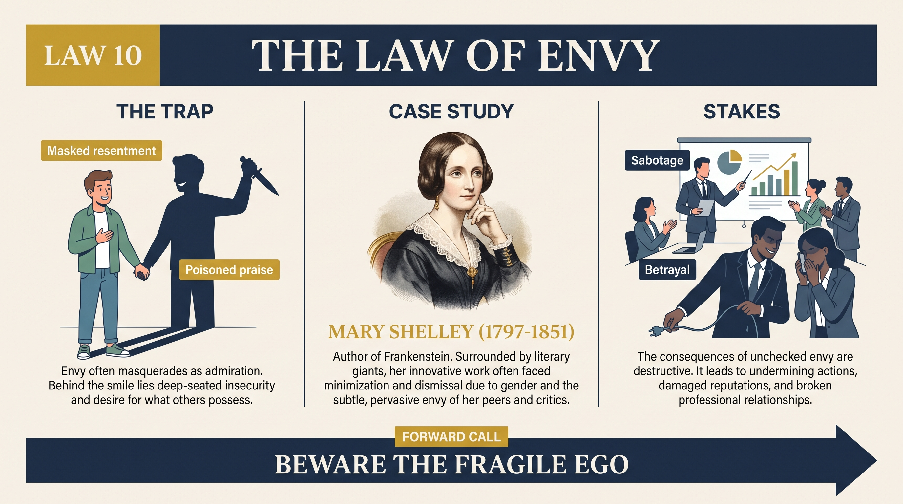
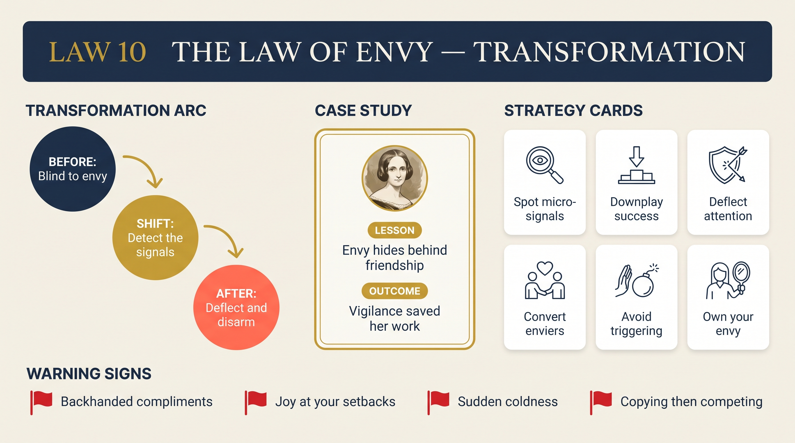

# Law 10: The Law of Envy

<audio controls preload="none" style="width:100%" src="../../audio/law-10-envy.mp3"></audio>

**Directive: "Beware the Fragile Ego"**

---

## Core Concept

Of all the emotions human beings experience, envy is the one most consistently lied about, to others and to ourselves. People will freely admit to anger, sadness, fear, even shame — but envy carries a unique stigma that makes it almost impossible to acknowledge. To envy is to feel that someone else's advantage diminishes you; it implies that you believe you deserved what they have and did not receive it; it confesses a fragile ego rather than a strong one. These implications are humiliating, and so the experience of envy is immediately translated into something else: moral criticism, competitive contempt, cold indifference, or sudden hostility that seems to have no clear cause. The emotion is real; its label is always something more acceptable.

Greene's central insight about envy is that it is triggered not by great distance but by proximity and specific comparison. We do not envy celebrities or historical figures in the consuming, dangerous way we envy the colleague in the next office, the sibling who has more recognition, the friend whose romantic life seems richer, the peer who published first. Envy requires a sense of similarity and competition — the feeling that we are in the same arena and that the other person has what we ought to have. This is why envy intensifies as people get closer to their goals: the would-be writer does not envy an established master the way they envy another unpublished writer who just got their first book deal. The advantage feels simultaneously more real and more arbitrary.

The social danger of envy is that envious actors are the most destructive precisely because they are the most hidden. A person operating from open hostility can be managed; their motives are legible. A person operating from envy while presenting as a supporter, collaborator, or admirer is far more dangerous. They work to undermine while appearing to help; they celebrate failures with a warmth they never brought to successes; they plant doubts in the minds of others while maintaining a face of loyal concern. Greene documents how many of the most damaging betrayals in creative, political, and personal life were driven not by obvious enemies but by people whose envy was invisible even to themselves.

The law has two directions: recognizing envy in others (defensive awareness) and recognizing it in yourself (inner honesty). Greene argues that both are essential, and that both require the same fundamental skill: the willingness to name envy as envy, without the usual disguises. Once it is named, it loses much of its autonomous destructive power. The emotion that cannot be acknowledged cannot be managed. The emotion that is seen clearly can be understood, redirected, or simply sat with until it passes — because envy, unlike some other drives, genuinely does pass when the comparison that triggered it is no longer active.

## The Human Weakness

The weakness envy exploits is the universally fragile human ego — the part of every person that measures its worth not in absolute terms but in relation to others in its comparison group. This relational self-assessment is not a pathology; it is built into the social animal. Status matters because it determined survival and reproduction throughout evolutionary history. The problem comes when this comparative sensitivity is combined with modern conditions: unprecedented visibility into others' achievements through social media and professional networks, highly competitive environments where tiny differences in outcome produce dramatically different results, and a cultural emphasis on individual meritocracy that makes every gap in outcome feel like a personal verdict.

The secondary weakness is the near-impossibility of self-diagnosis. Because envy immediately converts itself into other emotions — criticism, contempt, sudden cold, competitive urgency — most people experience it as something other than envy. The person whose closest friend gets a major recognition may experience this as suddenly noticing previously-unnoticed flaws in the friend's work, as a new conviction that the recognition was politically motivated, or as a puzzling desire to spend less time with someone they genuinely like. These are all forms of envy, but they feel like independent judgments. The self-deception is complete and sincere.

Greene also points to the way envy masquerades as justice. Because envy is almost always accompanied by the belief that the advantage is undeserved — that we merited it more — it tends to dress itself in the language of fairness and legitimate critique. The envious critic does not say "I am angry that they have what I wanted." They say "Their success is unearned, their work is overrated, the system that rewarded them is corrupt." These claims may sometimes be true; they are not reliable guides to reality when they emerge from envy, because envy cherry-picks evidence with ruthless efficiency. The envious person is not lying — they genuinely believe the critique. But the critique was generated by the envy, not the other way around.

## Historical Figure: Joseph and His Brothers (Biblical Narrative, Archetypal)

Greene uses the story of Joseph from Genesis as the archetypal envy narrative — a case study whose power comes not from historical specificity but from psychological universality. The story has circulated for millennia precisely because it captures the mechanics of envy with unusual precision, and Greene treats it as a diagnostic template.

Joseph is his father Jacob's favored son — visibly, demonstrably, extravagantly favored. Jacob gives him the famous coat of many colors; he gives Joseph special status among his brothers. Joseph compounds this by sharing dreams in which his brothers bow to him — visions that may be genuine but which he delivers with a tactlessness that could hardly be better designed to inflame. His brothers are not wicked men; they are men placed in a proximity-and-comparison trap with no good exits. They cannot surpass Joseph in their father's regard; they cannot distance themselves from the comparison; they cannot pretend the gap doesn't exist. Their envy accumulates until it reaches a murderous pressure, and they sell him into slavery.

What makes the story analytically useful is what follows: Joseph's own transformation, his eventual rise in Egypt, and the moment of reunion where his brothers, now the supplicants, bow to him — exactly as the dream predicted. Greene draws several lessons from this arc. First, the envied person often contributes to their own targeting by displaying their advantages too visibly, too early, too tactlessly — not out of cruelty but out of an incomplete understanding of how others experience their good fortune. Second, the enviers are not conscious of what is driving them; they construct rationalizations and act on them sincerely. Third, the way to defuse an envious adversary is not confrontation but demonstration over time — allowing achievement to become undeniable rather than flaunted.

Greene also draws on his secondary example: the social circle of Percy and Mary Shelley, where intellectual intimacy and competitive proximity created a constant, mostly-unacknowledged current of envy that expressed itself in literary criticism, social maneuvering, and the slow erosion of friendships that began as genuine affinities. The lesson in this case is that creative and intellectual communities — where proximity is highest and the stakes of comparison feel most personal — are particularly susceptible to envy's destructive dynamics.

## The Transformation

The transformation this law requires is twofold: developing the ability to recognize envy in yourself, and developing the ability to recognize and manage it in others. Both begin with the same fundamental move: accepting envy as a normal human emotion rather than a shameful aberration, and therefore giving yourself permission to see it clearly rather than immediately converting it into something more acceptable.

For self-recognition, Greene offers a set of diagnostic signals. When a person you genuinely like achieves something and your immediate, unbidden emotional response is something other than gladness, the likelihood of envy is high. When your assessment of someone's work suddenly and sharply deteriorates at exactly the moment they achieve a success, the assessment may be envy in analytical clothing. When you find yourself dwelling on how a particular advantage came to someone — cataloguing the luck, the privilege, the favorable circumstances — while simultaneously having little interest in your own favorable circumstances, envy is the most probable organizing emotion. These signals do not prove envy, but they warrant honest inquiry.

For managing envy in others, the first step is early screening. Greene is direct: before entering deep collaborations, professional partnerships, or close creative relationships, look for envy signals in the other person. Do they speak about colleagues' achievements with genuine warmth, or with a faint but consistent note of critique? Do they take pleasure in others' failures? Is their praise always slightly qualified? These patterns, noticed early, are far more reliable guides than later analysis of specific behaviors. Once a person's envy is activated, their behavior can be rationalized endlessly; the pattern before activation is clearer.

## Practical Guide

- **Track your first emotional response to others' good news**: Before analysis, before context, before you construct a narrative — what do you feel in the first two seconds when a peer achieves something significant? This raw response is diagnostically more reliable than anything that follows it.
- **Notice when your critical assessments change with someone's fortunes**: If your opinion of a person's work, character, or judgment tracks with their external success (getting worse when they succeed, better when they fail), envy is operating as the organizing principle of your assessment.
- **Do not display your advantages prematurely or unnecessarily**: Joseph's error was not having the advantage — it was announcing it before the relationship could absorb it. In competitive environments, visible advantages that are not yet secure or established generate envy without the social legitimacy that established success provides.
- **Distinguish between competitive drive and envy**: Competition can be generative — a genuine desire to match or surpass someone's achievements by raising your own game. Envy is corrosive — a desire for the other person not to have what they have, independent of your own advancement. The former produces energy; the latter produces resentment.
- **Screen collaborators for envy before commitment**: Before deep professional or creative partnership, observe how the person speaks about others in their field who have succeeded. Consistent, low-grade critique with insufficient acknowledgment of others' genuine achievements is a reliable warning sign.
- **Transform envy in yourself by using it as directional information**: Envy is an excellent guide to what you genuinely value and genuinely want. The specific achievement that generates your strongest envy points precisely to what matters most to you. Use that information to clarify your own direction rather than letting it curdle into resentment.
- **Create distance from envy-triggering comparisons when necessary**: The comparison group is not fixed. Deliberately stepping back from the specific arena of comparison — taking a break from professional social media, spending time with people outside your competitive field — reduces the chronic activation of envy in environments where it is always being triggered.

## Modern Application

**In professional teams and creative organizations**: Envy is the primary driver of most team dysfunction that gets diagnosed as something else — communication breakdown, personality conflict, strategic disagreement. The telltale signature is that the conflict intensifies when a team member achieves visible recognition or advancement. High-performing teams with low envy are not those where members are indifferent to each other's achievements — they are those where genuine celebration is possible because members have developed distinct enough roles and identities that comparison feels less zero-sum.

**In social media environments**: The specific social conditions that amplify envy — high visibility into others' curated achievements, continuous proximity-and-comparison dynamics, a format that makes others' advantages perpetually salient — are precisely what social media platforms are designed to produce. The research on social media use and psychological wellbeing consistently finds that passive scrolling (consuming others' content without producing your own) generates the highest levels of envy and associated negative affect. Recognizing this mechanism — and designing your media environment accordingly — is a practical application of this law.

**In mentorship and coaching relationships**: The envy that mentors sometimes feel toward protégés who surpass them is one of the least-discussed and most destructive dynamics in professional development. A mentor who unconsciously envies their student's emerging success will find reasons to qualify their praise, introduce doubts at critical moments, or withdraw exactly when the student needs support. Students who recognize this pattern — who can see the envy behind the suddenly cool mentor — are better positioned to navigate it without either confronting it directly (which will generate denial and hostility) or being destroyed by it.

**In close personal relationships**: Envy between close friends — particularly friends who are in similar life stages and have similar ambitions — is extremely common and almost never discussed. The friendship that begins to feel slightly strained, in which a previously warm person becomes slightly more critical or slightly less present, is often a friendship in which one person's advance has activated the other's envy. Addressing this directly requires a quality of honesty and safety that few friendships can sustain; but recognizing it, even privately, allows the affected party to adjust their expectations and protect themselves accordingly.

## Warning Signs

- **A collaborator praises you in front of others but consistently introduces doubts in private**: This pattern — public support, private qualification — is a classic envy signature. The public support maintains the relationship and their self-image as a supportive person; the private doubt-planting is where the envy expresses itself.
- **Someone's assessment of your work changes dramatically at the moment you achieve a success they did not**: The timing is diagnostic. If the critique was valid, it existed before the success. If it emerged at the moment of success, it is almost certainly being generated by the success.
- **A previously warm relationship goes cold without a clear precipitating event**: When warmth recedes without an obvious cause — no argument, no betrayal, no visible shift — envy is frequently the invisible cause. Something in your life has changed; their response to that change has changed the relationship.
- **Someone expresses pleasure at your setbacks with more warmth than they brought to your successes**: This is the clearest behavioral signal of envy, and one of the most reliable. Disproportionate pleasure at your difficulties reveals that your difficulties serve their psychological needs.
- **Your own critique of someone becomes most elaborate exactly when they are succeeding**: When you find yourself building the most sophisticated intellectual case against someone's achievements at the moment those achievements are most visible, the sophistication is likely in service of the envy, not independent of it.
- **You feel a persistent, low-grade restlessness or dissatisfaction in the presence of someone whose life you are tracking**: This restlessness — a combination of comparison-activation and the frustration of not being able to acknowledge the envy — is the chronic form of envious experience. It is less dramatic than acute envy but more damaging over time.

## Key Quotes

- Greene on the Joseph story: "The brothers did not hate Joseph because he was bad. They hated him because he was better positioned — in the same family, competing for the same resource — and their father made the difference visible. Envy needs proximity and comparison. It does not need evil."
- "We envy those nearest to us in age, profession, and status. The celebrity far above us does not trigger the same response as the colleague at the next desk." — Robert Greene, *The Laws of Human Nature*
- "Envy is the one emotion that gives no pleasure — not even the pleasure of expression. It can only be transformed: either into competitive drive, or into resentment. The choice of which direction it goes is the real test of character." — paraphrased from Greene's synthesis

## Reflection Questions

1. Who in your current life generates the most envy in you? What specific advantage or achievement triggers it? What does this tell you about what you genuinely value and want for yourself?
2. Think back to a time when your assessment of a colleague's or peer's work changed sharply. What was happening in their career or life at that moment? Is it possible the assessment was being driven by envy rather than independent judgment?
3. In your current professional or creative community, who are you most at risk of envying, and who is most at risk of envying you? How does this awareness change how you should behave?
4. When have you experienced the destructive effects of someone else's envy directed at you? What were the signals you may have missed or misread at the time?
5. Greene argues that envy points to what we genuinely value. Using your own most persistent envy as a compass, what does it tell you about the direction your energy should be going?

## Connected Laws

- [law-09-repression](law-09-repression.md) — Envy is among the most thoroughly repressed of emotions, and it operates almost entirely through the mechanisms Law 9 describes: conversion into more acceptable forms, projection onto others, and sudden eruption in apparently unrelated contexts. The shadow framework from Law 9 is the deepest explanation for why envy is so invisible and so difficult to name.
- [law-11-grandiosity](law-11-grandiosity.md) — Grandiosity and envy are mirror images: grandiosity inflates the self above others; envy burns at the gap between where the self is and where it believes it should be. Both are expressions of a fragile ego — one that cannot tolerate an accurate self-assessment. The grandiose person often generates enormous envy in those around them, while being blind to it; the envious person is often the most vulnerable to grandiose self-inflation as a compensatory defense.
- [law-07-defensiveness](law-07-defensiveness.md) — Understanding the dynamics of envy (Law 10) is essential context for applying the tools of Law 7. The person who envies you will resist your influence not because your arguments are bad but because agreeing with you would confirm an advantage they cannot acknowledge. The indirect approaches of Law 7 — confirmation of self-image, removal of threat — are the only tools that work with envious resistance.
