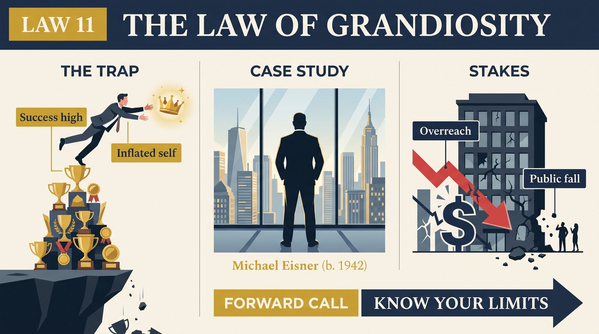
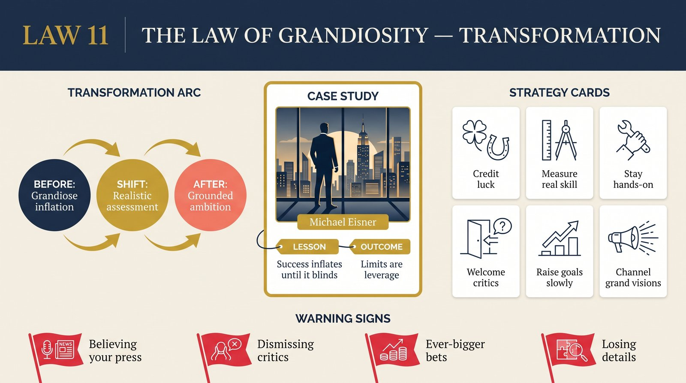

# Law 11: The Law of Grandiosity

<audio controls preload="none" style="width:100%" src="../../audio/law-11-grandiosity.mp3"></audio>

**Directive: "Know Your Limits"**

---

## Core Concept

Grandiosity is not simply arrogance or vanity in the colloquial sense — it is a specific psychological state in which the self-assessment has become systematically disconnected from reality. Where vanity is the performance of importance, grandiosity is the sincere belief in an exaggerated self-conception — a genuine conviction that one's talents, judgment, and destiny are exceptional in ways that justify exceptional behavior: discarding the rules, dismissing the concerns of others, taking risks that would be reckless for lesser people. The grandiose person is not pretending; they have genuinely lost accurate calibration. This makes the condition far more dangerous than ordinary arrogance, which maintains enough self-awareness to perform humility when strategically necessary.

Greene identifies success as the primary trigger of grandiosity — and this is the law's deepest irony. The people most vulnerable to grandiosity are not the mediocre or the deluded but the genuinely talented, the people whose accomplishments provide genuine grounds for elevated self-assessment. Success produces grandiosity through a mechanism Greene describes with precision: after major achievements, humans naturally attribute more of the outcome to their own exceptional qualities and less to luck, circumstances, timing, and the contributions of others. This attribution error is reinforced by social feedback — people around a successful person tend to confirm and amplify their self-assessment, because confirmation is what successful people reward. The feedback loops that provided reality-testing before success become echo chambers after it.

The grandiose state has several characteristic distortions. The person begins to believe that their intuition and judgment — which proved correct in the domain where they succeeded — generalize across domains they have not mastered. They become less interested in preparation and analysis, because those feel like the tools of people who lack their exceptional instincts. They become less tolerant of criticism, because criticism of their judgments now feels like an attack on an identity that their success has validated. They take larger risks in proportion to their certainty, while the actual evidence basis for that certainty has not changed. And they begin to isolate from the honest relationships that might provide correction — surrounding themselves instead with people who confirm the grandiose self-image.

The deepest problem with grandiosity is its invisibility from the inside. The grandiose state does not feel like a distortion — it feels like clarity. The grandiose person believes they are finally seeing their situation accurately, freed from the false modesty and excessive caution that held them back earlier. The experiences that look like warning signs to observers — the increasing impatience with detail, the dismissal of qualified advisors, the certainty in unfamiliar domains — feel, from inside, like mature confidence. This is why grandiosity is so reliably catastrophic: it cannot be corrected by the person experiencing it, because the corrective mechanism (accurate self-assessment) is precisely what has been compromised.

## The Human Weakness

The weakness grandiosity exploits is the fundamental human vulnerability to self-serving attribution — the unconscious tendency to attribute good outcomes to our abilities and bad outcomes to external forces. This is not a character flaw; it is a deep feature of how the motivated mind processes evidence. The brain does not function as a neutral truth-detector; it functions as a story-generator that is particularly motivated to generate stories that preserve the integrity and agency of the self. Success experiences powerfully activate this motivation: the mind grabs the evidence of success and constructs from it a narrative of exceptional personal quality, discarding the countervailing evidence with efficient unconscious selection.

There is also a social amplification mechanism that makes grandiosity particularly dangerous for people in positions of power and visibility. When someone succeeds significantly, those around them change their behavior: they become more careful with criticism, more likely to defer, more willing to confirm the successful person's judgments even when they privately doubt them. This happens for multiple reasons — fear of retaliation, desire to maintain access, genuine admiration, and the social norm that we do not challenge people whose success seems to validate their judgment. The result is that success progressively degrades the quality of feedback available to the successful person at exactly the moment when the risk of grandiosity is highest. The environment conspires with the internal distortion to produce a system with no corrective mechanism.

A third vulnerability is the deep human desire for significance — for the sense that one's life and choices matter, that one is operating on a larger scale than ordinary mortals. Grandiosity satisfies this desire directly and completely. It provides a story in which the person is exceptional, their judgments are uniquely reliable, and their destiny is of unusual importance. This story is experientially very satisfying, which is why people return to it even after it has cost them significantly. The grandiose state is not simply an error; it is a highly reinforced psychological reward state. Correcting it requires not just accurate information but a substitute source of the significance and meaning that grandiosity was providing.

## Historical Figure: Michael Eisner at Disney (Corporate Leadership, Late 20th Century)

Michael Eisner's arc at Disney is Greene's primary case study for this law, and its clarity makes it close to definitive. Eisner arrived at Disney in 1984 with genuine qualifications and immediately demonstrated genuine talent. The company was struggling; Eisner brought creative energy, strategic clarity, and a hands-on engagement with content that transformed Disney's output. Through the late 1980s and 1990s, his leadership produced an extraordinary run of successes: *The Little Mermaid*, *Beauty and the Beast*, *The Lion King*, *Aladdin*, theme park expansion, and the acquisition of ABC. By any objective measure, Eisner had achieved something remarkable.

The problem was what this success did to his self-assessment. Eisner began to attribute the company's successes primarily to his own exceptional taste and judgment, discounting the contributions of his partner Frank Wells (who managed the parts of the business Eisner found unglamorous), the talent of specific animators, writers, and directors, and the favorable cultural moment. When Wells died in a helicopter accident in 1994, Eisner did not replace him with an equally capable operational partner — instead, he consolidated authority, effectively becoming both the creative visionary and the operational chief, positions that require different skills and different personalities. The warning signs were immediate: Eisner began making decisions in domains where his judgment was less reliable, without the checks that Wells had provided.

As the decade progressed, the distortions of grandiosity became more visible. Eisner became increasingly resistant to input from talented subordinates, several of whom left or were pushed out — including Jeffrey Katzenberg, whose departure cost Disney both creative talent and, eventually, a lawsuit. He made major strategic bets based on personal conviction rather than analysis: the acquisition of ABC, the Euro Disney expansion, the internal creative decisions that produced the weak output of the late 1990s. He surrounded himself with people who deferred to him rather than challenged him. And he became convinced that his difficulties were the result of disloyalty, conspiracy, and the limitations of those around him — the paranoid variant of grandiosity that Greene identifies as the final stage before collapse.

By the early 2000s, the board of Disney — once reliably deferential — had fractured. Roy Disney and Stanley Gold mounted a public campaign against Eisner's leadership. The shareholder vote of 2004, in which 43% of shareholders withheld their votes for Eisner as a board member, was a public humiliation without modern precedent. Eisner resigned in 2005. Greene's analysis is that every step of this descent was predictable — was, in fact, the predictable outcome of uncorrected grandiosity operating without the checks that Eisner had progressively dismantled. His genuine talent made the grandiosity possible; his success removed the corrective mechanisms; and the resulting isolation from reality produced exactly the catastrophic overreach that this law describes.

## The Transformation

The transformation this law demands is the cultivation of what Greene calls "reality anchors" — specific practices, relationships, and habits of mind that maintain the connection between self-assessment and reality even during and after periods of significant success. This is not primarily a matter of willpower or humility as a performed virtue — the grandiose person cannot simply decide to be less grandiose, because the distortion operates at the level of perception rather than conscious attitude. Reality anchors work by creating structural constraints on the distortion: external inputs that are honest regardless of what the ego wants to hear, and internal practices that regularly recalibrate self-assessment against evidence.

The first and most important reality anchor is the maintenance of honest advisors — people who have both the credibility and the relationship security to tell the successful person hard truths, and who will not be punished for doing so. These relationships are rare and must be actively cultivated, because success progressively erodes them. The social dynamics of success push people toward agreement; maintaining genuine honesty requires deliberate counter-pressure. Greene identifies Frank Wells as Eisner's most critical reality anchor — when Wells died, Eisner did not simply lose a partner; he lost the primary mechanism by which his self-assessment was being regularly checked against reality.

The second transformation is learning to distinguish between pride in craft and pride in persona. Pride in craft — satisfaction in the quality and difficulty of specific work, calibrated against the actual standards of the field — is a generative emotion. It motivates continued investment in quality, it is not destabilized by others' successes, and it scales proportionately with genuine achievement. Pride in persona — satisfaction in being a person of exceptional qualities, a special destiny, a uniquely reliable judgment — is the grandiose variant. It is destabilized by challenges and failures because it has no basis in specific, verifiable achievement; it is purely self-referential. Cultivating the former while monitoring the latter is the practical form of this transformation.

## Practical Guide

- **Identify and protect your honest advisors**: Who in your life will tell you that you are wrong? Who has both the knowledge and the relationship security to challenge your judgments? Actively protect these relationships — especially when you are succeeding. Success will systematically degrade them if you don't.
- **Build a deliberate failure review practice**: Regularly, formally examine your recent failures and near-misses — not to punish yourself, but to maintain an accurate sense of the domains and conditions where your judgment is unreliable. Grandiosity thrives in the absence of this practice.
- **Study others who succeeded then crashed**: The pattern Greene identifies in Eisner repeats with striking consistency across domains — in business, politics, art, and sports. Studying specific examples — Lehman Brothers, Napoleon's Russian campaign, late-career Picasso, Rupert Murdoch's phone-hacking era — keeps the possibility of one's own grandiosity alive as a real risk rather than a theoretical one.
- **Attribute success more generously**: When things go well, deliberately and specifically identify the contributions of luck, timing, collaborators, and circumstances. This is not false modesty — it is accurate calibration. The more specifically you can identify what was not your doing, the more accurate your assessment of what was.
- **Treat the urge to dismiss an advisor as a signal, not a conclusion**: When a trusted advisor raises a concern and your immediate response is to dismiss them — to find them deficient, jealous, or simply wrong — treat that dismissal as a grandiosity warning. The dismissal may be warranted; it may not. The point is to examine it before acting on it.
- **Define your comparative advantages narrowly and specifically**: Grandiosity generalizes — it applies exceptional judgment in one domain to all domains. Counter this by maintaining a precise, specific, and conservative understanding of where your actual comparative advantages lie, and being explicit about where they do not.
- **Create regular intervals of deliberate constraint**: Take on projects where you are a beginner, not an expert. Expose yourself regularly to domains where your status and past achievements do not command deference. This is uncomfortable and generative — it provides the experience of uncertainty and limitation that counteracts the grandiosity feedback loop.

## Modern Application

**In startup and entrepreneurial culture**: The venture capital model — in which early success generates large new raises, which generate larger bets, which generate either exponential success or catastrophic failure — is a structural grandiosity-amplifier. The founders who survive multiple rounds and maintain realistic self-assessment tend to be those who have built deliberate reality-testing structures (strong boards, contrarian advisors, systematic failure reviews) rather than those who simply have stronger character. The culture that celebrates founder vision and contrarianism makes grandiosity extremely easy to mistake for confidence.

**In political leadership**: The "second-term curse" in American presidential history — the pattern by which second terms produce the most significant scandals and failures — is largely a grandiosity phenomenon. By the second term, a successful president has four years of confirmation that their instincts are right, their critics are wrong, and their judgment is exceptional. The honest advisors of the first term have often been replaced by loyalists; the institutional checks have been progressively worked around; the risk tolerance has risen. Nixon, Reagan (Iran-Contra), Clinton (Lewinsky), George W. Bush (Iraq escalation) — each of these second-term failures shows the same pattern: grandiosity meeting structural reality.

**In creative careers**: The creative professional who has significant early success faces a specific grandiosity trap: the assumption that the formula that worked once will work again, and that the judgment that produced the successful work is reliable across all future decisions. The reality is that early creative success often involves significant luck, perfect timing, and collaborative factors that cannot be replicated on demand. Artists who sustain long careers tend to be those who approach each project with the same uncertainty and rigor as the first, rather than relying on the confidence that past success has generated.

**In expert domains**: Experts are particularly vulnerable to a domain-specific form of grandiosity: the assumption that expertise in one field confers reliable judgment in adjacent or unrelated fields. The Nobel Prize winner who becomes a confident commentator on economics, education policy, or international relations; the successful entrepreneur who becomes a confident authority on public health or climate science — these are examples of domain grandiosity, where success in one arena is used to justify confidence in others where the person has no real expertise. Recognizing the boundaries of one's actual competence is the primary prophylactic.

## Warning Signs

- **You have stopped consulting the person whose opinion most challenged you**: If someone who used to be a regular advisor has gradually become less central — not through a conflict, but through a drift in which their advice felt less necessary — this is a grandiosity signal. The drift is often unconscious and directly proportional to how much you have begun to trust your own judgment.
- **Your explanations for recent failures consistently identify factors outside your control**: One or two external attributions may be accurate; a consistent pattern of them is almost always a distortion. Grandiosity is the only emotion that makes every failure feel like bad luck and every success feel like brilliant strategy.
- **You have begun taking positions in domains adjacent to your expertise without noticing the transition**: If you find yourself making confident pronouncements about areas where you have no track record, and not noticing the gap, this is the generalization failure that characterizes late-stage grandiosity.
- **People around you have stopped disagreeing with you**: This may reflect your genuine authority — but it may reflect the progressive selection of people who agree with you over people who do not. If you cannot remember the last time a trusted advisor strongly disagreed with a major decision, your environment may have become an echo chamber.
- **You feel that the normal rules of accountability do not quite apply to your situation**: Grandiosity generates a sense of exception — that the constraints and checks that apply to others are, in your case, excessive or inappropriate. This feeling is almost always a warning, not a fact.
- **Your recent risk-taking has not increased in proportion to your actual knowledge of the new domain**: Taking larger risks while knowing no more about the domain is the behavioral signature of grandiosity. The confidence has outrun the competence.

## Key Quotes

- Greene on Eisner: "He had convinced himself that his success was the product of exceptional personal qualities that applied broadly — to business strategy, to creative judgment, to personnel decisions. He had stopped distinguishing between the domains where this was true and the domains where it was not. By the time it mattered, there was no one around him who could tell him."
- "Success is the most dangerous drug in human experience. It does not impair your ability to function — it impairs your ability to doubt, which is the faculty that keeps functioning possible." — paraphrased from Greene's synthesis
- "The difference between confidence and grandiosity is that confidence is calibrated to evidence and domain. Grandiosity has escaped both constraints." — Robert Greene, *The Laws of Human Nature*

## Reflection Questions

1. In what domain of your life or work do you currently feel the greatest certainty about your judgment? What is the evidence base for that certainty, and how carefully have you examined its limits?
2. Who in your current life will tell you clearly and directly when you are wrong about something important? When did they last do so? If you cannot remember, why might that be?
3. Think of a major success you have had. How much of it do you attribute to your own qualities versus luck, timing, and the contributions of others? Have you ever formally examined this attribution?
4. In what domain are you most at risk of the "generalization failure" — applying confidence earned in one area to a different area where you have less expertise?
5. What would a genuine, honest performance review of your last year's major decisions look like? Who would you trust to conduct it, and what prevents you from asking them to?

## Connected Laws

- [law-09-repression](law-09-repression.md) — Grandiosity is often a defense against repressed inadequacy: the inflated self-assessment masks a shadow filled with doubt, fear of failure, and unacknowledged limitations. The grandiose collapse — when reality finally breaks through the inflated self-image — often produces exactly the shadow eruption that Law 9 describes, because the repressed material has been accumulating pressure beneath the grandiose persona.
- [law-10-envy](law-10-envy.md) — The grandiose person generates enormous envy in those around them, while typically being blind to it. Understanding Law 10 helps explain the social dynamics that develop around a grandiose leader: the progressive withdrawal of honest feedback (driven by envy and fear), the formation of factions, and the eventual coalition of people who feel marginalized by the grandiose persona's constant self-amplification.
- [law-08-self-sabotage](law-08-self-sabotage.md) — Grandiosity is a specific and disguised form of the contracting orientation described in Law 8: the grandiose state appears expanding but is organized around the avoidance of accurate self-assessment. The feedback loop between inflated self-image and the behaviors it generates (dismissal of critics, isolation from reality, excessive risk-taking) is a form of self-sabotage operating at its most sophisticated.
