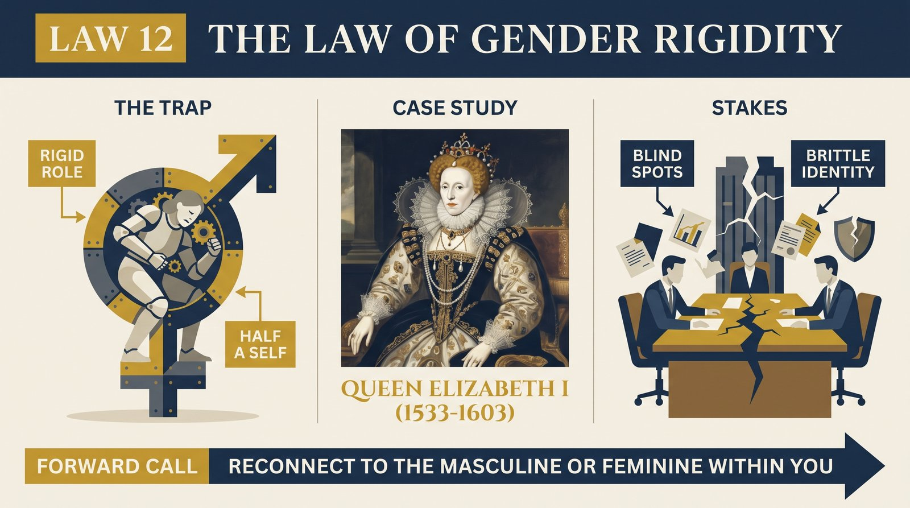
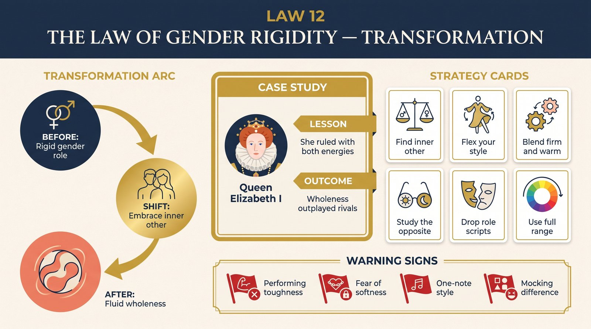

# Law 12: The Law of Gender Rigidity

<audio controls preload="none" style="width:100%" src="../../audio/law-12-gender-rigidity.mp3"></audio>

**Directive: "Reconnect to the Masculine or Feminine Within You"**

---

## Core Concept

Every human being, regardless of biological sex, possesses a full psychological spectrum that includes qualities culture has traditionally labeled "masculine" — decisiveness, strategic thinking, directness, competitive drive, the ability to enforce boundaries — and qualities it has traditionally labeled "feminine" — empathy, emotional attunement, indirect communication, flexibility, receptivity, and collaborative instinct. These are not biological assignments; they are psychological capacities that exist in all humans in varying degrees, capable of development through practice and attention. What prevents their full development is not nature but culture: the systems of reward and punishment that enforce gender norms from earliest childhood, shaping which qualities are expressed, developed, and owned, and which are suppressed, denied, and pushed into the shadow.

Greene's law is not about gender identity or biological sex — it is about psychological completeness. His claim is structural: when any psychological capacity is suppressed because it has been culturally designated as belonging to the "other" gender, the person loses access to a real and useful resource. The man who has been socialized to suppress empathy and emotional attunement does not become stronger — he becomes blunter, less able to read others accurately, less capable of the relational intelligence that effective leadership, negotiation, and creative collaboration require. The woman who has been socialized to suppress assertiveness and strategic directness does not become more feminine — she becomes more vulnerable to exploitation, less able to advance her genuine interests, and less effective in competitive environments that require the ability to hold ground.

This is Greene's engagement with what Jung called the "anima" (the feminine dimension in men) and the "animus" (the masculine dimension in women) — the psychological contrasexual element that, when acknowledged and developed, adds depth and effectiveness to a person's engagement with the world, and when repressed, generates the specific distortions associated with gender rigidity. The anima in a man, when repressed, produces a man who is emotionally illiterate, relationally clumsy, and susceptible to the sudden irrationalities and mood floods that emerge from denied emotional material. The animus in a woman, when repressed, produces a woman who is chronically accommodating, unable to enforce her genuine interests, and vulnerable to the particular kinds of exploitation that target people who have no reliable access to their own assertiveness.

Critically, Greene argues that the most effective people in any complex domain are not those who best conform to their gender's prescribed traits — they are those who can access both poles fluently and deploy them strategically. The great military leaders combined tactical ruthlessness with an empathic understanding of their soldiers' psychological needs. The great artists and writers combined focused, competitive drive with profound emotional sensitivity. The great leaders — and Greene's example of Elizabeth I is central here — combined the authority and decisiveness their position required with an emotional and relational intelligence that their advisors and subjects rarely encountered in people of power. It is the combination, not the purity, that produces exceptional effectiveness.

## The Human Weakness

The primary weakness this law addresses is the compliance cost of gender socialization — the way human beings sacrifice genuine psychological resources in order to maintain social acceptance and identity coherence within their gender group. This compliance begins extremely early: research consistently shows that children begin modifying their behavior along gender-coded lines by age two or three, in response to parental and peer feedback. By adulthood, the suppressed qualities are so thoroughly out of awareness that the person does not experience them as suppressed — they simply do not have access to them. The man who has not cried in twenty years does not experience himself as suppressing emotion; he experiences himself as someone who does not feel things that way. The woman who has spent her life accommodating others' preferences does not experience herself as suppressing assertiveness; she experiences herself as someone who genuinely prefers harmony.

The social reinforcement of gender rigidity is also self-perpetuating in ways that make it particularly difficult to challenge. Men who express traditionally feminine qualities — emotional vulnerability, collaborative deference, empathic attunement — risk social punishment from male peers whose own gender identity is threatened by the deviation. Women who express traditionally masculine qualities — competitive directness, territorial assertiveness, strategic ruthlessness — risk the specific punishments that culture reserves for women who exceed their prescribed behavioral range. These punishments are real and they work. They teach the lesson that the suppressed qualities are genuinely dangerous to express, which reinforces both the suppression and the belief that the suppression is voluntary rather than enforced.

There is also a deep identity investment in gender conformity that makes the suppressed qualities feel foreign and threatening rather than simply unavailable. The man whose identity is built around hardness and self-sufficiency experiences the possibility of emotional vulnerability not just as unfamiliar but as a threat to his sense of self. The woman whose identity is built around nurturing and accommodation experiences the possibility of strategic assertiveness not just as difficult but as a betrayal of who she understands herself to be. Recovering the suppressed qualities therefore requires not just skill development but identity work — a willingness to expand the self-concept to include qualities that have been defined as outside it.

## Historical Figure: Queen Elizabeth I (English Monarchy, 16th Century)

Queen Elizabeth I is Greene's central example for this law because she navigated one of history's most extreme versions of the gender rigidity problem and resolved it with unusual sophistication. As a woman ruling in a world that categorically denied the legitimacy of female authority — a world in which her own advisors, subjects, and foreign counterparts began from the premise that a woman could not effectively rule — Elizabeth faced a choice that most women in power still face, though in less extreme form: conform to prescribed femininity and be dismissed as incapable, or adopt prescribed masculinity and be condemned as unnatural.

Elizabeth's solution was neither. She developed what Greene describes as a fluid, strategic blending of both poles — and she did so not as a performance or a compromise but as a genuine integration of qualities that most of her contemporaries experienced as mutually exclusive. When she addressed her troops at Tilbury before the Spanish Armada in 1588, she delivered the speech in armor, on horseback, declaring: "I know I have the body but of a weak and feeble woman; but I have the heart and stomach of a king, and of a king of England too." This was not simply rhetoric — it was an accurate description of her governing style: genuinely, strategically masculine in her use of authority, military decision-making, and political ruthlessness, while genuinely, strategically feminine in her use of emotional intelligence, indirect communication, and relational management.

Elizabeth was a master of what modern psychologists would call emotional attunement — she read her advisors, courtiers, and foreign ambassadors with extraordinary accuracy, understanding their psychological needs and vulnerabilities and using this understanding to manage them far more effectively than a more directly authoritative style would have permitted. She was famous for her ability to keep suitors, rivals, and allies in a state of perpetual uncertainty through calculated ambiguity — a technique that draws entirely on the relational and emotional intelligence associated with the feminine pole. At the same time, when execution, dismissal, or strategic betrayal was necessary, she was capable of decisive, ruthless action that no one could mistake for weakness.

Greene emphasizes that this was not natural to Elizabeth — it was developed, deliberately, under conditions of extraordinary pressure. Her childhood had been marked by the execution of her mother, the threat of her own execution, and the experience of watching gender rigidity destroy the people around her. She had observed, with unusual precision, how the rigid performance of either femininity or masculinity created predictable vulnerabilities, and she had used those observations to construct a more complete approach to power. Her forty-five-year reign — the longest and, by most measures, most successful of any English monarch of her era — was the result.

## The Transformation

The transformation this law requires begins with an honest inventory of which qualities you have suppressed due to gender conditioning — not which qualities you dislike or don't naturally possess, but which ones you have actively been taught to deny as inconsistent with your gender identity. This distinction matters: the goal is not to become someone you are not, but to recover access to capacities you actually have but have not been permitted to develop. The inventory should be specific: not "I'm too aggressive" or "I'm not assertive enough," but a precise identification of the specific situations where a specific quality is unavailable to you in ways that are costing you effectiveness or fulfillment.

Greene draws explicitly on Jung's framework of anima and animus development — the idea that each person contains a contrasexual psychological element that, when developed consciously, adds depth and complexity to their personality, and when ignored, generates compulsive and distorted behavior. For men, anima development typically means cultivating the capacity for genuine empathic attunement — not emotional performance, but the actual skill of reading others' emotional states accurately and responding in ways that acknowledge those states. For women, animus development typically means cultivating the capacity for direct strategic assertiveness — not aggression, but the ability to hold ground, enforce genuine limits, and compete openly for what one actually wants.

The practical path to this development is deliberate cultivation in low-stakes contexts: taking roles that require the suppressed quality, seeking feedback from people who embody it, and practicing the behaviors associated with it in situations where failure is affordable. The qualities associated with the suppressed pole are not mysteries — they are skills, and skills are built through practice. The primary obstacle is not incompetence but identity resistance: the feeling that exercising the suppressed quality means betraying who you are. That resistance is precisely what this law asks you to examine.

## Practical Guide

- **Do the specific inventory**: In what specific contexts are you unable to deploy emotional attunement (if you tend masculine) or strategic assertiveness (if you tend feminine)? Name three concrete situations in the past month where this limitation cost you something. Specificity is essential — general awareness does not produce change.
- **Study models of the integrated pole**: Identify historical or contemporary figures who have developed the quality you most need — not people who possess it naturally, but people who developed it consciously in circumstances similar to yours. The development process, not just the outcome, is what is instructive.
- **Practice the suppressed quality in low-stakes contexts**: If emotional attunement is suppressed, practice it in relationships where the stakes are low — casual professional interactions, brief conversations where you focus entirely on the other person's emotional state rather than your own agenda. If assertiveness is suppressed, practice it in contexts where the consequences of imperfect execution are minimal.
- **Notice the identity resistance**: When you engage the suppressed quality and feel the characteristic discomfort — the sense that you are being "inauthentic" or violating something essential about who you are — recognize this as the conditioning speaking, not your actual identity. Sit with the discomfort rather than retreating from it.
- **Look for the shadow expression of the suppressed quality**: Qualities that are denied in their healthy form tend to express themselves in distorted shadow versions. The man who has denied empathy may find himself suddenly overwhelmed by sentimentality or emotionally manipulative in ways he doesn't recognize as emotional expression. The woman who has denied assertiveness may find it expressing as passive aggression. These shadow expressions point directly to what needs to be developed.
- **Integrate the poles through practice, not ideology**: The goal is not to adopt a philosophical position about gender but to increase practical effectiveness. Keep the focus on specific situations, specific outcomes, and the specific qualities those outcomes required that you could not deploy. The ideological frame is less useful than the practical one.
- **Resist the overcorrection**: In recovering suppressed qualities, the initial impulse is often to swing to the opposite extreme — the formerly-overly-deferential person who becomes reflexively confrontational, the formerly-emotionally-closed person who becomes indiscriminately emotionally expressive. The goal is integration and flexibility, not replacement of one pole by the other.

## Modern Application

**In leadership and management**: The most consistently effective leaders across sectors combine what leadership researchers now call "task orientation" and "relationship orientation" — the capacity to make clear strategic decisions and hold people accountable (associated with the masculine pole) with the capacity to read organizational emotional climate accurately, build genuine trust, and navigate conflict with empathic intelligence (associated with the feminine pole). Leaders who are rigid in either direction — purely directive or purely relational — produce teams that are either high-performing but brittle or warm but unproductive. The integration is not a compromise; it is a genuine synthesis that performs better than either extreme.

**In negotiation and conflict resolution**: Effective negotiators need access to both poles simultaneously: the assertiveness to hold ground and advance their genuine interests (masculine), and the empathic attunement to read the other party's needs, concerns, and emotional state accurately enough to find solutions that work for both parties (feminine). Negotiators who are strong only in one direction — those who push hard without reading the other party's emotional state, or those who read the other party so accurately that they over-accommodate — consistently leave value on the table or destroy the relationships that the negotiation was supposed to serve.

**In creative and intellectual work**: The creative process consistently requires both poles at different stages: the receptive, attentive, non-judgmental openness that allows new material to emerge (associated with the feminine), and the focused, critical, disciplined drive to develop that material into finished form (associated with the masculine). Creators who are rigid in either direction — either endlessly gathering and never committing, or driving toward product without the openness that allows genuinely new material — produce work that is either scattered or mechanical. The most generative creative processes involve both poles in a rhythmic alternation.

**In intimate relationships**: The most common relationship dysfunction pattern — the pursuer/withdrawer dynamic, in which one partner pursues emotional connection and the other withdraws from it — is largely a gender rigidity problem. The pursuer (more commonly, though not exclusively, the woman in heterosexual relationships) has suppressed the assertiveness that would allow them to be direct about their needs and hold ground when those needs are not met. The withdrawer (more commonly the man) has suppressed the emotional attunement that would allow them to remain present with emotional intensity rather than retreating from it. Both partners are paying the cost of the suppressed pole; both need to develop it for the dynamic to change.

## Warning Signs

- **You find a quality in the other gender inexplicably irritating or threatening**: The quality in others that generates the most intense reaction is often the quality most thoroughly suppressed in oneself. A man who finds emotional expressiveness in other men contemptible, or a woman who finds directness in other women aggressive and unattractive, is likely defending against qualities in their own shadow.
- **You experience a distinct physical or emotional aversion to situations that require the suppressed quality**: If the prospect of a direct confrontation produces panic rather than discomfort, or if the prospect of emotional vulnerability produces contempt rather than reluctance, the suppression has reached a depth that is likely generating shadow expressions.
- **Your professional effectiveness is limited specifically in situations that require the opposite pole**: If you consistently excel in situations requiring your dominant pole and consistently struggle in situations requiring the suppressed one, you are experiencing the practical cost of gender rigidity in professional form.
- **People of the other gender find you consistently difficult to relate to**: Difficulty connecting across gender lines is often a sign that one or both poles are missing from the exchange. The person who has developed only the masculine pole tends to find interactions with women uncomfortable because they lack the relational attunement those interactions often require. The reverse is equally true.
- **You have a rigid theory about the natural, proper, or healthy expression of your gender**: Rigidity in theory often reflects rigidity in practice. The man who has strong, detailed, confidently-held views about how "real men" should behave, or the woman who has similarly detailed views about what constitutes genuine femininity, is usually defending against their own suppressed qualities with ideological certainty.
- **The suppressed quality emerges only in private, under stress, or in ways you don't recognize as connected to gender**: Shadow expressions of the suppressed pole are often present but unrecognized. The "tough guy" who is secretly sentimental about animals or art; the endlessly accommodating woman who is secretly contemptuous of the people she accommodates — these are shadow expressions of the suppressed poles, present but not integrated.

## Key Quotes

- Queen Elizabeth I at Tilbury, 1588: "I know I have the body but of a weak and feeble woman; but I have the heart and stomach of a king, and of a king of England too." — Greene uses this as the definitive statement of conscious gender integration: claiming both poles explicitly and deploying each where it is most effective.
- Greene on the integrated person: "They possess a quality of completeness that is immediately felt by anyone who encounters them. They do not give off the rigid, defended quality of someone performing a gender role. They are simply present — all of them — in a way that is unusual and magnetic."
- "The masculine and feminine are not opposites but complements, and the person who has developed both does not experience conflict between them — they experience a richness of resource that the rigidly gendered person simply does not have access to." — paraphrased from Greene's synthesis in *The Laws of Human Nature*

## Reflection Questions

1. Which specific qualities in the "other pole" (empathic attunement if you tend masculine; strategic assertiveness if you tend feminine) are most unavailable to you in your professional and personal life? What specific situations in the past month required those qualities and were less effective because you couldn't access them?
2. Where in your childhood did you receive the most powerful instruction to suppress the qualities of the other pole? What was rewarded? What was punished? How has that instruction shaped who you present yourself as today?
3. Think of someone you deeply admire who embodies both poles effectively. What specific behaviors do they display that integrate the two? Which of those behaviors feels most foreign or most difficult for you to imagine yourself doing?
4. What is the shadow expression of your suppressed pole — the distorted form in which those suppressed qualities actually do emerge in your life? Where do you see them appearing in ways you don't fully recognize or own?
5. If you were to deliberately cultivate the suppressed pole for ninety days — through specific practices, specific reading, specific role-taking — what would you do? And what is the identity resistance that most prevents you from doing it?

## Connected Laws

- [law-09-repression](law-09-repression.md) — The suppressed gender pole lives in the shadow, and its dynamics follow exactly the patterns Law 9 describes: it accumulates pressure, expresses itself in distorted forms, and its eruptions are most dramatic in people whose persona most rigidly excludes it. Shadow work (Law 9) and gender integration (Law 12) address the same underlying mechanism from different angles.
- [law-07-defensiveness](law-07-defensiveness.md) — The tools of indirect influence described in Law 7 draw heavily on the "feminine" pole of empathic attunement and indirect communication. A person who has suppressed these qualities will find the techniques of Law 7 genuinely inaccessible — not because they don't understand them intellectually, but because they lack the developed empathic sensitivity that makes them work in practice.
- [law-08-self-sabotage](law-08-self-sabotage.md) — Gender rigidity is one of the clearest examples of the contracting orientation described in Law 8: the suppressed half of the psychological toolkit represents a genuine contraction of possibility. The self-sabotage of gender rigidity is often most visible precisely in the domains where the suppressed pole would be most useful — in exactly the situations where the person cannot bring their full resources to bear.
