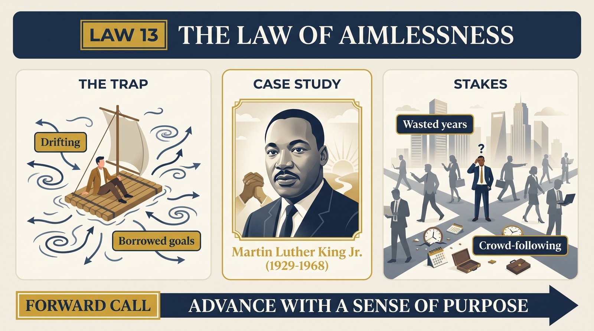
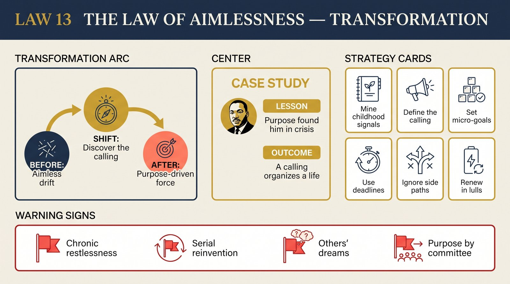

# Law 13: The Law of Aimlessness

<audio controls preload="none" style="width:100%" src="../../audio/law-13-aimlessness.mp3"></audio>

**Directive: "Advance with a Sense of Purpose"**

---

## Core Concept

Every person is born with a unique set of inclinations — ways of seeing, feeling, and engaging with the world that are entirely their own. Greene argues these primal inclinations are not random; they are the raw material of what he calls your "life's task," the project that will absorb your deepest energies and give your existence coherent direction. The tragedy of modern life is that most people never discover this task. They spend their formative years absorbing other people's definitions of success — parental ambitions, peer expectations, cultural scripts about money and status — until their original inclinations are buried beneath layers of conditioning.

The result is aimlessness: not the dramatic paralysis of someone unable to get out of bed, but the quieter drift of someone who is busy, productive even, yet persistently hollow. They move from one goal to the next without a thread connecting them. They achieve things that fail to satisfy, because the things they're achieving were never really theirs. They are susceptible to the enthusiasms of the moment — a new career path, a new relationship, a new identity — because they have no stable internal compass pushing back against the wind of circumstance.

Greene is insistent that purposeful living is not a spiritual luxury or a personality trait of the especially blessed. It is a practical achievement, accessible through deliberate self-examination. The people who seem to radiate purpose did not receive it as a gift; they excavated it from their own histories. What looks like destiny from the outside was usually years of accumulating evidence about what genuinely absorbed them, followed by the courage to organize their life around that evidence rather than continuing to defer to external expectations.

The stakes are high. Without a life's task, you are easy to manipulate — anyone who projects certainty and direction can capture your energy and bend it to their purposes. With one, you have an internal anchor. You know what to prioritize, what to decline, what to endure. You become, in Greene's language, the author of your own story rather than a character in someone else's.

## The Human Weakness

The primary weakness Greene identifies is the tendency to mistake substitutes for substance. Money, status, admiration, and comfort are not inherently corrupting — the problem is when they become ends in themselves rather than byproducts of meaningful work. When people pursue wealth as a replacement for direction, they find that each financial milestone raises the bar rather than resolving the underlying emptiness. The same applies to status: no amount of social recognition fills the hole left by the absence of genuine purpose. These substitutes are addictive precisely because they provide just enough satisfaction to keep you searching in the wrong direction.

A second weakness is the susceptibility to what Greene calls "false purpose" — causes and ideologies that offer the feeling of purpose without the labor of self-discovery. Joining a movement, adopting a strong political identity, or attaching yourself to a charismatic leader can produce real feelings of conviction and direction. But these borrowed purposes are fragile: they depend on external validation, and they collapse when the movement fails or the leader disappoints. True purpose is self-generated and self-sustaining; it does not require an audience.

The third trap is more subtle: the person who does have genuine interests but cannot commit to them out of fear of failure or judgment. They keep their real passions safely at the level of "hobbies" or "interests," never risking the vulnerability of staking their identity on something that might not work out. This is a kind of protective aimlessness — the life's task is present but quarantined, while the person performs acceptably in more conventional roles. The cost is a chronic low-grade dissatisfaction that never quite becomes acute enough to force change.

## Historical Figure: Martin Luther King Jr. (American Civil Rights Era)

Greene uses Martin Luther King Jr. as his central exemplar of purposeful living — not because King's greatness was inevitable, but because of how specifically and deliberately his sense of calling was constructed. King was not born knowing his mission. As a young man he felt the pull of multiple directions: his father's ministry, academic philosophy, the comfortable life of a middle-class Black professional. What Greene traces is how King learned, through a series of increasingly clarifying experiences, that his unique contribution lay at the intersection of his specific gifts as an orator, his deep emotional experience of racial injustice, his rigorous study of nonviolent philosophy, and a historical moment that needed exactly what he had to offer.

The specificity is essential to Greene's argument. King did not simply decide to "do good" or "fight injustice" in the abstract. He had a precise, personal calling: to lead a nonviolent mass movement by making the moral reality of segregation viscerally legible to white Americans through the language of Christian redemption and Constitutional promise. This precision gave his work its extraordinary power. Every speech, every strategic decision, every act of endurance under threat was coherent with this central task. He knew what he was for and what he was against, and that knowledge sustained him through pressures that broke or corrupted others in the movement.

Greene also notes that King's purpose was not static. It deepened and expanded over time. What began as a local struggle in Montgomery eventually grew to encompass Vietnam, poverty, and the fundamental economic structure of American society. This expansion was possible because King's purpose was rooted in principle rather than position — it was not "be famous in the civil rights movement" but something more fundamental about justice and human dignity, which could extend in multiple directions without losing coherence. Purpose of this quality is generative: it keeps producing new applications rather than exhausting itself in a single achievement.

Greene draws a parallel to Pericles, the Athenian statesman examined in Law 1, as another figure who combined strategic clarity about his historical moment with a personal sense of mission that gave his leadership a different quality than that of opportunistic politicians around him. Both figures demonstrate that the sense of purpose is not merely motivating; it makes people strategically superior, because they know what they are optimizing for while others are simply reacting.

## The Transformation

The path Greene prescribes begins with excavation rather than invention. You do not decide on a purpose; you discover one that was already latent in your history. This requires returning, seriously and without self-judgment, to the passions and inclinations of your childhood and adolescence — the period before social conditioning had fully shaped what you were "supposed" to want. What did you return to repeatedly? What absorbed you so completely that time disappeared? What made you feel most genuinely yourself? These early signals are not mere nostalgia; they are data about your primal inclinations, the raw material from which a life's task can be built.

The second phase is synthesis. A life's task is not simply one of your interests — it is the point where your deepest interests intersect with your specific emotional experiences (particularly the experiences of injustice, longing, or profound engagement that have marked you most deeply) and a genuine need in the world. This intersection is rarely obvious; it takes time and experimentation to find it. Greene recommends thinking of your work history not as a CV but as a map of what genuinely energized versus what merely kept you occupied. The activities that produced flow, that you would have done for free, that connected to something you felt was important — these are your evidence.

Once you have a provisional sense of your life's task, the work is to progressively organize your choices around it. This does not require immediate dramatic life restructuring; it begins with small commitments and redirections, gradually giving more of your time and energy to the work that aligns with your deeper calling. The key discipline is learning to say no — to opportunities, relationships, and commitments that would divert you from your task, however attractive they might appear. Every yes to something irrelevant is a no to your purpose, and the accumulation of those choices is how aimlessness happens even in busy, successful people.

## Practical Guide

- **Return to your nine-year-old self.** List 5-10 activities, subjects, or experiences that absorbed you completely before age 12. Look for patterns — these are your primal inclinations, uncorrupted by social pressure. What was the underlying theme connecting them?
- **Map your energy, not just your time.** Review your last several years of work and activities. Which produced genuine engagement and flow? Which drained you despite external success? The energy map is more honest than the achievement map.
- **Identify your formative emotional experiences.** What moments of injustice, beauty, wonder, or belonging have stayed with you most vividly? Your life's task will often be a response to these experiences — an attempt to create more of one or less of another.
- **Find the intersection of passion, skill, and need.** Your purpose requires all three: something you care about deeply, something you have or can develop genuine ability in, and something the world actually requires. Without all three, you have either an idle fantasy, a joyless competence, or a well-meaning ineffectiveness.
- **Treat the first version as provisional.** You will not identify your life's task perfectly on the first attempt. Commit to a working hypothesis, move in that direction, and let experience refine your understanding. Purpose is discovered through action, not only contemplation.
- **Build a "purpose filter" for decisions.** When facing significant choices — jobs, relationships, projects — ask explicitly: does this advance my life's task or divert from it? Not every decision requires this calculus, but the major ones do. The accumulation of purpose-aligned decisions creates a coherent life.
- **Protect your purpose from other people's definitions of success.** Regularly audit whether you are pursuing your goals or someone else's idea of what you should want. External validation is pleasant; it is not a reliable guide to whether you are living your own life.

## Modern Application

**The mid-career pivot:** A 38-year-old marketing executive realizes she has spent 15 years building a career that impresses her parents but does not engage her. She earns well and is competent — but finds the work hollow. Applying Law 13 means resisting the pull to immediately jump to a new field and instead excavating: What did she love before the career started? What moments in her current work have actually felt meaningful? Often the life's task is not in a completely different field but in a different relationship to one's existing skills — the same executive might find her purpose in teaching marketing to social enterprises, which combines her competence with a deeper care for institutional change she had suppressed.

**The young person overwhelmed by options:** A 24-year-old with multiple interests and no clear direction treats this as a problem to be solved by gathering more information about careers. Law 13 reframes this: the problem is not insufficient information but insufficient self-knowledge. The prescription is experimental — take small commitments in different directions, attend closely to which produce genuine absorption and which feel like performance, and use this data to progressively clarify your direction. Premature certainty is less useful than cultivated attention to your own responses.

**The successful but restless achiever:** A 50-year-old who has built a successful business but feels oddly empty faces the classic "substitutes for purpose" problem. His drive produced financial success, but that drive was borrowed from his father's ambitions rather than rooted in his own inclinations. Law 13 suggests that what often looks like a mid-life crisis is actually the life's task reasserting itself after decades of suppression. The restlessness is diagnostic — the question is whether he has the courage to follow where it points, even if that means restructuring a life that looks successful from the outside.

**The activist who burns out:** Someone who has devoted years to a cause finds herself exhausted and cynical, having given everything to something she no longer feels she chose. Law 13 helps distinguish between genuine vocation — a cause rooted in one's specific experiences, gifts, and convictions — and borrowed purpose, where a cause provides the feeling of meaning without the personal rootedness that makes it sustainable. The former is self-renewing; the latter exhausts itself because the person is running on external validation rather than internal conviction.

## Warning Signs

- You feel a persistent, low-grade sense that your current life is not quite yours — that you are performing a role rather than living authentically.
- You find yourself frequently excited by new directions but unable to sustain commitment once the novelty fades — a pattern of enthusiasms rather than development.
- Your goals are primarily defined in terms of what others will think of you (prestige, approval, admiration) rather than what the achievement would mean to you privately.
- You defer the activities that genuinely interest you to "when I have time" — which never arrives — while filling your schedule with urgent but ultimately less important work.
- You feel envy toward people who seem to have a clear sense of purpose, but interpret this envy as evidence that you simply haven't found your "passion" yet rather than as motivation to do the excavation work.
- You are unusually susceptible to charismatic people with strong convictions — you find yourself adopting their enthusiasms, their causes, their worldviews — because their certainty fills the vacuum left by your own lack of direction.

## Key Quotes

> "The first move toward mastering the Law of Aimlessness is to accept the fact that you have a purpose — a singular calling that was uniquely yours — and that it is buried somewhere inside you, waiting to be found."

> "The sense of purpose is not a feeling of comfort or security. It is more like a tension — the constant pull between where you are and where you know you need to go."

> "Most people are wandering through life because they have never made the essential inward journey — back to their primal inclinations, back to what they were before the world told them what to want."

## Reflection Questions

1. What activities or subjects absorbed you most completely before the age of 12 — not what you were praised for, but what you returned to freely? What is the underlying pattern across those early interests?
2. Looking at your adult work history with ruthless honesty: which activities produced genuine engagement and which felt like performance of competence? What does the difference tell you about your actual inclinations?
3. What significant emotional experiences — injustices you've witnessed, moments of profound beauty or belonging — have stayed with you most vividly? How might your life's task be a response to those experiences?
4. Whose definition of success are you currently pursuing — your parents', your peers', your culture's, or your own? If you stripped away all external validation, what would you still find worth doing?
5. What would you do with your time and energy if you had absolute financial security and complete freedom from others' judgment — and what does that answer tell you about what you actually value?

## Connected Laws

- [Law 1: The Law of Irrationality](law-01-irrationality.md) — The emotional clarity that a genuine sense of purpose provides is one of the most important defenses against the irrational thinking explored in Law 1. When you know what you're for, you are less susceptible to the mood-driven decisions and status anxieties that derail purposeless people. King's purposive clarity is also the central example in Law 1's treatment of Pericles.
- [Law 8: The Law of Self-Sabotage](law-08-self-sabotage.md) — Aimlessness and self-sabotage are deeply linked: the person without a life's task is far more likely to unconsciously undermine their own achievements, because there is no coherent internal narrative about what those achievements are for. Discovering purpose resolves many self-sabotage patterns by giving the psyche something to organize around.
- [Law 18: The Law of Death Denial](law-18-death-denial.md) — The contemplation of mortality explored in Law 18 is one of the most powerful tools for discovering and recommitting to purpose. The knowledge that time is finite clarifies which pursuits are genuinely yours and which are substitutes. Both laws ultimately concern the same question: are you living your own life?
