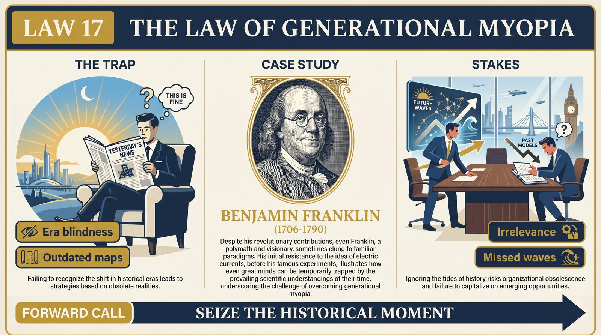
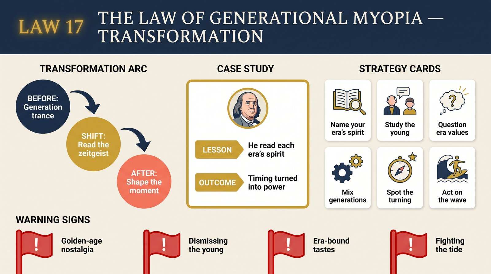

# Law 17: The Law of Generational Myopia

<audio controls preload="none" style="width:100%" src="../../audio/law-17-generational-myopia.mp3"></audio>

**Directive: "Seize the Historical Moment"**

---

## Core Concept

Each of us is born into a specific historical moment — a particular arrangement of economic conditions, technological capabilities, political structures, social anxieties, and cultural assumptions. This arrangement shapes our deepest assumptions about how the world works, what is possible, what is dangerous, what success looks like, and what kind of person it is worth becoming. The problem is that we do not experience these assumptions as historically contingent — as products of a specific time and place that might have been very different. We experience them as simply the way things are: natural, inevitable, obvious. This is generational myopia, and it operates in everyone, including the most intellectually sophisticated.

The pattern is remarkably consistent across history. Each generation's formative experiences create a distinctive psychological profile: characteristic fears, characteristic values, characteristic blind spots, and characteristic strengths. The generation shaped by economic depression prioritizes security, distrusts abundance, and may be psychologically unable to take the kinds of risks that a different historical moment would reward. The generation shaped by postwar prosperity embraces an optimism about social progress that later events will complicate. The generation shaped by terrorism and financial crisis develops a particular relationship to institutional trust. None of these responses are irrational given the formative experiences that produced them — but all of them become dysfunctional when carried wholesale into a different historical context where different responses are adaptive.

The deeper problem is that generational assumptions are transmitted in the most invisible possible way — through everything that is taken for granted, never stated, never examined, never recognized as a historical artifact. The parent who grew up in depression-era scarcity does not tell their child "I believe in extreme financial conservatism because I was formed by historical trauma." They simply live this belief in a thousand small daily choices, and the child absorbs it as reality. The cultural assumptions of a generation are communicated through every institution, every story, every implicit message about what kinds of people get rewarded — and they are absorbed before the recipient has the conceptual tools to critique them.

This creates a profound strategic disadvantage: people who cannot see the historical limits of their own assumptions will consistently misread situations that require a different framework than the one their formation provided. They will diagnose present-day problems through obsolete lenses, apply solutions that worked in a previous context to problems that require something new, and be bewildered when the world fails to respond as expected. Conversely, the rare person who can achieve genuine generational perspective — who can see both the forces that shaped their own assumptions and the forces shaping the emerging moment — has a strategic advantage of the first order.

## The Human Weakness

The primary weakness is what might be called "temporal solipsism" — the experiential conviction that your historical moment is not just your moment but the baseline of human experience. This is the cognitive equivalent of believing that the view from where you are standing is what the landscape actually looks like, rather than one of an infinite number of possible vantage points. People who grew up in an era of strong institutions experience institutional weakness as a departure from the norm. People who grew up in an era of weak institutions experience strong ones as aberrations. Neither is objectively correct; both are parochial projections of a particular historical experience onto reality as a whole.

This temporal solipsism is reinforced by the natural human tendency to seek out people who share our assumptions — who were formed by the same historical moment, who take the same things for granted. Generationally homogeneous environments (organizations, communities, families) create echo chambers where the assumptions of a particular period are continuously validated rather than challenged. The person who spends their entire career in an industry dominated by people from their own generation may never encounter a serious challenge to their fundamental assumptions about how work, value, and success operate. By the time the historical ground shifts beneath them, their assumptions have hardened into something too rigid to adapt.

A more subtle weakness is the emotional investment many people have in defending their generational worldview against the challenges posed by the next generation. Younger people's different values, different assumptions, and different ways of operating can feel threatening — not just inconvenient but morally wrong. The older person who dismisses younger people's concerns as laziness, entitlement, or naivety is often, in Greene's reading, someone whose generational identity is threatened by the evidence that the world has changed. The defensive response prevents exactly the adaptive learning that the historical moment requires.

## Historical Figure: Benjamin Franklin (Colonial America to Early Republic)

Benjamin Franklin is Greene's exemplar of generational transcendence — a figure who operated with an unusual consciousness of both his own historical moment and the larger historical forces at play, allowing him to make strategic interventions that were consistently uncannily well-timed. Greene is interested not just in Franklin's achievements but in the specific quality of historical intelligence that made them possible.

Franklin was born in 1706, and his remarkable longevity (he died in 1790 at 84) meant that he experienced more historical transformation within a single lifetime than almost any figure in American history: from colonial subject to revolutionary leader to founding statesman, navigating the transition from a pre-industrial to an early industrial world, from monarchy to republic, from provincial Puritanism to Enlightenment rationalism. What Greene emphasizes is that Franklin did not simply experience these transitions — he studied them, named them, and developed a theoretical framework for understanding what was changing and why.

Franklin's diplomatic mission to France (1778-1785) illustrates the practical payoff of his historical consciousness with particular clarity. Franklin understood something most of his diplomatic contemporaries did not: that France's support for the American Revolution was not primarily about American freedom but about a century-long geopolitical competition with Britain. He understood the French court culture with a depth unusual for any American — its values, its aesthetic preferences, its specific anxieties about status and honor. And he understood that the emerging figure of "the American" — self-made, practical, unpretentious — had a specific cultural valence in France at that particular historical moment, in a society chafing against aristocratic formality. By performing this character with great deliberateness (the fur hat, the simple clothes, the Enlightenment philosopher persona), Franklin was not being himself; he was making a sophisticated historical argument, positioning the American cause within the largest possible French narrative about progress and liberty. The result was the critical French alliance that made American victory possible.

Greene contrasts Franklin's temporal intelligence with the myopia of his contemporaries — figures who saw only the immediate political confrontation (colonies vs. Britain) rather than the larger historical structure Franklin perceived. Men like Thomas Hutchinson, the Massachusetts governor who could not imagine the colonies successfully separating from Britain, were trapped in the assumptions of their historical moment. Franklin could imagine it because he had the habit of stepping outside his moment and asking what forces were actually in motion — not just what the current alignment of power seemed to show. This capacity for what we might now call "systems thinking about historical change" was the source of his strategic prescience.

## The Transformation

Developing genuine generational awareness begins with an archaeological project: excavating the specific historical forces that formed you. This requires asking not just "what happened when I was young" but "what did those events teach me to assume about how the world works, what is safe, what is valuable, what is possible?" The person whose formative years included economic precarity learns different lessons than the person whose formative years were marked by abundance. The person formed in an era of social upheaval develops different assumptions about institutional trust than the person formed in a period of stability. These assumptions are not wrong; they were appropriate adaptive responses to real conditions. The question is whether those conditions still obtain, and whether the assumptions still serve you.

The second step is developing what Greene calls "intergenerational observation" — a practiced habit of carefully studying people significantly younger than yourself, not to judge or instruct them, but to understand the different historical formation that produced their values and assumptions. The things that younger people take for granted, the things they find obviously wrong with older generations' approaches, the things they are building and prioritizing — these are not noise. They are signals about the emerging historical moment, about what forces are shaping the next period. The person who can genuinely understand a generation significantly younger than their own — not condescendingly, but with real anthropological curiosity — has access to important information about where history is going.

Third is the cultivation of historical consciousness as an active intellectual practice: studying periods of significant historical change to understand the pattern of how moments transform. History is not simply a catalogue of events; it is a repository of transition patterns — the way technological changes produce cultural changes, the way economic shifts produce political ones, the way generational succession produces value inversions. People who have deeply studied several historical periods of transformation develop a kind of structural intuition about the present that is unavailable to people who know only their own moment. They can recognize the pattern in the current noise.

## Practical Guide

- **Conduct your generational archaeology.** Write down the 5-10 most formative experiences or periods of your childhood and early adulthood. For each, ask: what did this teach me to assume about how the world works? What fears, values, and expectations did it install? Now ask: are those assumptions still accurate, or are they historical artifacts?
- **Study the generation 20 years younger than you with real curiosity.** Not to understand "what young people want" for market research, but to genuinely comprehend what historical forces have formed them. What are they taking for granted that you would not? What are they prioritizing that seems strange to you? What does that tell you about where history is going?
- **Identify your "temporal blind spots."** What aspects of the current world do you consistently find confusing, wrong, or baffling? Confusion and moral offense directed at present realities are often indicators of generational myopia: the world has changed and your framework has not updated. These are your blind spots — prioritize understanding them.
- **Learn from historical inflection points.** Study in depth at least one previous historical period of major transition (Industrial Revolution, early 20th century, etc.). Understand the mechanisms by which a previous order gave way to a new one. What did the people who navigated it successfully understand that those who failed did not? Apply the structural pattern to the present.
- **Position yourself at the intersection of old and new.** The most valuable position in any period of transition is the person who understands both what is ending and what is beginning — who can translate between generations, who bridges the old competencies and the new requirements. This is where the highest-leverage opportunities concentrate during times of change.
- **Treat your strongest current assumptions as hypotheses, not facts.** The assumptions you hold most confidently — about how organizations work, how talent gets rewarded, how social relationships function — are the ones most worth examining. Their very confidence is a warning sign: you may be holding a historically contingent belief so firmly that you cannot see the evidence that it has stopped being true.
- **Follow the anxiety.** Generations are shaped most deeply by their formative anxieties. Understanding what a generation was most afraid of — what threats shaped their psychological profile — is the fastest way to understand why they behave as they do. Apply this to your own generation and to the generations around you.

## Modern Application

**The senior executive confronting digital transformation:** A 55-year-old executive who built her career in a world of relationship-based business development, deep industry expertise, and long organizational tenure finds herself increasingly confused by a business environment that seems to reward different things: agility over depth, platform thinking over product expertise, network effects over relationship capital. This is a paradigmatic case of generational myopia: the skills and assumptions that produced her career success were appropriate to a specific historical moment that is now transitioning. Law 17's prescription is not to abandon what she knows but to develop genuine curiosity about what is changing, to study the forces driving the transformation rather than explaining them away, and to identify how her genuine experience can be positioned at the intersection of old and emerging rather than treating the new as simply wrong.

**The political organizer reading the next generation wrong:** An experienced activist in a social movement finds that younger activists have different priorities, different tactics, and different values than the movement's founders — and experiences this as ideological deviation rather than generational signal. The older generation's approach was formed by a specific historical context; the younger generation's different approach may reflect genuine insight about what is actually needed in a changed environment. Law 17 prescribes holding the disagreement as a question rather than a verdict: what historical forces are forming this younger generation, and what do they know about the current moment that the older generation, shaped by a different moment, might be missing?

**The investor or entrepreneur identifying the next wave:** The most successful investors and entrepreneurs are consistently people who can see a technological or social shift early — who understand not just what is changing but the second- and third-order consequences of that change. This is exactly the historical intelligence Greene describes. The person who deeply studies what the emerging generation is taking for granted (what technologies are becoming infrastructure, what social arrangements are becoming normal, what institutions are losing and gaining credibility) has the raw material for predicting where value will concentrate in the next cycle — because the next generation's assumptions will shape the next economy.

**The person navigating family generational dynamics:** Family systems are among the most intense sites of generational conflict, because the different generations are spatially compressed together with high stakes. The adult child who can recognize that their parents' financial conservatism, their approach to gender roles, their relationship to institutional authority, or their assumptions about career and success are products of specific historical formations — rather than simply correct or incorrect views — gains both empathy and strategic clarity. They can engage with the substance of disagreements rather than the underlying generational anxiety, and they can draw what is genuinely useful from their parents' experience while updating what no longer applies.

## Warning Signs

- You find yourself using "kids today" or equivalent formulations — explaining generational difference as a character deficiency rather than a historical formation — as your primary response to encountering people formed by a different moment.
- Your strongest assumptions about how the world works have not been seriously examined or updated in the last decade, despite significant external changes in your industry, culture, or social environment.
- You feel moral offense (not just confusion, but genuine moral disapproval) at the values or priorities of people significantly younger or older than you — a reliable indicator that you are experiencing their historical difference as an ethical failing.
- You are consistently surprised by which individuals, organizations, or approaches succeed in your field — success keeps going to people who seem to be doing things wrong by the rules you learned. This is a signal that the rules have changed and your map is out of date.
- The people you most trust for perspective are almost all from your own generation, with similar formative experiences. Your information environment is generationally homogeneous in ways that eliminate the corrective input you most need.
- When you encounter evidence that your fundamental assumptions might be wrong, your response is to question the evidence rather than the assumptions.

## Key Quotes

> "Every generation believes it has arrived at the permanent truth about human nature and social reality. Every generation is wrong. The truth is always partial, always temporal, always shaped by the specific anxieties and experiences of a particular moment in history."

> "Franklin's genius was not superior intelligence but superior historical consciousness — the ability to step outside his moment and see it as one episode in a longer story, governed by forces that were recognizable to someone who had studied their predecessors."

> "The greatest strategic advantage available to any individual is the ability to see the present moment clearly — not through the distorting lens of their generational formation, but in its actual historical specificity, with its actual emerging possibilities."

## Reflection Questions

1. What are the 3-5 assumptions about how the world works that feel most obviously true to you — the things you take for granted so thoroughly that you barely notice them as assumptions? Now ask: what historical experiences formed these assumptions, and are those conditions still present?
2. What aspects of the current world — technological, social, economic, political — do you find most baffling, most wrong, or most threatening? These strong negative reactions are often markers of generational myopia. What would it mean to take seriously the possibility that the world has changed and these new realities represent adaptations rather than failures?
3. Who is the person significantly younger than you whose perspective you most respect? What do they see that you genuinely cannot see from your generational vantage point? What would it mean to act on that perception?
4. Looking at a previous period of major historical transition — the Industrial Revolution, the post-WWII era, the digital revolution — what allowed some people to navigate it effectively while others were left behind? What was the decisive difference, and how does that pattern apply to the current moment?
5. What skills, frameworks, and competencies are you most confident in? Now ask: are these valued because they are permanently valuable, or because they were particularly valuable in the historical moment when you developed them? What would it look like to honestly assess which have durable value and which are artifacts of a moment that is passing?

## Connected Laws

- [Law 6: The Law of Shortsightedness](law-06-shortsightedness.md) — Generational myopia is a form of temporal shortsightedness operating at a much longer timescale. Where Law 6 addresses the tendency to over-weight immediate consequences relative to medium-term ones, Law 17 addresses the deeper pattern of confusing one's historical formation with permanent reality. Both laws concern the failure to see beyond one's immediate vantage point; together they describe the full range of temporal blind spots from the tactical to the civilizational.
- [Law 13: The Law of Aimlessness](law-13-aimlessness.md) — Generational myopia is one of the primary mechanisms by which people end up pursuing purposes that were never really theirs. Parents transmit not just genetic material but the priorities and assumptions of their historical formation — and children who absorb these transmitted assumptions without examination find themselves pursuing life's tasks shaped by their parents' historical anxieties rather than their own actual inclinations. Authentic purpose requires breaking through the generational transmission as well as through personal conditioning.
- [Law 18: The Law of Death Denial](law-18-death-denial.md) — Generational character is partly a collective response to shared anxieties, and mortality anxiety — expressed in generation-specific forms — is among the most powerful drivers of generational psychology. The generation that experienced mass death in war has a different relationship to mortality than the generation that experienced the postwar expansion of medical technology. Understanding both the specific generational formation and the underlying death-denial machinery that shapes it provides the deepest possible picture of why a generation thinks and behaves as it does.
