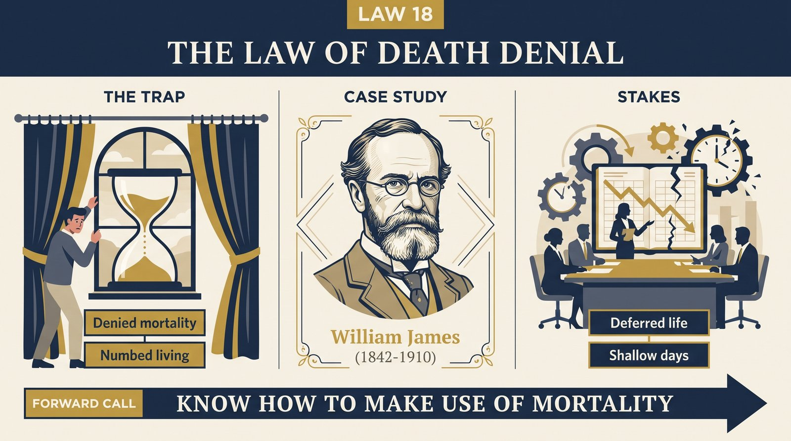
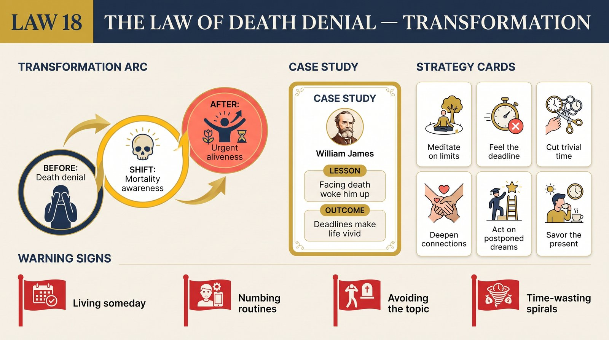

# Law 18: The Law of Death Denial

<audio controls preload="none" style="width:100%" src="../../audio/law-18-death-denial.mp3"></audio>

**Directive: "Know How to Make Use of Mortality"**

---

## Core Concept

Among the millions of species that have ever lived on Earth, human beings are distinguished by one cognitive capacity so radical it has shaped every aspect of our psychology and civilization: we know we will die. We can project our consciousness forward in time to a point where it no longer exists. We can contemplate our own nonexistence with enough vividness to produce genuine terror. And this terror — ancient, deep, and absolutely universal — is the most powerful single force in the architecture of the human psyche. Everything we build, everything we believe, everything we avoid, everything we pursue is partly organized around managing the anxiety that comes from knowing we are mortal.

The management strategy that most people employ, most of the time, is denial — not the simple intellectual refusal to accept the fact of death, but a vast and sophisticated psychological infrastructure for keeping death's reality at arm's length. This infrastructure is so complete that most people live as if they have infinite time. They defer the things they most want to do, the conversations they most need to have, the risks they most want to take — waiting for a "right time" that is actually a fantasy of permanent safety. They commit their best energies to activities that are ultimately about avoiding anxiety (accumulating security, building reputation, seeking comfort) rather than to the things that would make their finite time genuinely meaningful.

Greene draws on Terror Management Theory — the psychological framework developed by Sheldon Solomon, Jeff Greenberg, and Tom Pyszczynski based on the work of Ernest Becker — to explain the mechanisms of death denial. The theory's central claim is that a significant proportion of human motivation is organized around what Becker called "immortality projects": beliefs, behaviors, group memberships, and achievements that allow people to feel they are participating in something that will outlast their individual death. Religion, nationalism, artistic fame, ideological movements, the building of institutions, the bearing of children who will carry on your name — all serve partly as responses to mortality anxiety. This is not cynical reductionism; it acknowledges that these are real goods. The problem arises when the immortality project becomes so central that it produces the psychological distortions Greene catalogs: rigidity, fanaticism, the violent defense of belief systems, the refusal to question the ideology that provides existential protection.

The deepest irony, which is Law 18's central paradox, is that death denial does not actually reduce suffering — it increases it. By spending enormous psychological energy maintaining the illusion of unlimited time, people rob themselves of the urgency and clarity that finite time naturally provides. The person who has genuinely confronted their mortality — not morbidly, not in despair, but with clear-eyed realism — typically reports a profound change in their relationship to daily experience: trivial anxieties diminish, important things become more vivid, and the energy previously spent on denial becomes available for genuine engagement. Mortality, accepted rather than denied, is not a wound but a clarifying agent.

## The Human Weakness

The primary weakness is what Greene, following Becker and the Terror Management theorists, identifies as the "immortality hunger" — the need to feel that one's existence matters beyond the span of a single life. This hunger is not neurotic; it is the natural consequence of the human capacity for self-awareness applied to the fact of mortality. The problem is that immortality hunger, left unexamined, drives people toward substitute strategies that do not actually satisfy the underlying need. Fame is the most obvious: the fantasy that if enough people know your name, you will somehow persist. Status and wealth are subtler substitutes: if you can accumulate enough, perhaps you can buy your way past the equalizing finality of death. Ideological certainty is another: the true believer in any sufficiently absolute system (religious, political, philosophical) gains partial relief from mortality anxiety through identification with something eternal.

Each of these strategies has its costs. The fame-seeker organizes their life around the production of a public image rather than a genuine interior, and lives in permanent anxiety about whether the image is maintaining its value. The wealth-accumulator, past a certain point, is not accumulating for genuine use but for the illusory sense of permanence that large numbers produce — and the anxiety about losing the accumulation is as debilitating as the fear it was meant to resolve. The true believer finds that the immortality project requires vigorous defense against all challenges, because a challenged immortality project provides no protection — so they become progressively more hostile to doubt, more aggressive toward dissenters, and less capable of genuine intellectual engagement. The common thread is that all these strategies require continuous maintenance, and the maintenance itself becomes a form of psychological bondage.

A second weakness is the temporal distortion that death denial produces. When you are unconsciously operating as if you have unlimited time, you systematically undervalue the present moment relative to imagined future states. You defer the activities and relationships that matter most, treating them as rewards to be earned after you have secured sufficient safety, accumulated sufficient resources, achieved sufficient status. The present becomes a means to a future that perpetually recedes. The person on their deathbed who reports wishing they had spent less time working and more time with people they loved is describing the outcome of this systematic present-devaluation — decades of prioritization organized around a fantasy of unlimited future opportunity.

## Historical Figure: William James (American Philosophy and Psychology, Late 19th Century)

William James is one of the most significant intellectual figures in American history — the founder of American pragmatism, a pioneer of psychology as a scientific discipline, and the author of works that remain deeply alive a century after his death. Greene uses James's life story as his central case because James's intellectual vitality emerged directly from his confrontation with — not his denial of — existential terror.

James spent his early adult years in what he later described as a period of profound crisis: paralysis in the face of philosophical and existential uncertainty, terror at the implications of materialist science (which seemed to deny free will and render human existence meaningless), and what we would now recognize as severe depression. The crisis was not simply intellectual; it was existential, centered on the mortality question in its most acute form — if determinism is true, if there is no God, if the self is an illusion, then what is the point of any of this, and why bother? James was, in his late twenties and early thirties, genuinely unable to function, unable to commit to any direction, experiencing life as a series of suffocating constraints rather than open possibilities.

The transformation Greene traces is not James's resolution of these philosophical problems — he never resolved them, and his philosophy was partly built around the acceptance of irreducible uncertainty. The transformation was James's decision to act as if free will and meaning were real, not because he could prove they were, but because the alternative was paralysis and the experiment of acting otherwise was worth conducting. This pragmatic leap — choosing engagement over paralysis in the full knowledge that the choice was not metaphysically certain — was itself a confrontation with finitude. James was choosing to live fully in the absence of guarantees, which is only possible when you have faced, rather than denied, the reality that there are no guarantees.

From this confrontation emerged what became the core of pragmatism: the idea that the test of any belief is its practical consequences for life, that truth is not a fixed thing you discover but something you verify through action, that the universe is genuinely open and human choices genuinely matter. This philosophy could only have been written by someone who had faced the existential void and come back with the knowledge that engagement rather than certainty is what makes life livable. James's intellectual vitality for the rest of his long life — his curiosity, his generosity toward ideas, his willingness to take heterodox positions seriously, his enormous productivity — was the fruit of the confrontation rather than its casualty.

Greene also draws on the Japanese samurai tradition of daily death meditation — the practice of beginning each day by contemplating one's own death as a complete and final reality — as a contrasting cultural approach to the same challenge. The samurai who truly internalized this practice reportedly experienced a paradoxical liberation: knowing that death was already accomplished, there was nothing left to fear. Each day was therefore fully present, fully real, without the anxious future-orientation that death denial produces. This practice was not morbid; it was clarifying. It focused attention on what the day actually contained, on the relationships and actions that were genuinely present, rather than on the management of existential anxiety through accumulation, performance, and deferral.

## The Transformation

The transformation Greene prescribes begins not with accepting death intellectually (which is easy — everyone knows they will die) but with developing a visceral, practical, moment-to-moment awareness of finitude's implications. The intellectual knowledge "I will die" typically operates at a safe distance, processed and neutralized by familiar coping strategies before it can generate any useful urgency. What Greene prescribes is something closer to the samurai practice: a deliberate, regular return to the actual reality of your specific, finite time — not as an abstraction but as an immediate practical constraint on your choices.

One specific technique is the "decade exercise": imagine that you have only one more productive decade — not that you will die in ten years, but that you have ten years of full energy and capacity. Which relationships would you prioritize differently? Which work would you pursue more urgently? Which projects would you drop as too trivial for the time they require? Which conversations would you have that you have been deferring? Most people, doing this exercise honestly, discover a significant gap between how they are currently spending their time and how they would spend it under genuine time pressure. That gap is the cost of death denial — the difference between the life you are living and the life your actual values and priorities would produce.

The second element is what Greene calls "immortality project audit" — an honest examination of which of your significant commitments are organized around genuine values and which are organized around mortality anxiety. This requires asking, of each major commitment: if I were completely confident that I would not be remembered after my death — no legacy, no reputation persisting — would I still pursue this? The answer is uncomfortable for many people, because it reveals how much of what feels like purpose is actually anxiety management. The activities that survive the audit — that you would pursue even in the absence of any legacy — are your genuine values. The ones that do not survive it are worth examining honestly, and possibly replacing with something more genuinely aligned with the finite time you actually have.

Third is the cultivation of present-moment intensity — what Greene describes as learning to experience your current life with the vividness that mortal awareness can provide. This is partly a perceptual shift: choosing to attend to the actual texture of present experience (the specific person in front of you, the specific work in your hands, the specific quality of the moment) rather than treating the present as a staging ground for future states. The Buddhist notion of impermanence is relevant here: nothing that exists now will exist in exactly this form again, and the awareness of this impermanence can transform the ordinary into something genuinely precious.

## Practical Guide

- **Conduct the decade exercise regularly.** Once or twice a year, spend serious time imagining you have one more productive decade. Write down explicitly: what would you do differently? Which relationships would get more of your time? Which work would you prioritize? Which commitments would you drop? Then ask what is preventing you from living as if this were true, because it actually might be.
- **Audit your immortality projects.** List the commitments, goals, and identities you invest most heavily in. For each, ask honestly: am I pursuing this because it aligns with my genuine values, or because it provides relief from mortality anxiety? What would I feel if I gave it up — grief at the loss of something real, or terror at the loss of something I was using as protection?
- **Practice the Stoic memento mori.** Marcus Aurelius, Seneca, and the Stoic tradition generally prescribed regular contemplation of death — not as depression but as a clarifying technique. The phrase memento mori ("remember you will die") was a practical tool, not a curse. Find a form of this practice that works for you: a regular morning reflection, a written reminder, a ritual that returns you to the basic fact of your finitude.
- **Reverse the deferral habit.** Identify the three things you are most consistently deferring — the conversation, the project, the experience, the relationship — waiting for a "right time" that functions as a permanent excuse. Choose one and act on it within the next 30 days. The experience of having acted, rather than deferred, is usually clarifying: the deferral was maintaining an illusion of permanent future opportunity that is actually a form of death denial.
- **Use mortality to dissolve trivial anxieties.** When you find yourself consumed by social anxieties, status concerns, or the fear of judgment, practice asking: will this matter at the end? Not rhetorically, but genuinely. Most things that generate anxious energy are revealed, by this question, to be completely insubstantial — not worth the finite time they are consuming.
- **Honor the people who are still alive.** One of the most practical applications of mortality awareness is the recognition that the people you love and care about are also finite — and that expressions of genuine care, appreciation, and presence are not things that can be infinitely deferred. The specific form of death denial that treats important relationships as permanent background features, rather than finite present gifts, produces some of the most common deathbed regrets.
- **Build your legacy from genuine values, not anxiety.** If legacy matters to you — if you want your work to persist and matter beyond your death — ensure that the legacy you are building is genuinely yours: rooted in your actual values, expressing your real capacities, serving needs you genuinely care about. A legacy built on anxiety-management rather than genuine expression is both less satisfying to build and less likely to actually endure.

## Modern Application

**The driven professional who cannot stop working:** A 45-year-old executive is genuinely puzzled by her inability to slow down, take vacations, or be fully present with her family. She has enough; she has achieved significant things; but the drive continues to accelerate rather than diminish. Law 18 offers a diagnosis: the work has become an immortality project — a way of accumulating enough significance to protect against the awareness that she will die and be forgotten. The therapeutic work is not to work less but to examine what the work is for: to disentangle genuine vocation (work that aligns with real values) from anxiety management (work as a defense against finitude). The executive who has done this work is often more creative, not less productive — but the work becomes genuinely satisfying rather than compulsively necessary.

**The creative person blocked by perfectionism:** A writer who has been working on a novel for seven years, never quite finishing it, always finding something more to revise, is engaged in a specific form of death denial: the unfinished work is protected from judgment, from failure, from the finitude of having been completed and found wanting. While the work remains in progress, it retains the infinite potential of the not-yet-real. Law 18's prescription is direct: the perfectionistic block is mortality anxiety in creative form. Finishing requires accepting that the work will be what it is — finite, imperfect, mortal like its creator — and that this is exactly as it should be. The acceptance of creative mortality is the condition for creative vitality.

**The person facing a serious health diagnosis:** A 58-year-old diagnosed with a serious illness experiences the collapse of the death-denial infrastructure — the diagnosis makes the abstract concrete in a way that cannot be managed by the usual psychological strategies. This can produce either terror or clarity, depending on how the person relates to what has been revealed. Many people who have faced serious illness and survived report that the period after diagnosis — when the illusion of unlimited time collapsed — was among the most vivid and purposeful of their lives. The health crisis did not create the values and priorities that emerged; it simply removed the obstruction that had kept them from guiding daily choice. Law 18 suggests that this clarity is available without the health crisis, if the underlying work of mortality confrontation is done voluntarily rather than forced.

**The elderly parent and adult child navigation:** Adult children of aging parents often find themselves managing their own mortality anxiety through the relationship — avoiding difficult conversations about death, estate planning, end-of-life wishes, because having those conversations would make the parent's finitude too real. The parent, similarly, may collude with the avoidance. Both are engaged in death denial at the exact moment when genuine engagement would make the parent's final years and the child's grief ultimately less painful. Law 18 prescribes the harder path: having the conversations, making the arrangements, being genuinely present with the reality of finitude, so that what remains is as full and clear as possible.

## Warning Signs

- You consistently defer the things you most want to do, the people you most want to see, and the life you most want to live until you have achieved some threshold of security, success, or readiness that perpetually recedes.
- You feel compelled to accumulate — money, status, recognition, achievements — beyond any rational assessment of what you actually need, and the accumulation does not reduce anxiety but seems instead to raise the threshold of "enough."
- The prospect of being forgotten after death — of having no lasting legacy, no reputation that survives — produces a level of distress that feels existentially threatening rather than simply unfortunate. You may be heavily invested in immortality projects.
- You find it very difficult to be fully present with people, experiences, or activities — your mind is consistently in an imagined future or a processed past, rarely in the actual present moment. This is the temporal consequence of death denial.
- You respond to others' philosophical or spiritual challenges to your worldview with disproportionate hostility — more than intellectual disagreement would explain. This may indicate that the challenged belief is functioning as an immortality project rather than simply as a held view.
- You have important conversations that you have been meaning to have for years — with parents, partners, children, friends — that you keep deferring. The deferral is comfortable; the conversation would require acknowledging that the relationship and the people in it are finite.

## Key Quotes

> "The awareness of death is not the enemy of life — it is its most powerful ally. Every great culture that has been honest about mortality has found in it not despair but liberation: from trivial anxieties, from the tyranny of other people's opinions, from the compulsive pursuit of substitutes for living."

> "James did not overcome his terror of death. He did something harder and more useful: he learned to act in its full presence. His pragmatism was not a philosophical system built in spite of mortality but a practice of living built from its direct confrontation."

> "We live as if we have infinite time, which means we spend our finite time very poorly. The paradox is that the person who has genuinely made peace with their finitude is the most fully alive person in the room — because they know what the room actually costs."

## Reflection Questions

1. If you had only one more productive decade — not certain death, but one decade of full energy and capacity — what would you do differently, starting tomorrow? What does the gap between that answer and your current life tell you?
2. What are the things you are most consistently deferring: the conversations, the projects, the risks, the experiences? What is the "right time" you are waiting for, and what is the probability that time will actually arrive? What would you need to believe in order to stop deferring?
3. What are your primary "immortality projects" — the commitments and achievements that provide you with a sense of participating in something that will outlast your death? Which of these are rooted in genuine values and which might be anxiety-management? What would it mean to pursue only the former?
4. Where do you notice your mortality anxiety most clearly — in workaholism, perfectionism, status-seeking, belief rigidity, inability to be present, difficulty with relationships? What specific form does your death denial take, and what is it costing you?
5. What do you most want to be true of the life you have lived, at its end? Not what you want to be remembered for — what do you want to have actually been and done? And what would it mean to begin organizing your choices around that answer now, rather than deferring it to a future that may not arrive?

## Connected Laws

- [Law 13: The Law of Aimlessness](law-13-aimlessness.md) — Confronting mortality is one of the most powerful tools for discovering and clarifying a genuine life's task. When you strip away the immortality projects, the accumulated social performances, and the deferred authentic desires that death denial produces, what remains — what you would still pursue if there were no legacy, no recognition, no permanent significance — is your actual purpose. The two laws together describe the complete project of living a fully owned life: Law 13 asks what you are for, and Law 18 asks whether you are living it with appropriate urgency.
- [Law 8: The Law of Self-Sabotage](law-08-self-sabotage.md) — Death denial is a foundational driver of self-sabotage. The person who unconsciously believes they do not deserve genuine happiness, or who is more comfortable with the familiar constraints of an unlived life than with the terrifying openness of genuine choice, is often using self-sabotage as a death-denial strategy: if you never fully commit, you never fully die (because you never fully live). The connection between mortality fear and the patterns of unconscious self-defeat explored in Law 8 is one of Greene's deepest structural insights.
- [Law 17: The Law of Generational Myopia](law-17-generational-myopia.md) — Generational psychology is partly organized around shared mortality anxiety and shared immortality projects. Each generation develops its characteristic immortality strategies — the values, commitments, and achievements that provide collective protection against the awareness of death — and these collective strategies shape the generation's distinctive blind spots. Understanding both laws enables a fuller picture: not just how mortality shapes individual psychology (Law 18) but how it shapes the collective psychology of historical moments (Law 17).
