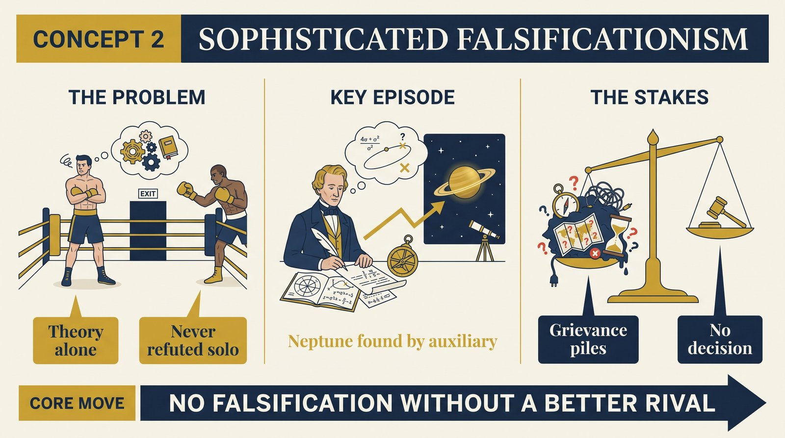
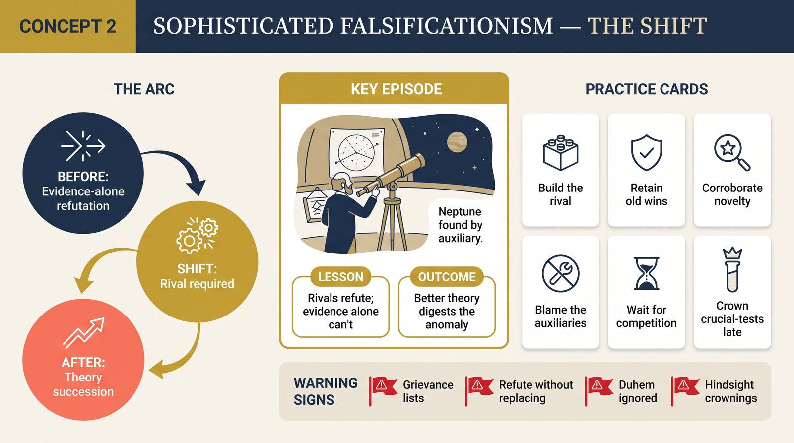

# Concept 2 — Sophisticated Falsificationism

<audio controls preload="none" style="width:100%" src="../../audio/concept-02-sophisticated-falsificationism.mp3"></audio>

## Core Thesis

Lakatos's repair of Popper: a theory is never falsified by evidence alone — it is falsified only when a **better theory** arrives. "Better" has three parts: the rival predicts novel facts the old theory forbids, explains the old theory's successes, and some of the novel predictions get corroborated. Refutation without replacement is no refutation at all; science is a contest of theories, not a duel between theory and nature.

## The Problem It Solves

Two fatal defects of naive falsificationism. First, theories never face nature alone (the Duhem problem): every test involves auxiliary assumptions, so blame can always be shifted. Second, all theories are born into an ocean of anomalies; if anomalies killed, nothing would survive infancy. Sophisticated falsificationism relocates the decision: not "does evidence contradict theory?" but "does a rival digest the evidence better?"

## Key Episode

The white raven problem, Lakatos-style: observing anomalies in Uranus's orbit did not falsify Newton — astronomers postulated an unseen planet, and Le Verrier's calculation found Neptune exactly where the auxiliary hypothesis required. The same maneuver tried for Mercury (planet "Vulcan") failed forever — but Newton still wasn't abandoned until Einstein offered a theory that predicted Mercury's perihelion *and* everything Newton got right.

## The Shift

From falsification-as-execution to falsification-as-succession: the unit of appraisal doubles (theory plus rival), the verdict waits for competition, and "crucial experiments" are recognized as crucial only in hindsight, after a rival wins. Popper's logic survives, but the trigger changes hands.

## Critiques & Rivals

Popper resisted: this makes refutation hostage to invention — a theory could reign unchallenged forever merely for lack of rivals. Lakatos accepts that consequence; so does history. Feyerabend radicalized it: if rivals are required for refutation, then proliferating theories is a scientific duty — even wild ones.

## Modern Application

The operational rule from Kuhn's crisis chapter gets its logic here: never retire a system on bug reports; retire it on a benchmarked rival. An architecture, vendor, or strategy with known failures is unfalsified until the alternative exists that keeps its wins and fixes its losses — and demonstrates one new win besides. Build rivals; don't collect grievances.

## Key Terms

- **Duhem problem** — tests hit theory-plus-auxiliaries, never theory alone
- **Novel fact** — a prediction not used in constructing the theory
- **Crucial experiment** — an honorific bestowed retrospectively

## Key Quotes

> "There is no falsification before the emergence of a better theory."

> "The proponents of a research programme may even 'thrive on' anomalies: an ocean of anomalies is a challenge, not a refutation."

## Reflection Questions

1. What grievance list are you maintaining that needs to become a rival prototype?
2. Which "crucial experiment" in your field's lore was actually decided by the winner's later success?
3. What auxiliary assumptions absorb the blame when your main framework misses?

## Connections

- The machinery that manages anomalies: [protective belt](concept-05-protective-belt.md)
- What "better sequence" means precisely: [progressive problemshifts](concept-07-progressive-vs-degenerating.md)
