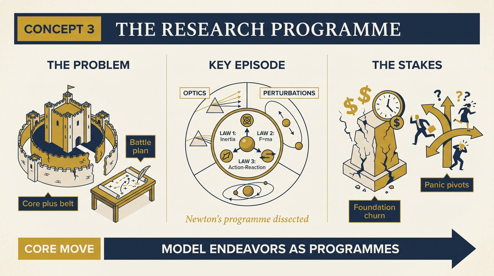
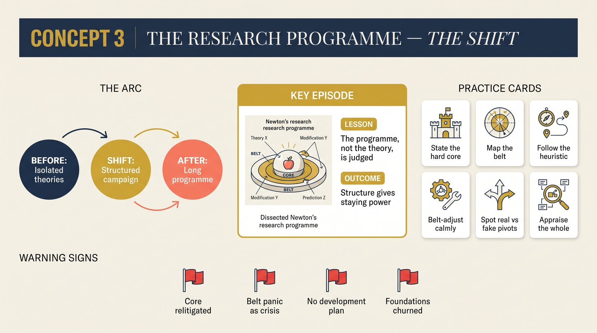

# Concept 3 — The Research Programme

<audio controls preload="none" style="width:100%" src="../../audio/concept-03-research-programme.mp3"></audio>

## Core Thesis

The unit of scientific achievement is not the theory but the **research programme**: a developing sequence of theories bound together by a hard core of unrevisable commitments, a protective belt of adjustable auxiliaries, and heuristics — rules telling researchers what to avoid (negative heuristic) and what to pursue (positive heuristic). Newtonian mechanics, Marxism, Freudianism: each is a programme, and each is appraised as a whole, over time.

## The Problem It Solves

Kuhn's paradigm captured something real — the tenacity, the shared commitments — but wrapped it in sociology. Lakatos rebuilds it as logic: the paradigm's "dogmatism" becomes the negative heuristic (a methodological decision, not blind faith); normal science's puzzle-solving becomes the positive heuristic's planned agenda. Everything Kuhn described, reconstructed as rational strategy.

## Key Episode

The Newtonian programme in full dress: hard core — the three laws plus universal gravitation; protective belt — geometrical optics, planetary shapes, perturbation assumptions, atmospheric refraction; positive heuristic — the planned march from point-planets to spinning oblate spheroids to interplanetary perturbations. Anomalies hit the belt, never the core; the heuristic told each generation which idealization to relax next.

## The Shift

From theories as isolated claims to programmes as **strategies with structure**. Science stops being a pile of propositions and becomes a small number of long-running campaigns, each with protected foundations, sacrificial outworks, and a battle plan.

## Critiques & Rivals

How sharply can core and belt be distinguished in practice? Historians find the boundary negotiated, not given. And who decides what's core? Lakatos: the community's methodological decision — which reopens the door to the sociology he wanted to expel. Kuhn noted the deep similarity to his own view, minus the label "irrational."

## Modern Application

Model any serious endeavor as a programme. A startup: hard core = the founding bet ("developers will pay for X"); belt = pricing, packaging, channels, features; positive heuristic = the roadmap's planned idealization-lifting. Most "pivots" are belt adjustments; a real pivot changes core — and that founds a *new* programme. Knowing which layer you're touching prevents both panic and drift.

## Key Terms

- **Research programme** — theory-sequence + hard core + belt + heuristics
- **Negative heuristic** — do not aim refutations at the core
- **Positive heuristic** — the planned agenda of programme development

## Key Quotes

> "The basic unit of appraisal must be not an isolated theory or conjunction of theories but rather a 'research programme'."

> "All scientific research programmes may be characterized by their 'hard core'."

## Reflection Questions

1. State your project's hard core in one sentence. Can your team?
2. Which current "crisis" is actually a routine belt adjustment?
3. Does your roadmap embody a positive heuristic — or just react to the loudest anomaly?

## Connections

- Each component in depth: [hard core](concept-04-hard-core.md), [belt](concept-05-protective-belt.md), [heuristic](concept-06-positive-heuristic.md)
