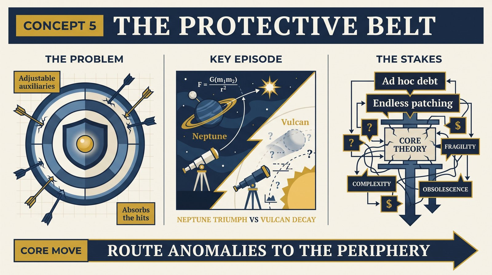
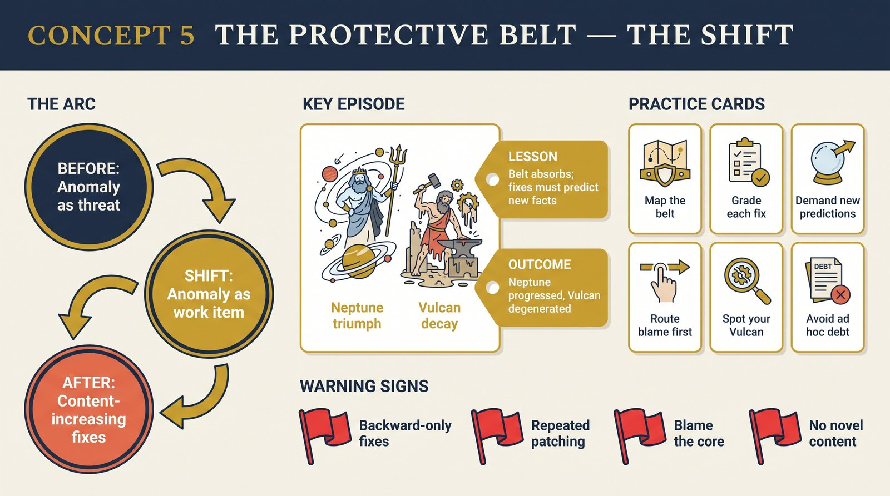

# Concept 5 — The Protective Belt

<audio controls preload="none" style="width:100%" src="../../audio/concept-05-protective-belt.mp3"></audio>

## Core Thesis

Around the hard core sits the **protective belt**: auxiliary hypotheses, initial conditions, observational theories, instrument assumptions — everything adjustable. The belt takes the hits. When prediction fails, blame lands here by design: refine the auxiliary, remeasure, add a factor. Science's day-to-day work is belt engineering, and the quality of belt adjustments — ad hoc or content-increasing — decides whether the programme lives honorably.

## The Problem It Solves

The Duhem problem, weaponized into method. Since tests never isolate the core anyway, Lakatos makes the ambiguity productive: *decide in advance* where blame lands. The belt converts potential refutations into research tasks — each anomaly becomes an assignment to some auxiliary hypothesis, keeping the core's deep consequences flowing while the edges absorb reality's friction.

## Key Episode

Neptune again, now in its proper home: Uranus misbehaves; Newtonians adjust not the law of gravitation but the auxiliary assumption "the solar system contains seven planets." The adjustment predicts a new planet's exact position — content-increasing, gloriously corroborated. Contrast the same move decades later: "Vulcan" postulated inside Mercury's orbit, never found, re-postulated, never found — the identical maneuver, degenerating into excuse.

## The Shift

From anomaly-as-threat to anomaly-as-work-item. The belt is a *routing* mechanism: it doesn't deny failures, it assigns them. And it reframes what "testing a theory" means — you're always testing the current belt configuration, and belt failure is informative precisely because the core stayed fixed.

## Critiques & Rivals

Grünbaum and others pressed: without independent criteria for *which* auxiliary to blame, routing is arbitrary. The ad hoc distinctions (Lakatos catalogued ad hoc₁, ad hoc₂, ad hoc₃) sharpen the answer — an adjustment must predict something new (not ad hoc₁), have some of it confirmed (not ad hoc₂), and grow from the heuristic rather than patchwork (not ad hoc₃) — but applying the labels in real time remains contested.

## Modern Application

Run incident postmortems with belt discipline: list the auxiliary assumptions between your core system and the failure (config, data quality, third-party APIs, user behavior models) and route blame there *first* — but demand each fix be content-increasing: it must predict some new observable improvement, not merely re-describe the incident. Fixes that only explain backwards are ad hoc debt.

## Key Terms

- **Protective belt** — the adjustable periphery absorbing refutation
- **Ad hoc adjustment** — belt change with no novel content
- **Content-increasing shift** — adjustment that predicts new facts

## Key Quotes

> "It is this protective belt of auxiliary hypotheses which has to bear the brunt of tests and get adjusted and re-adjusted, or even completely replaced."

> "Any theory can be saved from refutation by suitable adjustments in the background knowledge in which it is embedded."

## Reflection Questions

1. List the belt around your core system — which auxiliary absorbs the most blame, and is it earning it?
2. Was your last fix content-increasing or ad hoc — what new thing did it predict?
3. Where has repeated belt-patching (your Vulcan) signaled something deeper?

## Connections

- What distinguishes noble from shameful adjustments: [progressive vs degenerating](concept-07-progressive-vs-degenerating.md)
- The planned sequence of adjustments: [positive heuristic](concept-06-positive-heuristic.md)
