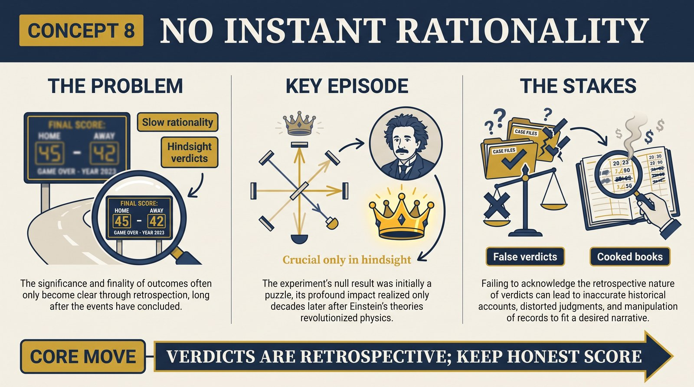
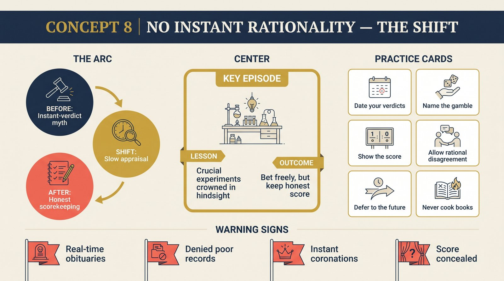

# Concept 8 — No Instant Rationality

<audio controls preload="none" style="width:100%" src="../../audio/concept-08-no-instant-rationality.mp3"></audio>

## Core Thesis

The methodology's most disquieting honesty: **appraisal is not advice**. Lakatos can tell you a programme is degenerating; he cannot tell you the rational moment to leave it. Crucial experiments are crowned only in hindsight — sometimes decades later. It is not irrational to stick with a degenerating programme (it may recover), nor to gamble on a young one still behind its rivals. Rationality operates, but slowly; "instant rationality" — the dream of a rulebook verdict at each moment — is a myth.

## The Problem It Solves

Every earlier methodology promised real-time verdicts and was humiliated by history: scientists who violated the rulebook (staying with "refuted" Newton, backing "unproven" Copernicus) kept being vindicated. Lakatos saves rationality by slowing it down: the game has objective standards, but the score is announced in retrospect. That's also his answer to Feyerabend — standards exist; they just don't run on your clock.

## Key Episode

The Michelson–Morley experiment, textbook-crowned as the "crucial experiment" that killed the ether. In real history: performed 1887, treated for decades as a puzzling anomaly inside the ether programme, reinterpreted as crucial only *after* Einstein's programme progressed — a quarter-century later. The execution happened long before anyone knew a crucial experiment had occurred. Hindsight wrote the caption.

## The Shift

From methodology-as-referee to methodology-as-historian. Verdicts are real but retrospective; risk is ineliminable; and the freedom this grants is symmetrical — the conservative sticking with the old programme and the gambler backing the new one can both be rational, *provided both keep honest score*. What's irrational is only denying the score: claiming a degenerating programme is progressing.

## Critiques & Rivals

Feyerabend called this the methodology's self-destruction: standards that never command action in real time are "verbal ornament." Others saw a virtue Popper missed — tolerance of rational disagreement within science. Later Bayesians reframed the whole picture as gradual updating, dissolving the drama. Lakatos's line held: honesty about the score, freedom about the bet.

## Modern Application

Two disciplines follow. First, humility in judgment: the verdict on today's contested bets (a technology, a research direction) belongs to the future — treat confident real-time obituaries and coronations as genre fiction. Second, honesty in bookkeeping: you may rationally stay long on a struggling approach or jump early to an immature one, but you must say out loud which it is and what the score shows. The sin isn't the bet; it's cooking the books.

## Key Terms

- **Instant rationality** — the myth of real-time rulebook verdicts
- **Crucial experiment (hindsight)** — crowned retrospectively by the winner
- **Rational disagreement** — conservative and gambler both within reason

## Key Quotes

> "Rationality works much slower than most people tend to think, and, even then, fallibly."

> "It is not irrational to defend a degenerating programme... what is irrational is to deny its poor public record."

## Reflection Questions

1. Which current "verdict" in your field is really a bet wearing a referee's uniform?
2. Are you denying a poor public record — yours or your team's — rather than defending a known gamble?
3. What score would you need to see, honestly kept, to change your biggest professional bet?

## Connections

- The score being kept: [progressive vs degenerating](concept-07-progressive-vs-degenerating.md)
- What this means for writing history: [next concept](concept-09-history-and-methodology.md)
