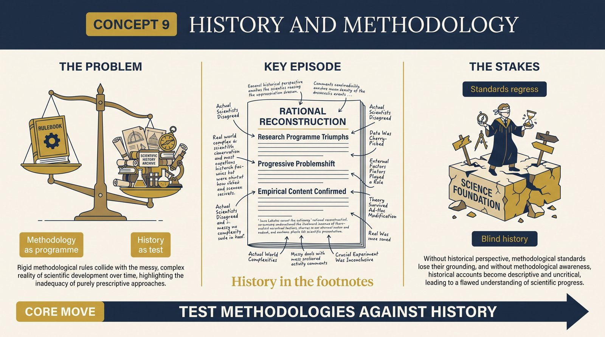
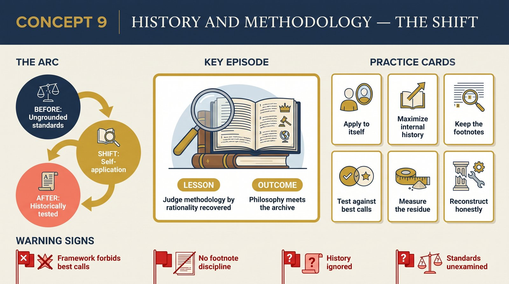

# Concept 9 — History and Methodology

<audio controls preload="none" style="width:100%" src="../../audio/concept-09-history-and-methodology.mp3"></audio>

## Core Thesis

Methodologies of science are themselves research programmes, and history is their testing ground. Lakatos's meta-criterion: the best methodology is the one that reconstructs the largest part of great science as *rational* (internal history), leaving the smallest residue to be explained away by psychology and sociology (external history). Inductivism, conventionalism, and falsificationism each fail their historical test; the methodology of research programmes, he argues, turns more of science's actual record into reason than any rival.

## The Problem It Solves

The regress everyone feared: by what standard do you judge the standards? Lakatos's answer is elegantly recursive — apply the methodology to itself. A theory of rationality that must call Newton, Copernicus, and Einstein irrational at their finest moments is degenerating as a theory. History becomes the anomaly-ocean in which methodologies swim or drown.

## Key Episode

The famous provocation: history of science written as "rational reconstruction" in the main text, with actual history relegated to the footnotes — and the footnotes noting where real scientists deviated from rationality's script. Critics gasped ("history as caricature"); Lakatos grinned. The caricature is the point: it shows exactly how much of the record reason can claim, and prices what remains for sociology to buy.

## The Shift

From methodology-versus-history as embarrassment to methodology-times-history as research design. Internal history (what reason explains) and external history (what needs causes, not reasons) become variables: each methodology draws the line differently, and the line's position is the methodology's test score. Philosophy of science becomes an empirical discipline — its data, the archive.

## Critiques & Rivals

Kuhn: the reconstruction is "not history at all." Feyerabend, in their glorious correspondence (*For and Against Method*): the meta-criterion presupposes what it must prove — that great science was rational. Sociologists of knowledge took the opposite exit: make *everything* external. The debate is the direct ancestor of today's rationalist-versus-constructivist divide in science studies.

## Modern Application

Apply the meta-criterion to your organization's decision frameworks. A good framework should reconstruct most of your *best past decisions* as rational applications of it — if your prized methodology would have forbidden the three best calls your team ever made, the methodology is degenerating, not the calls. And keep the footnote discipline: record where reality deviated from the framework's script. The size of those footnotes is your framework's honest test score.

## Key Terms

- **Internal history** — the part of history rational by the methodology's lights
- **External history** — the residue, explained by psychology/sociology
- **Meta-criterion** — judge methodologies by how much rationality they recover

## Key Quotes

> "Philosophy of science without history of science is empty; history of science without philosophy of science is blind."

> "Each rational reconstruction produces some characteristic pattern of rational growth of scientific knowledge... all of them may be criticized... by criticizing the rational historiographical research programmes into which they can be developed."

## Reflection Questions

1. Would your decision framework endorse your team's three best historical calls? If not, which is degenerating?
2. What lives in your footnotes — where did the last big win deviate from the official method?
3. How much of your field's history can your favorite methodology claim as rational — honestly measured?

## Connections

- The self-application completes [Concept 1's problem](concept-01-the-problem.md)
- Kuhn's rival account of the same record: the [Kuhn companion](../../structure-of-scientific-revolutions/index.md)
