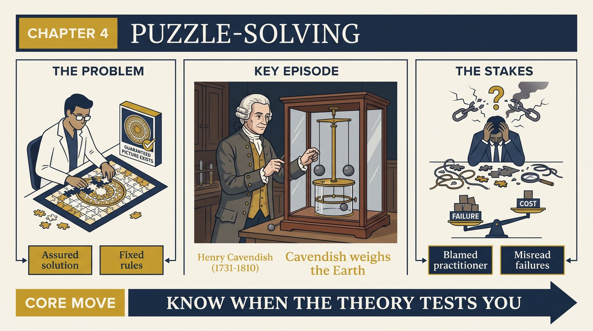
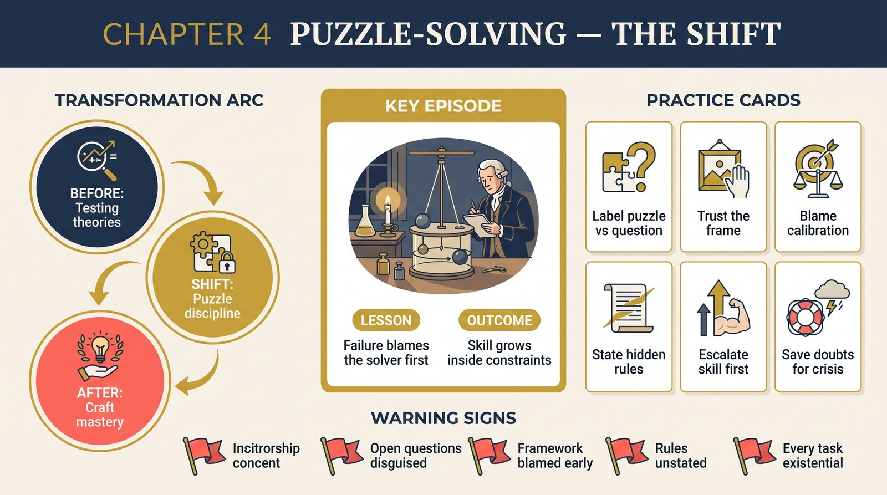

# Chapter 4 — Normal Science as Puzzle-Solving

<audio controls preload="none" style="width:100%" src="../../audio/ch-04-normal-science-as-puzzle-solving.mp3"></audio>

## Core Thesis

Normal research problems are **puzzles**: challenges where a solution is assured to exist, the rules constrain admissible moves, and failure discredits the scientist rather than the theory. Like a chess problem or crossword, the fascination isn't the outcome's importance — it's the test of ingenuity against known constraints.

## The Problem It Solves

Why do brilliant people devote careers to questions whose answers are largely known in advance? Because the paradigm guarantees the puzzle has a solution, and solving what nobody else could solve is the professional achievement. This also explains scientific motivation without invoking noble truth-seeking: the drive is craftsmanlike — to be the one who cracked it.

## Key Episode

The measurement of Cavendish's gravitational constant, or the decades-long refinement of atomic weights in nineteenth-century chemistry. Nobody doubted Newton or Dalton; the challenge was making apparatus and analysis good enough. A scientist who failed had failed as a puzzle-solver — "a poor carpenter blames his tools," and a poor scientist gets blamed, not the paradigm.

## The Shift

From "scientists test theories" to "theories test scientists." During normal science, the paradigm is not on trial. This reverses Popper exactly: a failed prediction reflects first on the practitioner's skill, and only after repeated, resistant failure does it begin to reflect on the framework.

## Critiques & Rivals

Popper: this is dogmatism institutionalized. Lakatos tried a synthesis — research programmes with a protected "hard core," where the negative heuristic forbids aiming refutations at foundations, mirrors Kuhn's puzzle-solving while keeping a rational reconstruction. Critics also note some sciences (parts of social science) generate puzzles without assured solutions — are they then not normal sciences?

## Modern Application

Well-run engineering and operations teams work in puzzle mode: the architecture is fixed, the ticket has a definition of done, failure means escalate-your-skill not redesign-the-system. Burnout and chaos follow when management turns every task into an open question — or when a genuinely open question is disguised as a routine puzzle. Name which mode a task is in before assigning it.

## Key Terms

- **Puzzle** — a problem with an assured solution and rules constraining acceptable solutions
- **Rules** — explicit and implicit commitments: laws, instruments, metaphysics, standards
- **Assured solution** — the paradigm's guarantee that makes sustained effort rational

## Key Quotes

> "Though intrinsic value is no criterion for a puzzle, the assured existence of a solution is."

> "It is a poor carpenter who blames his tools... only the practitioner is blamed, not his tools."

## Reflection Questions

1. Which of your current problems are puzzles (solution assured) and which are open questions dressed as puzzles?
2. When you fail at a task, do you first suspect your skill or your framework — and is that calibrated?
3. What rules constrain your solutions so silently you'd struggle to state them?

## Connections

- Where the rules come from — and why they're not really rules: [Priority of Paradigms](ch-05-priority-of-paradigms.md)
- What happens when a puzzle refuses solution: [Crisis](ch-07-crisis-and-new-theories.md)
