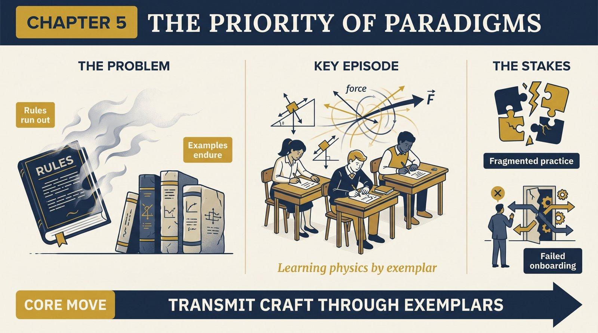
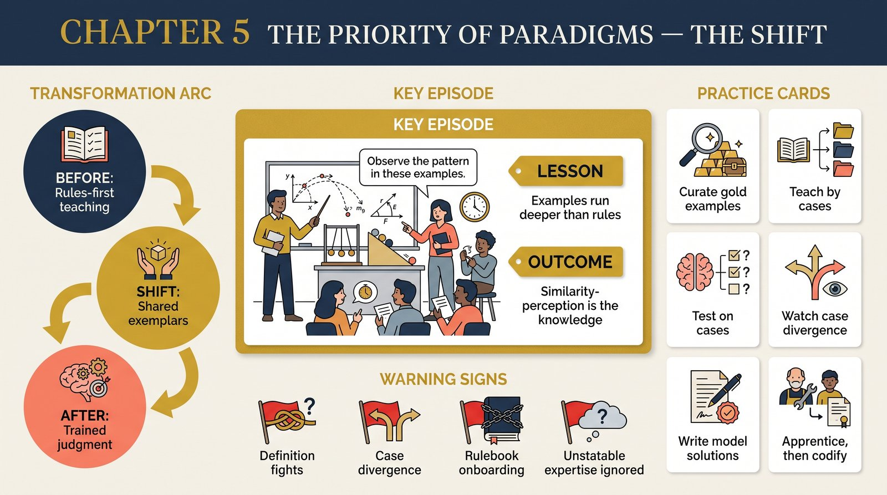

# Chapter 5 — The Priority of Paradigms

<audio controls preload="none" style="width:100%" src="../../audio/ch-05-priority-of-paradigms.mp3"></audio>

## Core Thesis

Paradigms are prior to, and deeper than, any set of rules you could extract from them. Scientists agree on exemplary solutions — concrete model problems — without necessarily agreeing on, or even being able to state, the rules those solutions embody. Shared examples, not shared definitions, hold a research tradition together.

## The Problem It Solves

Historians hunting for the "rules" of a scientific era find endless disagreement at the level of definitions and methodology — yet the science itself proceeds coherently. Kuhn's resolution: coherence lives in the exemplars. Like Wittgenstein's "games," research traditions are family-resemblance networks; nobody needs the essence to play.

## Key Episode

Students learning physics. They don't learn "force" from a definition; they learn it by grinding through the inclined plane, the pendulum, the orbit — until new problems look like old ones. Ask working physicists for the rules of their trade and you get hesitation and disagreement; give them a problem and they converge instantly. The knowledge is in the trained similarity-perception, not in stated criteria.

## The Shift

From rules-first to examples-first accounts of knowledge. Education in a science is acquisition of exemplars, closer to apprenticeship than to theorem-learning. This is why paradigms can guide research even where rules run out — and why a tradition can drift into crisis without anyone violating an explicit rule.

## Critiques & Rivals

The 21-senses-of-paradigm critique lands hardest here. In the Postscript Kuhn splits the term: **disciplinary matrix** (the whole constellation of shared commitments) versus **exemplars** (the concrete shared examples — the sense he calls "philosophically deepest"). Rule-based philosophies of science (Carnap, early Popper) are the standing rivals; later cognitive science largely vindicated Kuhn on similarity-based learning.

## Modern Application

Onboarding, style guides, and playbooks fail when written as rules alone. What actually transmits a practice: worked examples, model PRs, gold-standard documents, case libraries. If you want a team to share judgment, curate exemplars. If people disagree on definitions but converge on cases, the practice is healthy; if they recite the same definitions but diverge on cases, it isn't.

## Key Terms

- **Exemplar** — a concrete problem-solution that trains similarity perception
- **Family resemblance** — coherence through overlapping likeness, no common essence
- **Tacit knowledge** — what practitioners know but cannot state (via Polanyi)

## Key Quotes

> "Paradigms may be prior to, more binding, and more complete than any set of rules for research that could be unequivocally abstracted from them."

> "Scientists work from models acquired through education... often without quite knowing or needing to know what characteristics have given these models the status of community paradigms."

## Reflection Questions

1. What three exemplars would you hand a newcomer to transmit your craft — and do your colleagues pick the same ones?
2. Where does your team share definitions but diverge on cases?
3. What do you know how to do that you cannot state as rules?

## Connections

- Grounds the education story behind [puzzle-solving](ch-04-normal-science-as-puzzle-solving.md)
- The Postscript's disciplinary matrix: [Chapter 14](ch-14-postscript.md)
