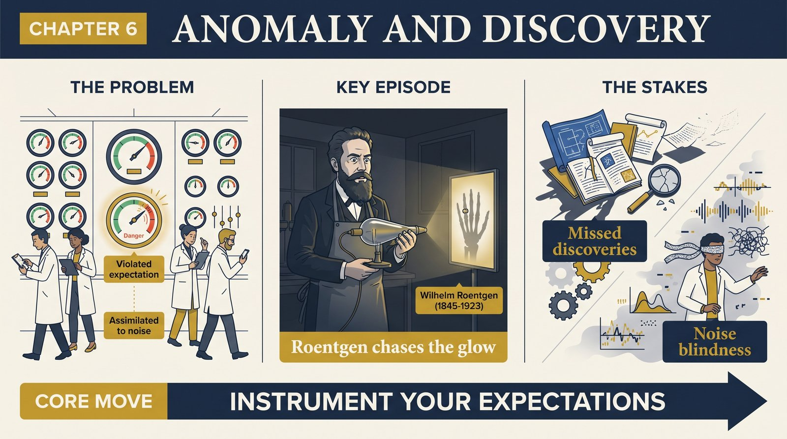
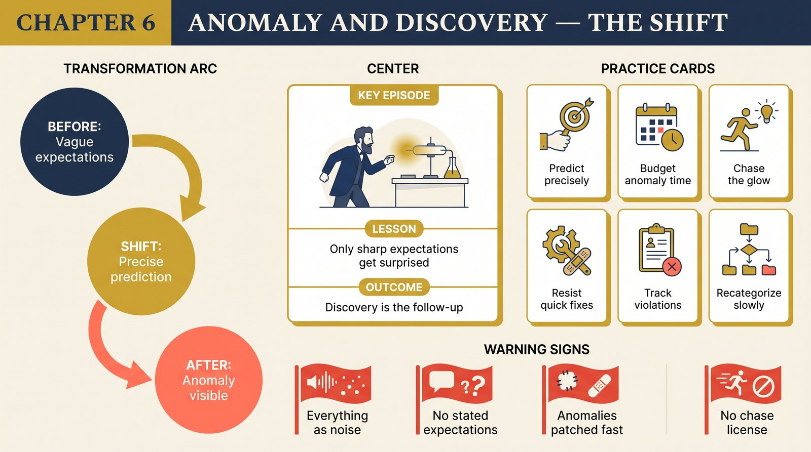

# Chapter 6 — Anomaly and the Emergence of Scientific Discoveries

<audio controls preload="none" style="width:100%" src="../../audio/ch-06-anomaly-and-discovery.mp3"></audio>

## Core Thesis

Discovery is not an event but a **structured process**: it begins with the awareness of anomaly — nature violating paradigm-induced expectations — and ends only when the paradigm has been adjusted so the anomalous becomes the expected. Paradoxically, the paradigm's rigidity is what makes anomalies visible: you can only be surprised if you had precise expectations.

## The Problem It Solves

The myth of the discovery moment. "Who discovered oxygen, and when?" has no clean answer — because seeing something and seeing it *as* something new are different achievements, often spread across people and years. Kuhn replaces "eureka" with a process: anomaly → extended exploration → conceptual adjustment.

## Key Episode

Oxygen. Priestley collected the gas but categorized it within phlogiston chemistry ("dephlogisticated air"). Lavoisier, primed by growing anomalies in weight-gain experiments, saw a new kind of substance — and rebuilt chemistry around it. Also X-rays: Roentgen noticed a glowing screen that "shouldn't" glow, and weeks of investigation turned a lab accident into a new class of phenomena. The cathode-ray paradigm made the glow anomalous; that's why it was noticed at all.

## The Shift

From discovery-as-moment to discovery-as-process, and from novelty-seeking to novelty-against-expectation. Kuhn adds the psychology: like the anomalous playing cards in the Bruner–Postman experiment (a red six of spades), scientists first assimilate anomalies to existing categories, and only with repeated exposure — often with resistance and discomfort — does the new category emerge.

## Critiques & Rivals

Philosophers questioned whether "paradigm-induced expectation" is needed — wouldn't any background theory do? Others note discoveries in weakly-paradigmatic fields. But the core claim — that precision of expectation is the anomaly-detector — survives and now underwrites ideas like "measure everything so surprises can register."

## Modern Application

Instrument your expectations. A team that predicts precisely (forecasts, error budgets, dashboards with expected ranges) will detect the market shift or the system fault early; a team with vague expectations sees nothing but noise. And when an anomaly appears, budget real time for it — the discovery is in the follow-up, not the first glimpse.

## Key Terms

- **Anomaly** — a violation of paradigm-induced expectation
- **Discovery-as-process** — noticing, exploring, and conceptually assimilating novelty
- **Perceptual assimilation** — forcing the new into old categories (the anomalous cards)

## Key Quotes

> "Discovery commences with the awareness of anomaly, i.e., with the recognition that nature has somehow violated the paradigm-induced expectations that govern normal science."

> "Novelty ordinarily emerges only for the man who, knowing with precision what he should expect, is able to recognize that something has gone wrong."

## Reflection Questions

1. What are your precise expectations this quarter — precise enough that a violation would register?
2. What anomaly are you currently explaining away as measurement error?
3. Who in your organization has permission to chase a glowing screen for three weeks?

## Connections

- When anomalies accumulate and resist: [Crisis](ch-07-crisis-and-new-theories.md)
- The perceptual mechanics return in [Revolutions as Changes of World View](ch-10-revolutions-as-worldview-change.md)
