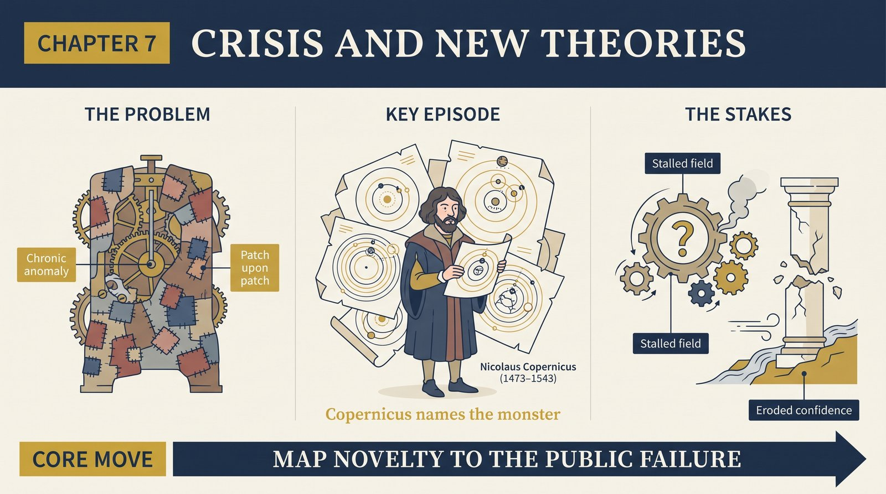
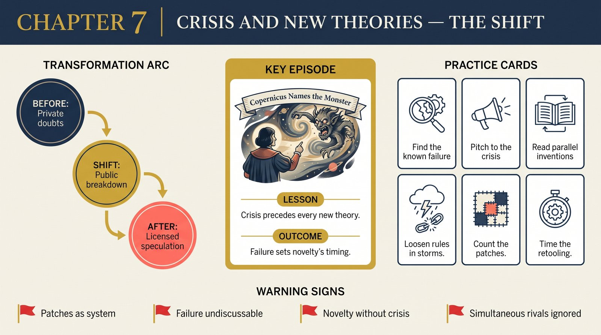

# Chapter 7 — Crisis and the Emergence of Scientific Theories

<audio controls preload="none" style="width:100%" src="../../audio/ch-07-crisis-and-new-theories.mp3"></audio>

## Core Thesis

New theories are born from **crisis**: a period when a paradigm's core puzzles persistently refuse solution, confidence erodes, and the field's ailment becomes common knowledge. Crisis is the essential precondition of novel theory — no community abandons its way of seeing the world over a mere handful of anomalies.

## The Problem It Solves

Why do new fundamental theories appear when they do — and why are they so often invented independently and simultaneously? Because crisis is a community condition, not a private insight. When the shared paradigm visibly fails at a central problem, many minds converge on the breaking point at once.

## Key Episode

Copernicus inherited a Ptolemaic astronomy that was, by his own description, a "monster" — accurate nowhere in particular, patched endlessly, with calendar reform stalled on its imprecision. The crisis was recognized before the solution existed. Likewise phlogiston chemistry drowning in weight-gain anomalies before Lavoisier, and the ether problem (Michelson–Morley among others) before Einstein. In each case: technical breakdown first, new theory second.

## The Shift

From "genius strikes" to "crisis selects." The pre-history of every major theory shows a paradigm already in visible trouble at exactly the point the new theory addresses. Novelty is a response to failure, and its timing is set by the old paradigm's collapse schedule, not by inspiration's calendar.

## Critiques & Rivals

Historians have found revolutions without clear crisis (was there a crisis before Darwin?) and crises resolved without revolution. Lakatos objected that "crisis" is a psychological notion, not a rational one — his degenerating research programmes are the attempted rational reconstruction. Kuhn's reply in the Postscript: crisis is the usual, not universal, prelude.

## Modern Application

Organizations rarely adopt genuinely new models while the old one still hits its numbers. If you carry a heterodox idea, map it to the current model's most public failure — that's the only door through which novelty enters. And read simultaneous invention as a signal: when three competitors ship the same "original" idea, the old paradigm's crisis was the real author.

## Key Terms

- **Crisis** — community-wide erosion of confidence from persistent core anomalies
- **Simultaneous discovery** — parallel invention driven by a shared breaking point
- **Paradigm articulation vs. speculation** — crisis loosens rules and licenses wilder theorizing

## Key Quotes

> "Novel theory emerged only after a pronounced failure in the normal problem-solving activity."

> "The significance of crises is the indication they provide that an occasion for retooling has arrived."

## Reflection Questions

1. What is your field's "calendar reform" — the practical failure everyone quietly acknowledges?
2. Are you trying to sell a new framework where no crisis exists yet?
3. Which anomaly in your work has been patched so many times the patches are the system?

## Connections

- How practitioners behave inside the storm: [Response to Crisis](ch-08-response-to-crisis.md)
- The rival rational reconstruction: Lakatos's research programmes (companion book, forthcoming)
