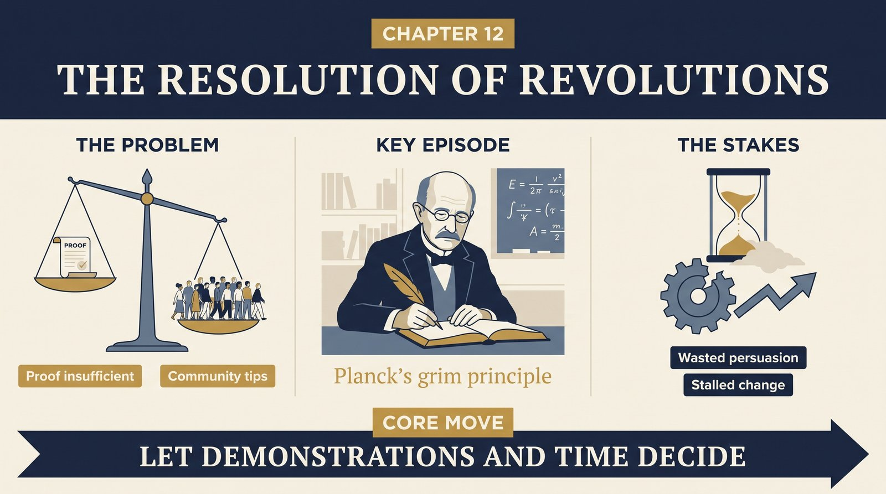
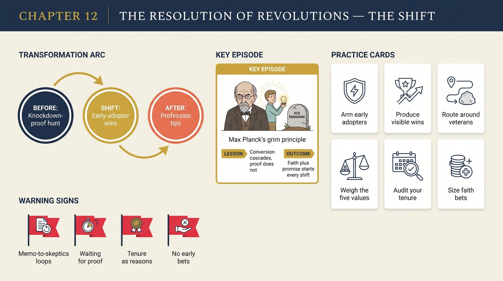

# Chapter 12 — The Resolution of Revolutions

<audio controls preload="none" style="width:100%" src="../../audio/ch-12-resolution-of-revolutions.mp3"></audio>

## Core Thesis

Paradigm debates end not by proof but by **conversion and community shift**. Because the contest is incommensurable, arguments are circular and no algorithm of theory choice exists. What decides: the new paradigm's ability to solve the crisis problems, displays of quantitative precision, aesthetic appeal ("neater," "simpler"), and — bluntly — generational turnover, as the old guard's resistance is outlived rather than out-argued.

## The Problem It Solves

How can science be rational if revolutions aren't settled by logic and experiment alone? Kuhn's answer: rationality lives in good *reasons* (problem-solving power, accuracy, fruitfulness) rather than compelling *rules*. Individual conversions are decisions made on promise and faith — early adopters commit before the evidence is decisive, and must, or the new paradigm would never get developed enough to win.

## Key Episode

Max Planck's grim testimony, quoted by Kuhn: "a new scientific truth does not triumph by convincing its opponents and making them see the light, but rather because its opponents eventually die, and a new generation grows up that is familiar with it." Also Priestley, who never accepted oxygen chemistry to his death — not irrational, Kuhn insists, but no longer a chemist by the field's evolving definition. And the early Copernicans, converted by the theory's mathematical harmony years before Galileo's telescope supplied arguments.

## The Shift

From verification/falsification to conversion dynamics: first a few, for varied and often aesthetic reasons; their work makes the paradigm concrete and fruitful; arguments multiply; the profession tips; holdouts dwindle into irrelevance. Theory choice is a social cascade with rational inputs — not a court verdict.

## Critiques & Rivals

"Mob psychology!" (Lakatos's phrase). Kuhn's later "Objectivity, Value Judgment, and Theory Choice" answered with the five shared values — accuracy, consistency, scope, simplicity, fruitfulness — which constrain choice without dictating it; scientists weigh them differently, and that variance is functional: it distributes the community's bets. Bayesians model the same process as gradual updating; sociologists of science took the chapter as license Kuhn never intended.

## Modern Application

Driving change: recruit early adopters on promise, arm them to produce visible wins, and let results argue. Don't waste cycles converting the most invested skeptics — route around them and let time do its work. Assess your own resistance honestly: are your objections reasons, or tenure? And when betting early on a framework, know that you're betting on faith plus promise — that's how it always works, so size the bet accordingly.

## Key Terms

- **Conversion** — paradigm change as gestalt-like commitment, not stepwise proof
- **Five values** — accuracy, consistency, scope, simplicity, fruitfulness (Kuhn's later formulation)
- **Generational resolution** — Planck's principle: fields tip as cohorts replace each other

## Key Quotes

> "The transfer of allegiance from paradigm to paradigm is a conversion experience that cannot be forced."

> "The man who embraces a new paradigm at an early stage must often do so in defiance of the evidence provided by problem-solving... a decision of that kind can only be made on faith."

## Reflection Questions

1. Which change are you trying to win by memo that can only be won by demonstration and time?
2. What early-stage bet are you refusing because the evidence isn't decisive — when it can't yet be?
3. Honestly: which of your professional positions are reasons, and which are tenure?

## Connections

- Resolves the circularity established in [Chapter 9](ch-09-nature-and-necessity.md)
- Sets up the final question: is this still progress? [Chapter 13](ch-13-progress-through-revolutions.md)
