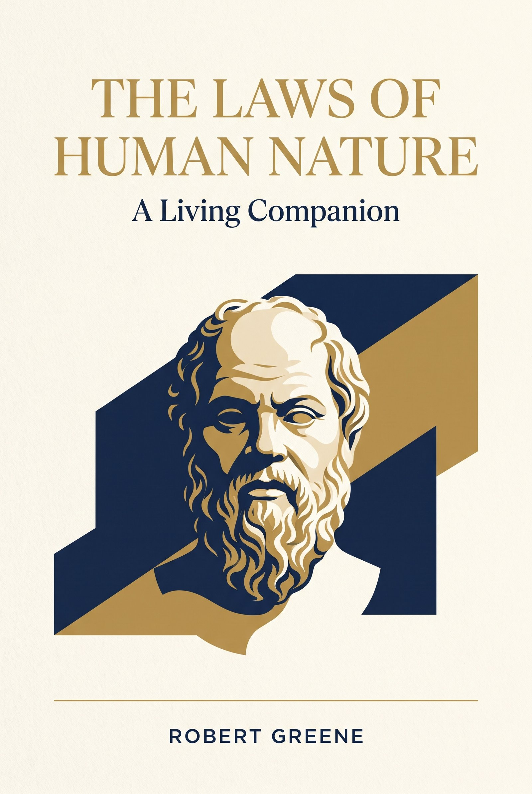
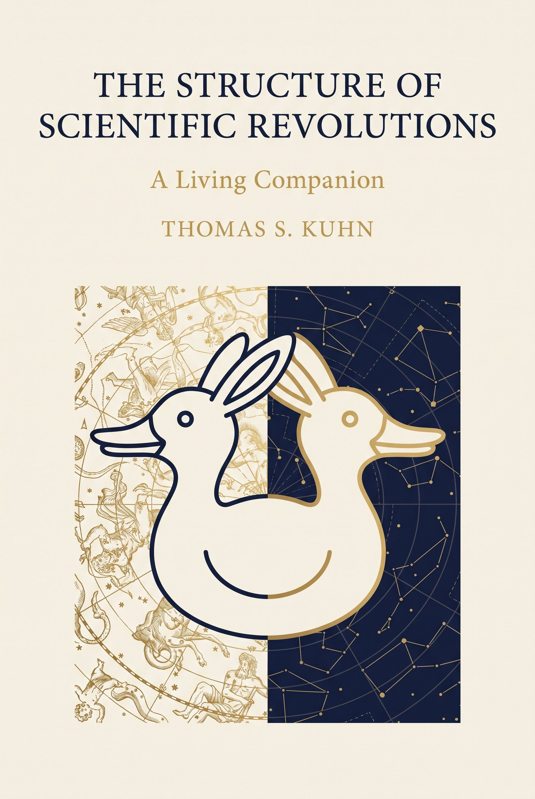
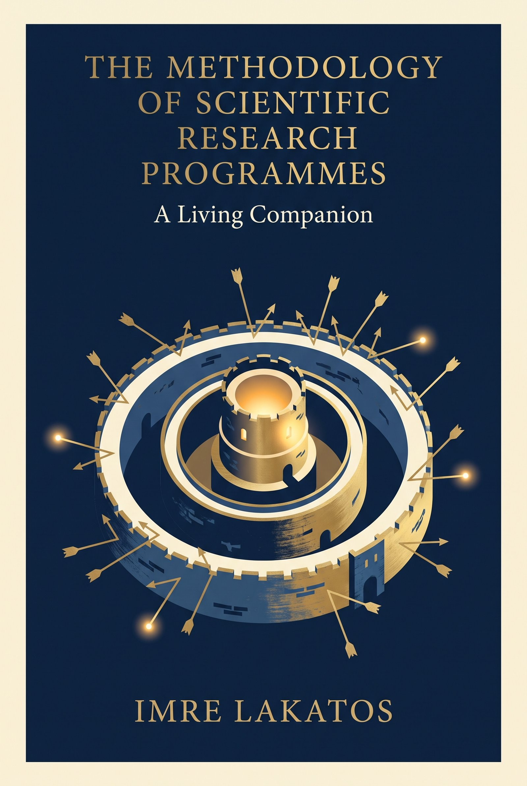
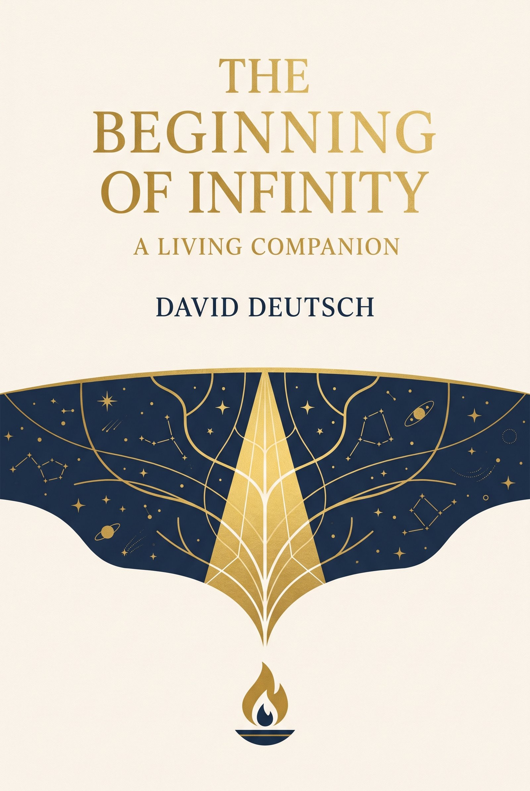

# Living Books

Book companions that improve with your feedback.

Each book here gets a full study companion — chapter summaries, study guides, infographics, and audio — built by an AI pipeline and refined by what readers tell us.

---

## The Library

| Book | Author | Companion |
|------|--------|-----------|
| The Laws of Human Nature | Robert Greene | [18 chapters · study guides · infographics · audio](books/laws-of-human-nature/index.md) |
| The Structure of Scientific Revolutions | Thomas S. Kuhn | [14 chapters · study guides · infographics · audio](books/structure-of-scientific-revolutions/index.md) |
| The Methodology of Scientific Research Programmes | Imre Lakatos | [9 concepts · study guides · infographics · audio](books/scientific-research-programmes/index.md) |
| The Beginning of Infinity | David Deutsch | [18 chapters · study guides · infographics · audio](books/beginning-of-infinity/index.md) |

*More books coming — [request one](#feedback).*

**Reading path — Philosophy of Science trilogy:** Kuhn poses the puzzle (science advances by revolutions, not accumulation), Lakatos answers it (rationality lives in research programmes over time), and Deutsch reframes it entirely (knowledge growth is unbounded). Read in that order for the full argument.

---

## Ask the Books

Have a question? Chat with all four books at once — answers cite the exact chapter.

[:material-chat: Ask the Books →](/ask/){ .md-button .md-button--primary }

---

## Concept Atlas

The ideas in the library, connected across domains. 224 concepts from 31 books — systems thinking, technology, business, agile delivery, leadership, psychology — woven together with typed connections (*extends, contradicts, parallels, tempers…*). Ask it what you're trying to understand; it answers from every shelf at once.

[:material-map: Open the Concept Atlas →](/atlas/){ .md-button .md-button--primary }

---

## How the loop works

1. **Read** a companion alongside (or instead of skimming) the book.
2. **Tell us** what's weak, missing, or wrong.
3. **The companion improves** — feedback drives the next revision.

## Feedback

One click opens your email app with everything filled in:

[:material-email: Send feedback on a book](mailto:visual-book-feedback-action@agentmail.to?subject=%5Bbook-name%5D%20Feedback&body=Which%20book%20and%20chapter%3F%20What%27s%20weak%2C%20missing%2C%20or%20wrong%3F%0A%0A){ .md-button .md-button--primary }
[:material-book-plus: Request a new book](mailto:visual-book-feedback-action@agentmail.to?subject=%5Brequest%5D%20New%20book&body=Book%20title%20and%20author%3A%0A%0AWhy%20you%27d%20like%20a%20companion%20for%20it%3A%0A%0A){ .md-button }

Prefer to type it yourself? Email **visual-book-feedback-action@agentmail.to** — put `[book-name]` in the subject for feedback, or `[request]` to ask for a new book.

Every message is read. The best feedback ships as visible improvements.
